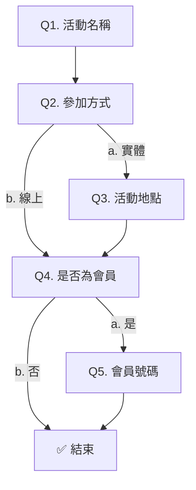

# OakMega 使用手冊（全文）

> 自動產生，來源為 Notion，每小時同步。不要手動編輯。
> 內容最後更新：2026-09-01T10:18:00.000Z

---

## OakMega 使用手冊

原文：https://app.notion.com/p/ac043939ff4c4f45b5044bd669a23909

---

## OakMega 使用手冊 › 訊息格式設定（3.0）

原文：https://app.notion.com/p/3-0-3ceccd367ae880069538c97f83611498

**目錄**

---

[圖片]

[圖片]

[圖片]

> 建立多元的訊息格式能夠讓您有更多與 LINE 好友互動的方式，以更有趣的方式增進與他們的黏著度，使得與您的官方帳號互動變得更加豐富有趣！

> 🚪 傳送門：訊息格式能夠用在多個地方，可由下方連結前往說明指南
>
> [發布文章內容設定 →](./0e4e3c68.md)
>
> [聊天機器人內容設定 →](./e9523450.md)

## 管理訊息格式

### 新增訊息

[圖片]

- 於中央點擊要新增的訊息格式

### 移動訊息

[圖片]

- 點擊訊息卡片右上角 `上/下` 按鈕，即可調整訊息格式的傳送順序

### 複製訊息

[圖片]

- 點擊訊息卡片右上角 `複製` 按鈕，即可複製相同的訊息格式內容

### 刪除訊息

[圖片]

- 點擊訊息卡片右上角 `刪除` 按鈕，即可刪除該訊息格式

---

## 編輯訊息內容

### **文字訊息**

[圖片]

- 點擊新增「文字訊息」
- 輸入要傳送的文字內容，字數上限為 500 字
- 欄位右下方按鈕可插入：
  - 連結：在文字訊息中附上連結
  - 表情符號：在文字訊息中插入表情符號
  - 會員名稱：在文字訊息中插入 LINE 好友名稱

> 💡 備註：若用於 LINE 發布文章，受眾來源須為「OakMega 分眾」，才可插入「會員名稱」

---

### 圖片**訊息**

[圖片]

- 點擊新增「圖片訊息」
- 點擊上傳圖片檔案，或拖曳檔案至方框內

> 💡 備註：檔案大小限制為 10 MB，格式須為 JPG、JPEG、PNG。

---

### **影片訊息**

[圖片]

- 點擊新增「影片訊息」
- 點擊上傳影片檔案，或拖曳檔案至方框內

> 💡 備註：檔案大小限制為 200 MB，格式須為 MP4。

---

### **語音訊息**

[圖片]

- 點擊新增「語音訊息」
- 點擊上傳語音檔案，或拖曳檔案至方框內

> 💡 備註：檔案大小限制為 10MB，格式須為 M4A。

---

### **貼圖訊息**

[圖片]

- 點擊新增「貼圖訊息」
- 點擊方框，選擇要傳送的貼圖

> 💡 備註：由於 LINE 平台限制，目前僅支援使用官方貼圖，暫時無法使用其他第三方貼圖

---

---

### **進階影片訊息**

[圖片]

- 點擊新增「進階影片訊息」
- 預覽文字：當傳送影片給 LINE 好友時，會顯示好友的於手機通知及 LINE 訊息列表上
- 上傳影片：點擊方框上傳影片檔案，或拖曳檔案至方框內
- 動作按鈕：開啟後可設定按鈕文字、連結，關閉則不顯示

> 💡 備註：影片大小限為 200 MB，格式須為 MP4。

---

### **圖文訊息**

[圖片]

- 點擊新增「圖文訊息」
- 預覽文字：當傳送訊息給 LINE 好友時，會顯示好友的於手機通知及 LINE 訊息列表上
- 上傳圖片：點擊方框上傳圖片檔案，或拖曳檔案至方框內
- 選擇版型：根據 4 種版型，將圖片切分不同區塊
- 區塊點擊行為：LINE 好友點擊圖片後觸發
  1. 無：點擊不觸發
  2. 文字：點擊後傳送文字內容
  3. 網址：點擊後開啟連結

#### **圖文訊息示範影片**

[影片]

> 💡 備註：圖片大小限制為 10 MB，格式須為 JPG、JPEG、PNG。

---

### **多圖訊息**

[圖片]

- 預覽文字：當傳送訊息給 LINE 好友時，會顯示好友的於手機通知及 LINE 訊息列表上
- 上傳圖片：點擊方框上傳圖片檔案，或拖曳檔案至方框內
- 圖片點擊行為：
  - 無：不觸發任何行為
  - 傳送文字：點擊後傳送文字內容
  - 開啟連結：點擊後開啟指定連結

[圖片]

- 宣傳標語：開啟後會顯示於圖片左上方
  - 標語文字：輸入文字內容，最多 20 字
  - 標語顏色：
    - 預設搭配六種配色
    - 可自訂義背景色、文字顏色，透過「顏色編輯器」或「輸入六位色碼」設定

[圖片]

- 動作按鈕：開啟後顯示於圖片下方
  - 按鈕文字：顯示於動作按鈕上
  - 點擊行為：可傳送文字或開啟連結，選擇後填入相對應的內容
  - 文字顏色、背景顏色：可透過「顏色編輯器」或「輸入六位色碼」設定

> 💡 備註：動作按鈕會顯示在圖片下方，最多可以新增 10 個

#### 新增 / 複製頁面

[圖片]

- 點擊`＋`按鈕，可新增空頁面，或複製當前頁面內容

> 💡 備註：一次最多可新增 10 個頁面

#### 刪除頁面

[圖片]

- 點擊右側 `刪除` 按鈕，可刪除當前頁面

#### **多圖訊息示範影片**

[影片]

---

### **多頁訊息**

[圖片]

- 預覽文字：當傳送訊息給 LINE 好友時，會顯示好友的於手機通知及 LINE 訊息列表上
- 選擇圖片種類：
  - 一般圖片：上傳靜態圖片，大小限制為 10 MB
  - 動態圖片：上傳 PNG / APNG 檔，大小限制為 300 KB，建議使用線上工具製作（例如 [https://ezgif.com/apng-maker](https://ezgif.com/apng-maker)），並且避免太複雜的動態效果。
  - 無圖片
- 宣傳標語：開啟後會顯示於圖片左上方
  - 標語文字：輸入文字內容，最多 20 字
  - 標語顏色：
    - 預設搭配六種配色
    - 可自訂義背景色、文字顏色，透過「顏色編輯器」或「輸入六位色碼」設定

[圖片]

- 設定文字內容、顏色
  - 文字標題：最多 100 字
  - 文字說明：最多 500 字
  - 價格：不限數字，可以輸入一般文字內容，最多 20 字
  - 文字顏色：可透過「顏色編輯器」或「輸入六位色碼」設定
  - 背景底色：可透過「顏色編輯器」或「輸入六位色碼」設定

[圖片]

- 點擊「＋新增按鈕」
- 動作按鈕：開啟後顯示於圖片下方
  - 按鈕文字：顯示於動作按鈕上
  - 點擊行為：可傳送文字或開啟連結，選擇後填入相對應的內容
  - 文字顏色、背景顏色：可透過「顏色編輯器」或「輸入六位色碼」設定

> 💡 備註：動作按鈕會顯示在圖片下方，最多可以新增 10 個

#### 新增 / 複製頁面

[圖片]

- 點擊`＋`按鈕，可新增空頁面，或複製當前頁面內容

> 💡 備註：一次最多可新增 10 個頁面

#### 刪除頁面

[圖片]

- 點擊右側 `刪除` 按鈕，可刪除當前頁面

---

### **卡片訊息**

[圖片]

- 預覽文字：當傳送訊息給 LINE 好友時，會顯示好友的於手機通知及 LINE 訊息列表上
- 上傳圖片：點擊方框上傳圖片檔案，或拖曳檔案至方框內
- 設定文字內容：
  - 文字標題：最多 100 字
  - 文字說明：最多 100 字

[圖片]

- 選擇動作按鈕列：
  - 3 個並排：一行 3 個按鈕
  - 單獨 1 個：一行 1 個按鈕
- 上傳圖片：點擊方框上傳圖片檔案，或拖曳檔案至方框內
- 觸發連結：好友點擊該區塊會開啟該連結
- 點擊 `＋新增按鈕列` ，最多可以使用三行（共 9 個）按鈕

> 💡 備註：一次只能傳送一張卡片訊息，卡片中的圖片大小限為 10 MB，格式須為 JPG、JPEG、PNG

[圖片]

- 左側預覽開啟「顯示版型」，可依據圖片上的編號對照設定內容

---

### 範本訊息

[圖片]

- 點擊新增「範本訊息」
- 點擊中央「選擇範本」開啟視窗

[圖片]

- 選擇已建立的範本，點擊右下角 `確認`

---

### **進階模組**

[圖片]

- 點擊新增「進階模組」
- 點擊中央「選擇進階模組」開啟視窗

[圖片]

- 選擇已於模組商城開通的進階模組，點擊右下角 `確認`

> 💡 備註：根據不同的功能頁面，部分進階模組可能無法被引入

---

### **優惠券**

[圖片]

- 點擊新增「優惠券」
- 點擊中央「選擇優惠券」開啟視窗

[圖片]

- 選擇已建立的優惠券，點擊右下角 `確認`

> 💡 備註：
>
> - 限 3.0 優惠券，且類型須為「會員主動領取 - 非公開」或「後台設定發放」
> - 此操作不會傳送任何訊息通知，僅觸發系統行為：
>   - **會員主動領取－非公開**：指定會員可在票券匣的「可領取」分頁查看並領取優惠券
>   - **後台設定發放**：優惠券會直接顯示於指定會員的票券匣「已領取」分頁
> - 若用 LINE 發布文章傳送，受眾來源需為「OakMega 分眾」，且受眾人數 < 優惠券剩餘張數

> 🚪 傳送門：想了解優惠券的設定方式，可由下方連結前往說明指南
>
> [3.0 優惠券內容設定 →](./a917bdc2.md)

---

### **圖文選單**

[圖片]

- 點擊新增「圖文選單」
- 點擊中央「選擇圖文選單」開啟視窗

[圖片]

- 選擇已建立的圖文選單，點擊右下角 `確認`

> 💡 備註：此操作不會傳送任何訊息通知，僅替指定會員更換圖文選單

---

### **API**

[圖片]

- 此功能為客製化開發專用

---

---

## OakMega 使用手冊 › Messenger 選單

原文：https://app.notion.com/p/Messenger-3aeccd367ae88033b561f3ddabbe1abd

[圖片]

- 自動顯示工作區內所有已串接的 Facebook 粉絲專頁帳號、Messenger 連結

[圖片]

- 點擊列表中的編輯按鈕，或是選擇粉專後，點擊右下方的編輯，即可進入設定頁面

[圖片]

- 點擊 `新增按鈕`

[圖片]

- 輸入按鈕文字
- 設定點擊行為，傳送按鈕文字或開啟指定連結
- 設定完成後點擊右上 `儲存` 按鈕

[圖片]

- 選單按鈕會顯示在 Messenger 底下，引導用戶快速點擊

---

## OakMega 使用手冊 › 權限管理

原文：https://app.notion.com/p/3acccd367ae880d2af14dd17537ba1d4

[圖片]

- 點擊左下角的設定符號
- 點擊 `權限管理` 進入設定頁面

---

# 1. 成員管理

## 新增成員

[圖片]

- 點擊成員管理列表右上角的 `＋新增成員`

[圖片]

- 輸入新成員的 Email，設定通知信件語言
- 點擊 `確認` 後系統寄送信件至該 Email，成員加入列表

> 💡 備註：新增時一律預設為「一般成員」，若要更改權限，請於新增完成後進入該成員的編輯頁面設定

---

## 編輯成員

[圖片]

- 點擊列表中的編輯按鈕，或是選擇成員後，點擊右下方的編輯，即可進入權限設定頁面

[圖片]

- 選擇「擁有者 / 一般成員」：
  - 擁有者：具有全部功能項目的最高權限
  - 一般成員：可獨立設定各功能項目的權限，或套用已建立的身份

[圖片]

- 一般成員套用身份後，各功能權限將依該身份設定顯示為統一狀態，無法逐項編輯
- 設定完成後，點擊右上 `儲存` 按鈕，該成員的權限設定立即生效

---

## 刪除成員

[圖片]

- 於成員管理列表中，點擊右側 `⋯` 按鈕，或於右側成員資訊右上角點擊 `⋯` 按鈕，再點擊刪除

[圖片]

- 點擊刪除後會顯示再次確認畫面，點擊 `確認` 即可刪除

---

# 2. 身份管理

[圖片]

- 切換至成「身份」分頁以檢視身份列表

## 新增身份

[圖片]

- 點擊身份管理列表右上  `＋新增身份`

[圖片]

- 輸入身份名稱，不可與已建立的身份名稱重複
- 設定各功能頁面的權限（可檢視 / 可編輯 / 隱藏）
- 完成後點擊右上角 `儲存` 按鈕，即套用至此身份下的所有成員

---

## 新增成員

[圖片]

- 回到身份管理列表點擊 `＋新增成員`，可將「尚未套用身份」的一般成員加入此身份

## 移除成員

[圖片]

- 點擊成員右側 `X` 按鈕可移除指定身份，該成員的權限將回復到套用身份前的設定

---

## 複製 / 刪除成員

[圖片]

- 點擊列表右側 `⋯` 按鈕，或於右側成員資訊右上角點擊 `⋯` 按鈕，可複製或刪除身份

> 💡 備註：刪除身份後，原本套用此身份的所有成員，權限將自動回復到套用身份前的個別設定

---

## OakMega 使用手冊 › OakMega SCRM AI Plugin

原文：https://app.notion.com/p/OakMega-SCRM-AI-Plugin-3a7ccd367ae8801ebc47e24ae9b0f87e

## 說明

OakMega SCRM AI Plugin 為 Claude 專用 AI Plugin，目前可提供 AI 數據分析服務，未來將持續開發並支援建立發布內容、活動企劃等功能。

目前此 Plugin 尚為測試版本，「不會」更改任何你在 OakMega Social CRM 的資訊，僅作為檢視或分析用途，請不用擔心造成後台資料變更問題。

如需使用或有任何問題請洽 OakMega 窗口。

---

## 安裝 Plugin

1. 下載 Claude 桌面版應用：[https://claude.com/download](https://claude.com/download)
2. 開啟 Claude Desktop 並切換到 Code 模式
  [圖片]
3. 點開 Customize → 左下角找到 Plugins → 點擊右上角 Add → 點擊 Add marketplace
  [圖片]
4. 貼上 [https://github.com/oakmega/OakMega-SCRM-AI-Plugin](https://github.com/oakmega/OakMega-SCRM-AI-Plugin/tree/master) 並選擇
  [圖片]
5. 找到剛剛安裝的 Plugin 並點擊 `+`
  [圖片]
6. 回到對話（記得左上角要是 Code），新增一個新的對話，輸入 `/` 並且找到 oakmega-crm 這個指令
  [圖片]
7. 在藍色字的後面，接著打你想要的指令並送出即可
  [圖片]
8. 建議於左下角將 Accept Edit 切換為 Auto，避免需要一直點擊同意 AI 的操作
  [圖片]

  [圖片]

### 疑難排解

> 💡 若在點擊送出時，出現選擇資料夾的頁面，請建立一個空白資料夾後繼續。
>
> 這是因為 Claude Code 需要位於一個資料夾內運作，生成之內容有可能也會放於該資料夾內。

> 💡 若執行時，Claude 提示缺少 Node.js 等套件，可直接於對話中請 Claude 自行處理。
>
> 這是因為 Claude 需透過套件來執行程式碼，而電腦預設通常沒有這些資訊，所以需要先行安裝才能正常使用。

---

## 登入

1. 首次使用時，Claude 會引導你開啟網頁，並要求需要輸入 API Key 來登入，API Key 與 Open API Key 不同，如有需要請洽 OakMega 窗口
2. 除 API Key 外，還要填寫 workspace ID，以及別名，輸入完按儲存設定
  [圖片]

---

## 新增 / 切換工作區

1. 如果有同時使用多個工作區的需求，可以直接跟 Claude 說「幫我加一個工作區」，AI 就會引導你完成步驟
2. 切換工作區也直接跟 Claude 說即可
3. 如果你已經設定了多個工作區，建議每次開始對話的時候，都指定你要用的工作區，以免 AI 誤判

---

## API Key 注意事項

- 此 API Key 視同於工作區內的成員（你自己），權限也完全相同
- 每個工作區都有單獨的 API Key，要切換多個工作區時，就要使用多個 API Key
- **請不要把你的 API Key 給別人用**

---

## 注意事項

- Plugin 功能正在開發中，若不確定 Plugin 能做到什麼範圍，可以直接詢問，目前大略功能如下：
  - QBR 報告：好友成長、發文分析報告
  - 標籤報告：特定標籤的數字成長、區間變化
  - 常用篩選受眾報告：篩出一群受眾，觀察封鎖率、標籤排名報告
- QBR 報告因資料來源較多，運行超過 10 分鐘是正常的狀況
- 對話最開始一定要使用 `/oakmega-scrm` 指令，後續對話就不需每次引用
- 此 Plugin 「不會」因為你的對話包含 OakMega 或相關字詞就自動啟動
- 此 Plugin 為 OakMega 所提供被動式資料存取介面，存取動作都將由使用者自有的 Claude 環境中主動發起，並完成授權後方可執行

---

## OakMega 使用手冊 › 優惠券內容設定

原文：https://app.notion.com/p/392ccd367ae880ea94fae659a917bdc2

## 1. 基本設定

[圖片]

- **優惠券名稱：**顯示於前台標題
- **優惠券圖片：**顯示於前台圖片
- **優惠券說明：**顯示於標題下方的敘述文字
- **條款內容：**顯示於底部條款區塊

> 💡 備註：編輯後會同步更改至所有優惠券，包含未領取、已領取、已使用的券面

---

## 2. 發放設定

### 發放類型

[圖片]

設定會員獲得優惠券的方式：

- **會員主動領取：**由會員手動點擊領取，才會獲得優惠券
- **後台設定發放：**直接將優惠券發至指定會員的票券匣，會員收到後即可使用，不需點擊領取

> 💡 備註：儲存後不可變更設定。

### 票券匣可見性

[圖片]

設定哪些會員的票券匣會顯示此券：

- **全部公開：**所有會員可在票券匣中看到此券
- **限定標籤公開：**僅擁有指定標籤的會員可在票券匣中看到此券。
  - 同時擁有：會員需同時擁有所有指定標籤才能看到
  - 符合任一：會員只需擁有其中一個指定標籤即可看到
- **非公開：**不顯示於票券匣，需透過其他管道（如 LINE 發文）指定顯示給部分會員

> 💡 備註：限「會員主動領取」類型可設定

---

## 3. 領取設定

### 領取方式

[圖片]

設定會員領取優惠券時的流程：

- **直接領取**：免費領取，不消耗點數
- **點數兌換**：需消耗指定點數才能領取

> 💡 備註：限「會員主動領取」類型可設定

### 領取期限

[圖片]

設定優惠券可被領取的時間範圍：

- **不限定**：無期限限制，隨時可領取
- **早於（含）**：設定截止日，到期後無法再領取
- **晚於（含）**：設定開始日，開始日前無法領取
- **介於（含）**：設定開始與截止日

> 💡 備註：限「會員主動領取」類型可設定

---

## 4. 優惠碼

[圖片]

- **不顯示**：每張券不附帶任何優惠碼
- **顯示統一優惠碼**：所有券共用同一組代碼，所有會員使用時皆顯示相同內容
- **顯示獨立優惠碼**：每張券各自擁有不重複的代碼，需上傳 CSV 檔案匯入

> 💡 備註：
>
> - 儲存後不可變更優惠碼類型，或刪減獨立碼檔案
> - 變更優惠碼僅影響**還未領取或獲得**的券，不影響會員已獲得的券
>
> ---
>
> #### 優惠碼類型
>
> |  | 不顯示 | 統一優惠碼 | 獨立優惠碼 |
> | --- | --- | --- | --- |
> | 代碼 | 無 | 每張相同 | 各自不同 |
> | 設定方式 | — | 手動輸入 | 上傳 CSV |
> | 儲存後修改 | — | 不可修改 | 只可加碼 |
> | 適合情境 | 不需核銷代碼 | 統一折扣碼 | 序號制、防重複使用 |

### 新增獨立碼

[圖片]

- 點擊 `新增獨立碼檔案`

[圖片]

- 上傳 CSV 檔案，系統依照欄位內容匯入優惠碼
- 可下載 `sample.csv` 參考檔案格式
- 上傳完成後，右側顯示獨立碼數量及前十筆預覽
- 點擊右下 `確認`

> 💡 備註：上傳的優惠碼數量即為此優惠券的總張數，儲存後只可加碼、不可刪減。

### 條碼顯示

[圖片]

設定優惠碼是否以條碼形式呈現：

- **不顯示**：僅顯示文字代碼，不產生條碼
- **QR Code**：將優惠碼轉為 QR Code 圖示顯示
- **CODE_39**：支援大寫英文字母與數字、特殊符號（ `.` `$` `/` `+` `%` `space`）組合
- **CODE_128**：支援大小寫英文字母與數字、符號組合
- **EAN_13**：支援 13 碼純數字的優惠碼

---

## 5. 張數設定

[圖片]

- **優惠券總張數：**設定優惠券的總庫存上限，歸零後將無法領取或發放
- **每人限領張數：**設定每位會員最多可領取的張數（後台發放不受限制）

> 💡 備註：總張數儲存後**只能增加、不可減少**。若使用獨立優惠碼，總張數由系統依上傳數量自動計算，無法手動設定

## 6. 使用設定

### 使用方式

[圖片]

設定會員核銷優惠券時的流程：

- **點擊使用**：會員點擊「立即使用」即完成核銷
- **輸入代碼**：需由工作人員輸入代碼作為紀錄，才能完成核銷

> 💡 備註：變更使用方式僅影響**還未領取或獲得**的券，不影響會員已獲得的券

### 使用期限

[圖片]

設定優惠券可被使用的時間範圍：

- **不限定**：無期限限制，隨時可使用
- **早於（含）**：設定截止日，到期後無法再使用
- **晚於（含）**：設定開始日，開始日前無法使用
- **介於（含）**：設定開始與截止日
- **領取後 N 天內**：從「會員領券」或「後台發券」當下起算，自動維持「今日 + N 天」，並於最後一日的 23:59 截止

> 💡 備註：變更使用期限的設定，僅影響**還未領取或獲得**的券，不影響會員已獲得的券

---

## 7. 按鈕設定

[圖片]

- 使用優惠券後，可設定是否顯示額外按鈕

---

## 8. 標籤設定

[圖片]

- **領取優惠券貼上標籤：**會員完成領取後，系統自動為該會員貼上指定標籤
- **使用優惠券貼上標籤：**會員使用優惠券後，系統自動為該會員貼上指定標籤

---

## 9. 後續動作

[圖片]

- **傳送訊息：**使用優惠券後，自動傳送指定訊息範本給會員
- **自動轉客服**：使用優惠券後，將該會員的對話轉入客服中心

---

## OakMega 使用手冊 › 票券匣設定

原文：https://app.notion.com/p/392ccd367ae880d6a847f6a943271466

[圖片]

- 點擊優惠券管理頁面右上角 `票券匣設定`，即可進入設定頁面

## 1. 基本設定

[圖片]

- 票券匣名稱：設定前台票券匣頁面的名稱
- 顯示會員點數：開啟時，會員在票券匣中可看到自己目前的點數餘額

## 2. 顏色設定

[圖片]

- 主要顏色：套用於按鈕、文字、連結等元件
  - 推薦顏色：從系統預設色票中選擇
  - 自訂顏色：可輸入色碼，指定品牌色
- 頁面背景色：設定票券匣頁面的背景底色

> 💡 備註：建議主要顏色選擇較深的色調，背景色搭配較淺的顏色，讓前台的按鈕與文字更清晰易讀。

## 3. 語系設定

[圖片]

- 設定前台預設呈現的語系，目前支援：繁體中文、英文、日文、泰文

> 💡 備註：語系設定僅影響系統預設文字（如按鈕、頁籤等），不影響優惠券標題、敘述等自訂內容。

## 4. 圖片設定

[圖片]

- Logo：預設顯示 LINE 官方帳號頭貼，可上傳圖片更換
- Banner：顯示於票券匣最上方，可選擇套用主要顏色，或自行上傳圖片

---

## OakMega 使用手冊 › 優惠券管理頁面

原文：https://app.notion.com/p/392ccd367ae880b2ab5fcd98d08cb7ca

## 優惠券是什麼？

[圖片]

> 優惠券讓品牌能夠輕鬆建立數位票券，發放給 LINE 會員領取或使用。無論是折扣券、兌換券、入場券，都能透過優惠券模組完成。
>
> 會員可在**票券匣**中查看優惠券，品牌也能靈活設定領取資格、張數限制、使用期限，以及核銷後的自動貼標與後續動作，打造完整的票券發放流程。

---

## 1. 優惠券列表

[圖片]

- 優惠券管理頁面分為左側資料夾**、**右側優惠券列表

### 切換瀏覽模式

[圖片]

- 點擊列表右上角的切換按鈕，可切換瀏覽樣式
  - Table view（預設）：以表格呈現，方便比較數據
  - Card view：塊狀式呈現，方便查看優惠券圖片

### 設定顯示欄位

[圖片]

- 若選擇 Table view，可點擊 `顯示欄位` 按鈕，開啟設定介面

[圖片]

- 除了優惠券名稱外，所有欄位皆可自由開關（顯示 / 隱藏），也可以拖曳改變列表上的排列順序
- 此設定會儲存於手機或電腦裝置，下次使用相同裝置時自動顯示

### 搜尋優惠券

[圖片]

- 於上方搜尋框輸入優惠券名稱，即可進行搜尋

---

## 2. 資料夾管理

### 新增資料夾

[圖片]

- 點擊左側資料夾的 `+` 號

[圖片]

- 輸入資料夾名稱後，點擊 `確認`

### 重新命名資料夾

[圖片]

- 點擊資料夾名稱右側的 `…` 按鈕，再點擊 `重新命名`

### 刪除資料夾

[圖片]

- 點擊資料夾名稱右側的 `…` 按鈕，再點擊 `刪除`

> 💡 備註：刪除資料夾時，資料夾內的所有優惠券將一併被刪除，請謹慎操作。

### 拖曳資料夾

[圖片]

- 滑鼠長按資料夾後拖曳，即可調整排列順序

> 💡 備註：若要拖曳至子層結構，請先展開母層資料夾，才能拖曳到下一層

---

## 3. 優惠券操作

### 新增優惠券

[圖片]

- 點擊右上角「＋新增優惠券」，進入優惠券編輯頁

> 🚪 傳送門：優惠券內容設定，可由此連結前往：[[優惠券內容設定](./a917bdc2.md)](./a917bdc2.md)

### 編輯優惠券

[圖片]

- 點擊列表中間的編輯 icon，或右側 Sidebar 底部的 `編輯` 按鈕，即可進入編輯頁面

> 💡 備註：部分欄位在儲存後即不可修改，詳細說明請參考：[[優惠券內容設定](./a917bdc2.md)](./a917bdc2.md)

### 複製 / 移動 / 刪除

[圖片]

- 點擊列表右側或 Sidebar 右上角的 `…` 按鈕，可選擇以下操作：
  - **複製**：建立一份新券並直接進入編輯頁，部分欄位將清空為預設值
  - **移動**：將優惠券移動至其他資料夾
  - **刪除**：刪除後該券將從前台票券匣隱藏，已領取的會員也將無法再查看或使用

---

## 4. 優惠券資訊

[圖片]

- 於列表點擊任一優惠券，右側展開優惠券資訊與優惠券數據
- 於「優惠券資訊」可查看所有設定內容

### 複製連結 / 下載 QR Code

[圖片]

- 點擊 `複製連結` 按鈕，可取得票券匣或此券面的連結
- 點擊 `QR Code` 按鈕，可下載票券匣或此券面的圖檔

> 💡 備註：點擊「查看優惠券連結」僅開啟券面，不會自動領取優惠券

---

## 5. 優惠券數據

[圖片]

- 於右側小卡點擊 `文章數據`，可查看：
  - 優惠券總張數
  - 已領取張數
    - 若發放類型為「會員主動領取」，顯示已領取數量
    - 若發放類型為「後台設定發放」，顯示已發放數量
  - 已使用張數

[圖片]

- 篩選指定日期，可查看區間數據及圖表變化

[圖片]

- 點擊列表右側或 Sidebar 右上角的 `…` 按鈕，可下載：
  - **優惠券數據**：匯出每日數據，及近 100,000 筆領取、發放、使用紀錄
  - **獨立碼使用紀錄**：僅限設有獨立碼的優惠券，匯出每一碼的使用紀錄
  - **可領取會員資料**：僅限發放類型為「會員主動領取 - 非公開」的優惠券，匯出所有具備領取資格的會員資料

---

## OakMega 使用手冊 › 客服中心身份說明

原文：https://app.notion.com/p/38dccd367ae8804c8f37df0493b49c32

# 身份

- 身份是客服中心控制成員操作權限的設定方式
- 每位成員都必須套用一個身份，身份決定了該成員能看到哪些對話、能執行哪些操作。
- 系統預設提供「主管」與「專員」兩種身份，也可以在身份管理中自訂身份，以對應不同的組織架構與分工需求。

---

# 預設身份

## 主管

- 擁有所有權限，可以執行所有操作，自由度高
- 可檢視客服中心內**所有組織**的對話，不受自身所屬組織限制

## 專員

- 具有部分功能操作限制，只能看到跟自己相關的訊息
- 只能檢視**自己所屬組織**內，自己負責或尚未指派的對話

### 預設身份 - 權限對照表

> 欄位說明：
>
> - **所屬組織** — 成員自己加入的組織
> - **其他組織** — 成員未加入的其他組織
> - **自己負責 / 他人負責 / 未指派** — 對話目前的負責成員狀態

## 主管

| 權限項目 | 所屬組織 - 自己負責 | 所屬組織 - 他人負責 | 所屬組織 - 未指派 | 其他組織 - 他人負責 | 其他組織 - 未指派 |
| --- | --- | --- | --- | --- | --- |
| 檢視對話 | ✅ | ✅ | ✅ | ✅ | ✅ |
| 傳送文字訊息 | ✅ | ✅ | ✅ | ✅ | ✅ |
| 傳送貼圖訊息 | ✅ | ✅ | ✅ | ✅ | ✅ |
| 傳送圖片 / 影片 / 音訊 | ✅ | ✅ | ✅ | ✅ | ✅ |
| 傳送檔案 | ✅ | ✅ | ✅ | ✅ | ✅ |
| 傳送範本 | ✅ | ✅ | ✅ | ✅ | ✅ |
| 傳送進階模組 | ✅ | ✅ | ✅ | ✅ | ✅ |
| 變更對話狀態 | ✅ | ✅ | ✅ | ✅ | ✅ |
| 結束客服 | ✅ | ✅ | ✅ | ✅ | ✅ |
| 變更組織至自己所屬組織 | ✅ | ✅ | ✅ | ✅ | ✅ |
| 變更組織至所有組織 | ✅ | ✅ | ✅ | ✅ | ✅ |
| 變更負責成員 | ✅ | ✅ | ✅ | ✅ | ✅ |

## 專員

| 權限項目 | 所屬組織 - 自己負責 | 所屬組織 - 他人負責 | 所屬組織 - 未指派 | 其他組織 - 他人負責 | 其他組織 - 未指派 |
| --- | --- | --- | --- | --- | --- |
| 檢視對話 | ✅ | ⛔️ | ✅ | ⛔️ | ⛔️ |
| 傳送文字訊息 | ✅ | ⛔️ | ✅ | ⛔️ | ⛔️ |
| 傳送貼圖訊息 | ✅ | ⛔️ | ✅ | ⛔️ | ⛔️ |
| 傳送圖片 / 影片 / 音訊 | ✅ | ⛔️ | ✅ | ⛔️ | ⛔️ |
| 傳送檔案 | ✅ | ⛔️ | ✅ | ⛔️ | ⛔️ |
| 傳送範本 | ✅ | ⛔️ | ✅ | ⛔️ | ⛔️ |
| 傳送進階模組 | ✅ | ⛔️ | ✅ | ⛔️ | ⛔️ |
| 變更對話狀態 | ✅ | ⛔️ | ✅ | ⛔️ | ⛔️ |
| 結束客服 | ⛔️ | ⛔️ | ⛔️ | ⛔️ | ⛔️ |
| 變更組織至自己所屬組織 | ⛔️ | ⛔️ | ⛔️ | ⛔️ | ⛔️ |
| 變更組織至所有組織 | ⛔️ | ⛔️ | ⛔️ | ⛔️ | ⛔️ |
| 變更負責成員 | ✅ | ⛔️ | ✅ | ⛔️ | ⛔️ |

---

# 自訂身份

如果預設的主管與專員無法滿足你的團隊分工需求，可以在身份管理中建立自訂身份。

應用情境包括：

- 多層級組織架構，需要介於主管與專員之間的中間層級（如部門主管）
- 特定身份只允許傳送範本訊息，不可傳送圖片、影片、檔案等格式
- 特定組織的主管只允許查看自己組織的對話，看不到其他組織

## 對話範圍

自訂身份的每個權限項目，都可以依照對話的歸屬範圍分別設定：

- **所屬組織** — 成員自己加入的組織內的對話，可依「自己負責」、「他人負責」、「未指派」分別設定
- **其他組織** — 成員未加入的所有組織內的對話，可依「他人負責」、「未指派」分別設定

## 可設定的權限項目

| 權限項目 | 說明 |
| --- | --- |
| 檢視對話 | 可看到此類對話。此為所有其他權限的前提，未開啟時其餘項目無法設定 |
| 傳送文字訊息 | 可輸入並傳送文字 |
| 傳送貼圖訊息 | 可傳送貼圖訊息 |
| 傳送圖片 / 影片 / 音訊 | 可傳送圖片、影片、音訊 |
| 傳送檔案 | 可傳送檔案 |
| 傳送範本 | 可傳送範本 |
| 傳送進階模組 | 可傳送進階模組 |
| 變更對話狀態 | 可將對話狀態變更為待處理、處理中、處理完成 |
| 結束客服 | 可將對話狀態變更為結束客服 |
| 變更組織至所屬組織 | 可將對話移至其他組織，但只能選自己所屬的組織 |
| 變更組織至其他組織 | 可將對話移至自己未加入的組織 |
| 變更負責成員 | 可變更對話的負責成員 |

---

## OakMega 使用手冊 › 標籤分流連結

原文：https://app.notion.com/p/34bccd367ae880ba9e6bc647e3749ec3

**目錄**

---

## 1. 建立連結

[圖片]

- 點擊右上角 `＋新增` 建立標籤分流連結

[圖片]

- 基本設定：「連結名稱」僅用於後台管理，不會顯示於前台
- 標籤設定：
  - 點擊分流連結的當下，貼上指定標籤
  - 無論分流條件是否符合，好友點擊連結的當下即貼上所有設定標籤

[圖片]

- 符合條件網址：符合標籤條件的會員，點擊連結後會分流至此網址（可填入一般連結、追蹤連結或聊天機器人連結等）
- 分流限定標籤：選擇作為判斷條件的標籤，可多選
- 標籤多選規則：
  - 同時擁有上述標籤，才算符合條件
  - 擁有任一個標籤，即視為符合條件
- 符合條件貼上標籤：分流至「符合條件網址」的會員，貼上指定標

[圖片]

- 不符合條件網址：不符合標籤條件的會員，點擊連結後會分流至此網址
- 不符合條件貼上標籤：分流至「不符合條件網址」的會員，貼上指定標籤

> 💡 備註：會員需完成 LINE Login 授權，系統才能讀取其標籤進行分流判斷。若會員未完成 LINE Login，將導向「不符合條件網址」。

[圖片]

- 連結預覽
  - 連結標題：連結預覽顯示的標題文字
  - 連結說明：補充說明連結內容，顯示於標題下方
  - 連結預覽縮圖：連結分享時顯示的預覽圖片

---

## 2. 檢視連結資訊

[圖片]

- 於列表上點擊指定連結，右側展開連結資訊
- 連結資訊包含：
  - 標籤分流連結：可點擊 `複製` 或 `顯示 QRocde` 按鈕
  - 基本設定：連結名稱、資料夾、建立時間
  - 標籤設定：點擊連結貼上標籤
  - 符合條件網址：目標網址、分流限定標籤、符合條件貼上標籤
  - 不符合條件網址：目標網址、不符合條件貼上標籤

---

##  3. 檢視連結數據

[圖片]

- 於右側小卡點擊 `連結數據`，可查看：
  - 歷史數據：從連結建立時到點擊當下累積的數據
    - 總點擊次數：點擊連結的總次數（重複計算）
    - 總點擊人數：點擊連結的總人數
    - 符合條件次數 / 人數：擁有指定標籤、被導向符合條件網址的次數 / 人數
    - 不符合條件次數 / 人數：未擁有指定標籤、被導向不符合條件網址的次數 / 人數
  - 區間數據：
    - 分為過去 24 小時、過去 7 天、過去 30 天、自訂日期區間（最多 100 天）
    - 根據區間設定顯示點擊次數 / 人數、符合條件次數 / 人數、不符合條件次數 / 人數

[圖片]

- 選擇自訂日期區間後，點擊 `展開日期區間` 可設定起訖日期

[圖片]

- 選擇開始日期、結束日期，結束日期不得早於開始日期，且相隔需小於 100 天
- 點擊 `確認` 套用日期

[圖片]

- 往下滾動可查看區間日期內的圖表
- 點擊圖表右上角 `放大`，開啟視窗檢視完整資訊

---

##  4. 編輯連結

### 修改連結

[圖片]

- 點擊右側 `編輯` 按鈕開啟設定頁

[圖片]

- 編輯符合條件網址：將會影響已發布的連結和已印製的 QR code，且調整後不會立即生效

[圖片]

- 編輯分流限定標籤或多選規則：
  - 將重置該條件的分流數據（符合條件次數 / 人數、不符合條件次數 / 人數）
  - 下載檔案也會清空過往的點擊數據，重新進行紀錄
  - 不影響總點擊次數、總點擊人數

[圖片]

- 編輯連結預覽：不影響已發布的連結預覽資訊，變更內容也不會即時套用，需靜候一段時間才會生效

### 移動連結

[圖片]

- 展開右側 `…` ，點擊 `移動` 可變更連結所屬的資料夾

### 下載數據

[圖片]

- 展開右側 `…` ，點擊 `下載連結數據` 可匯出：
  - 每日點擊數據：每日點擊次數、好友人數等數據統計
  - 連結點擊紀錄：每一筆分流成功的紀錄，包含符合條件、不符合條件

### 刪除連結

[圖片]

- 展開右側 `…` ，點擊 `刪除` 可刪除該連結

> 💡 備註：刪除後無法復原，請謹慎操作

---

## 5. 自訂顯示欄位

[圖片]

- 點擊 `顯示欄位` 按鈕，開啟設定介面

[圖片]

- 除了「連結名稱」外，所有欄位皆可自由開關，選擇要「顯示」或「隱藏」在列表上，也可以自由拖曳改變排列順序

---

## 6. 搜尋連結

[圖片]

- 點擊右上角 `搜尋` 按鈕，展開搜尋框後可輸入搜尋內容，再點擊搜尋類型：
  - 連結名稱
  - 連結標題
  - 標籤分流連結
  - 目標網址：符合條件 / 不符合條件網址

---

## OakMega 使用手冊 › 新舊好友分流連結

原文：https://app.notion.com/p/333ccd367ae88086a487cbc6950c5dd9

**目錄**

---

## 1. 建立連結

[圖片]

- 點擊右上角 `＋新增` 建立新舊好友分流連結

[圖片]

- 基本設定：連結名稱僅用於後台管理，不會顯示於前台
- 標籤設定：點擊分流連結的當下，貼上指定標籤

[圖片]

- 分流設定：系統會依據使用者是否為 LINE 官方帳號好友，觸發不同的關鍵字聊天機器人
  - 新好友分流機器人：
    - 點擊連結後再加入 LINE 官方帳號，觸發此聊天機器人
    - 若使用者曾封鎖官方帳號，點擊連結後解除封鎖，**不會觸發此聊天機器人**
  - 新好友貼上標籤：針對新加入的 LINE 好友貼上指定標籤
  - 舊好友分流機器人：
    - 點擊連結時已為 LINE 官方帳號好友，觸發此聊天機器
    - 若使用者觸發過「新好友分流機器人」，重複點擊連結，就會觸發此聊天機器人
  - 舊好友貼上標籤：針對既有的 LINE 好友貼上指定標籤

> 💡 備註：聊天機器人一次僅會觸發一個，當好友觸發「新好友分流機器人」時，將不會同時觸發 LINE 歡迎訊息

> 🚪 傳送門：[LINE 聊天機器人管理 →](./ce03eaff.md)  [LINE 聊天機器人內容設定 →](./e9523450.md)

[圖片]

- 連結預覽
  - 連結標題：連結預覽顯示的標題文字
  - 連結說明：補充說明連結內容，顯示於標題下方
  - 連結預覽縮圖：連結分享時顯示的預覽圖片

---

## 2. 檢視連結資訊

[圖片]

- 於列表上點擊指定連結，右側展開連結資訊與連結數據
- 連結資訊包含：
  - 新舊好友分流連結：可點擊 `複製` 或 `顯示 QRocde` 按鈕
  - 基本設定：連結名稱、資料夾、建立時間
  - 標籤設定：點擊連結貼上標籤
  - 分流設定：新 / 舊好友分流機器人預覽圖、新 / 舊好友貼上標籤

---

##  3. 檢視連結數據

[圖片]

- 於右側小卡點擊 `連結數據`，可查看：
  - 歷史數據：從連結建立時到點擊當下累積的數據
    - 總點擊次數：點擊連結的總次數（重複計算）
    - 總好友人數：點擊連結的好友數，不含點擊後未加入好友的使用者
    - 新好友人數：點擊連結的新好友，不含解除封鎖
    - 舊好友人數：點擊連結的舊好友
    - 新好友轉換率：新好友人數 / 總點擊次數
  - 區間數據：
    - 分為過去 24 小時、過去 7 天、過去 30 天、自訂日期區間（最多 100 天）
    - 根據區間設定顯示點擊次數 / 好友人數、系統資訊、瀏覽器資訊

[圖片]

- 選擇自訂日期區間後，點擊 `展開日期區間` 可設定日期

[圖片]

- 選擇開始日期、結束日期，結束日期不得早於開始日期，且相隔需小於 100 天
- 點擊 `確認` 套用日期

[圖片]

- 往下滾動可查看區間日期內的圖表
- 點擊圖表右上角 `放大`，開啟視窗檢視完整資訊

---

##  4. 編輯連結

### 修改連結

[圖片]

- 點擊右側 `編輯` 按鈕開啟設定頁

[圖片]

- 修改基本設定、標籤設定、分流設定後，會立即套用於原連結
- 修改連結預覽，不會影響已發布的連結預覽資訊，變更內容也不會即時套用，需靜候一段時間才會生效

### 移動連結

[圖片]

- 展開右側 `…` ，點擊 `移動` 可變更連結所屬的資料夾

### 下載數據

[圖片]

- 展開右側 `…` ，點擊 `下載連結數據` 可匯出：
  - 每日點擊數據：每日點擊次數、好友人數等數據統計
  - 好友分流紀錄：每一筆好友分流紀錄
  - 新好友名單：有點擊此連結的新好友會員資料
  - 舊好友名單：有點擊此連結的舊好友會員資料

### 刪除連結

[圖片]

- 展開右側 `…` ，點擊 `刪除` 可刪除該連結

> 💡 備註：刪除後無法復原，請謹慎操作

---

## 5. 自訂顯示欄位

[圖片]

- 點擊 `顯示欄位` 按鈕，開啟設定介面

[圖片]

- 除了「連結名稱」外，所有欄位皆可自由開關，選擇要「顯示」或「隱藏」在列表上，也可以自由拖曳改變排列順序

---

## 6. 搜尋連結

[圖片]

- 點擊右上角 `搜尋` 按鈕，展開搜尋框

[圖片]

- 輸入「連結名稱」、「連結標題」、「新舊好友分流連結」進行搜尋

---

## 7. 資料夾管理

### 新增資料夾

[圖片]

- 點擊左側資料夾的 `+`  號

[圖片]

- 輸入資料夾名稱後點擊 `確認`

### 重新命名

[圖片]

- 點擊資料夾名稱右側的 `…` 按鈕，可重新命名資料夾

### 刪除資料夾

[圖片]

- 點擊資料夾名稱右側的 `…` 按鈕，再點擊 `刪除`

> 💡 備註：刪除資料夾時，資料夾內的項目會一併被刪除，請小心使用。

### 拖曳資料夾

[圖片]

- 滑鼠長按可拖曳資料夾，調整結構與排序
- 若要拖曳至第二、第三層，需先展開母層資料夾

> 💡 備註：多層級資料夾順序為共用設定（非個人設定），調整後會同步影響其他使用者或其他裝置。

---

## OakMega 使用手冊 › 預約中心

原文：https://app.notion.com/p/333ccd367ae880588d32cc1abf8ebc5b

## 預約中心是什麼？

預約中心讓你快速建立各種預約服務，透過簡單的表單就能自動化收集並管理客戶預約。
你可以輕鬆完成以下三件事：

#### **一、設定「預約項目」**

- **客製化預約規則：**針對不同服務類別（如：法律諮詢、汽車保養）設定專屬規則，包含服務時長、開放間隔、每週有效時段、預約期限等
- **自動計算可約時間：** 系統會結合綁定的服務人員空檔時間，以及設定的預約規則，自動產出可預約時段
- **自由加入表單：** 預約項目可作為「題目」新增至表單中，客戶就能在手機或電腦上挑選時間並完成預約，一份表單可新增多組不同的預約項目

#### **二、安排「服務人員」**

- **自動避開忙碌時段：**當預約項目綁定服務人員，系統會根據人員的既有預約及 Google / Outlook 行事曆忙碌時段，自動計算出真正的空擋時間，徹底避免重複預約
- **即時訊息通知：**當預約成功、變更或取消時，服務人員會收到 LINE 通知，並同步更新至行事曆行程
- **資源彈性綁定：**一位服務人員可以同時負責多個預約項目

#### **三、管理「預約紀錄」**

- **完整資訊追蹤：**集中管理所有預約資訊，包含預約時間、項目、會員資訊、表單填答資料等
- **即時調整預約：** 支援後台手動變更或取消預約，執行後系統會自動發送 LINE 通知給預約者與服務人員，確保雙方資訊同步

## 1. 新增預約項目

[圖片]

- 點擊右上角 `＋新增` 建立預約項目

### 基本設定

[圖片]

- 預約項目名稱：顯示於預約項目管理頁、表單題目編輯頁、表單前台
- 開放預約：開啟後可進行預約，關閉則不顯示於表單前台，且無法新增至表單題目

### 時間設定

[圖片]

- 預約時長：此預約項目的時間長度
- 開放時段間隔：每一筆可預約時段的間格
  - 舉例：
    - 設定 60 分鐘，前台會顯示 00:00、01:00、02:00 … 23:00 共 24 個可預約時間
    - 設定 180 分鐘，前台會顯示 00:00、03:00、06:00 … 21:00 共 8 個可預約時間
- 預約截止時間：每個時段開始前多久停止接受預約
  - 舉例：
    - 設定 24 小時，12/25 13:00 無法預約 12/25 14:00 前的時段
    - 設定 48 小時，12/25 13:00 無法預約 12/25 15:00 前的時段

> 💡 備註：每個時段僅提供 1 個預約名額

### 限定條件

[圖片]

- 預約期限：
  - 早於（含）：在指定日期前可進行預約
  - 晚於（含）：在指定日期後才能進行預約
  - 介於（含）：在指定日期區間才能進行預約
  - 未來 N 天內：系統自動判斷今日＋N 天可進行預約
    - 舉例：設定 5，1/1 當天進行預約，前台會顯示到 1/5 23:59 前的可預約時段
- 每週有效時段：限制一週內每日可開放預約的時段，每日可新增多筆時段

### 標籤設定

[圖片]

- 完成預約貼上標籤：當會員預約完成，貼上指定標籤
- 完成預約移除標籤：當會員預約完成，移除指定標籤
- 取消預約貼上標籤：當預約取消時，貼上指定標籤
- 取消預約移除標籤：當預約取消時，移除指定標籤

### 人員設定

[圖片]

- 開啟 `綁定服務人員`，即可選擇 1 位服務人員
- 設定後，系統會依該人員的預約行程，自動計算可預約時段，且排除已被預約的時段（不限於此預約項目）
- 若服務人員有串接行事曆，系統也會自動排除行事曆中的忙碌時間，避免重複預約

---

## 2. 預約項目管理

### 新增資料夾

[圖片]

- 點擊左側資料夾的 + 號

[圖片]

- 輸入資料夾名稱後點擊 `確認`

### 編輯資料夾

[圖片]

- 點擊資料夾名稱右側的 `…` 按鈕，可 `重新命名` 或 `刪除` 資料夾

> 💡 備註：刪除資料夾時，資料夾內的項目會一併被刪除，請小心使用。

### 排序資料夾

[圖片]

- 滑鼠長按可拖曳資料夾，調整結構與排序
- 若要拖曳至第二、第三層，需先展開母層資料夾

> 💡 備註：多層級資料夾順序為共用設定（非個人設定），調整後會同步影響其他使用者或其他裝置。

### 設定顯示欄位

[圖片]

- 點擊右上角 `顯示欄位` 按鈕，開啟設定介面

[圖片]

- 除了預約項目名稱，所有欄位皆可自由開關（顯示 / 隱藏），亦可拖曳改變排列順序

### 查看預約資訊

[圖片]

- 於列表上點擊預約項目，右側展開預約項目資訊，可快速查看設定內容

### 查看預約數據

[圖片]

- 於右側小卡點擊 `預約項目數據` 可查看歷史數據，包含：
  - 總預約次數：此預約項目建立以來累積的全部預約數
  - 已預約：尚未開始的預約數量（預約時間尚未到達）
  - 已結束：已完成的預約數量（已超過預約時間）
  - 已取消：在預約開始前取消的預約數量

### 複製 / 移動 / 下載 / 刪除

[圖片]

- 點擊右側 `…` 可操作：
  - 複製：複製預約項目
  - 移動：將預約項目移動至其他資料夾
  - 下載：匯出此預約項目近 10,000 筆的預約紀錄
  - 刪除：刪除預約項目

> 💡 備註：預約項目刪除後，有使用此項目的表單將會隱藏該題目，相關預約紀錄將無法再變更預約時間，請謹慎操作

### 表單新增預約項目

[圖片]

- 預約項目建立後，若狀態為開啟，將會顯示於表單題目中
- 一個表單可新增多個預約項目，但一個預約項目在同個表單僅能新增一次
- 新增題目後可設定標題、說明文字、是否必填、預設隱藏
- 若「關閉必填」或「開啟預設隱藏」，當填寫者未填寫預約題目即提交表單，系統將不會建立預約紀錄，該筆回覆依然會保留於「表單回覆資料」中

> 💡 備註：表單需開啟「登入設定」才能使用預約項目，若關閉則會隱藏該題

> 🚪 傳送門：完整表單設定教學請參考 [OakMega 表單基本內容設定 →](./8b16b8c1.md)

---

## 3. 服務人員設定

[圖片]

- 從預約中心點擊右上角 `服務人員設定`，進入服務人員管理頁面

### 新增服務人員

[圖片]

- 點擊右上角 `新增`

[圖片]

- 選擇工作區成員後，點擊 `確認`

[圖片]

- 新增完成後，系統自動帶入工作區成員的名稱、信箱、LINE 帳號
- 若要修改上述資料，需至「我的帳號」進行設定

> 🚪 傳送門：[我的帳號設定教學 →](./5299dcca.md)

### 串接行事曆

服務人員串接行事曆後，當有新的預約成立時，系統會自動建立行事曆活動

同時，系統也會自動排除該人員行事曆中的忙碌時段，避免重複預約

[圖片]

- 選擇服務人員後，點擊右側 `串接行事曆`

[圖片]

- 選擇串接 Google Calendar 或 Outlook Calendar

[圖片]

- 點擊 `以 Google/Outlook 帳號繼續`，會開啟登入與授權頁面

[圖片]

- 成功串接 Google 帳號後，選擇要綁定的行事曆，點擊 `確認`

[圖片]

- 串接完成後，若要更換行事曆需先 `中斷串接`，才能重新串接其他行事曆

> 💡 備註：若行事曆串接異常（如授權失效或連線中斷），有綁定此服務人員的預約項目將暫時無法預約或變更預約，須中斷串接後重新授權

### 刪除服務人員

[圖片]

- 點擊 `…` 可刪除服務人員

> 💡 備註：刪除後原本綁定該人員的預約項目，會改為不綁定服務人員，並依預約項目的時間設定顯示可預約時段

## 4. 預約紀錄管理

[圖片]

- 從預約中心點擊右上角 `預約紀錄`，進入預約紀錄管理頁面

### 預約紀錄列表

[圖片]

- 依照預約狀態分類
  - 已預約：預約尚未結束
  - 已完成：超過「預約開始時間＋預約時長」，系統自動判定為已完成
  - 已取消：在預約結束前，由預約者或後台人員手動取消

### 查看預約資訊

[圖片]

- 於列表上點擊預約紀錄，右側展開預約資訊，包含：
  - 預約狀態：已預約、已完成、已結束
  - 預約項目：若後續變更名稱，會即時更新
  - 預約時長：以建立當下為準，後續修改不會回溯影響已建立的紀錄
  - 服務人員：以建立當下為準，後續變更、移除人員都不會回溯影響已建立的紀錄

[圖片]

- 往下滾動可查看「會員資訊」及「表單回覆資料」
  - 會員資訊：各欄位會隨 LINE 會員資料即時更新
  - 表單回覆：
    - 顯示本次提交表單所填寫的內容，排除預約時間
    - 資料為填寫當下的紀錄，若後續修改表單不會回溯影響

### 變更預約時間

[圖片]

- 點擊編輯按鈕，可變更預約時間

> 💡 備註：「已結束」或「已取消」的預約紀錄，無法變更預約時間

[圖片]

- 既有預約資訊：變更前原本的預約資訊
- 選擇新時段：選擇日期後，再於右側選擇預約開始時間
- 點擊右下 `確認` 後即變更成功，將發送 LINE 通知、更新行事曆活動（若有串接）

### 取消預約

[圖片]

- 點擊 `…` 可取消該筆預約，點擊後將發送 LINE 通知、刪除行事曆活動（若有串接）

> 💡 備註：預約紀錄無法刪除，僅能變更時間或取消預約

---

## 5. 預約通知

系統會依據預約狀態自動發送通知給預約者（LINE 會員）及服務人員（若有綁定），無需手動設定

- 通知方式：LINE 訊息、Email 信件
- 通知時機：
  - 預約成功：提交包含預約題組的表單後發送
  - 預約即將到來：於預約開始前 24 小時發送
  - 變更預約成功：預約時間變更後發送
  - 預約已取消：取消預約後發送，該筆預約將無法再進行變更

> 💡 備註：預約建立時間距離開始時間未滿 24 小時，將不會發送「預約即將到來」通知

---

## OakMega 使用手冊 › 群組發文內容設定（3.0）

原文：https://app.notion.com/p/3-0-325ccd367ae88022862aee70ebdb8cd9

---

# 1. 建立文章

[圖片]

- 點擊 `+新增` 建立文章，或點擊右下 `編輯` 進入文章編輯頁面

[圖片]

- 編輯頁共有 3 個頁籤：
  - 文章設定：設定文章名稱、發布時間、發布對象
  - 編輯訊息：設定文章內容，最多可使用 5 則訊息
  - 互動模組：設定表情符號或 Quick Reply 模組，固定顯示於文章最後面

[圖片]

- 點擊右上角按鈕執行動作
  - 取消：不儲存文章編輯內容，返回管理頁面
  - 測試發布：將文章發送給指定的測試人員
  - 儲存為草稿：儲存文章內容為草稿，返回管理頁面
  - 發布：立即發布文章，或根據預約發布的時間，進入預約排程

---

# 2. 文章設定

## 基本設定

[圖片]

- 文章名稱：顯示於管理頁面，僅供內部查看
- 預約發布：
  - 預設關閉，可直接發布文章
  - 開啟後需設定「預約日期時間」，右側【文章資訊】會同步顯示預計發布時間

## 發布對象

### 特定群組

[圖片]

- 需選擇至少一個群組作為發布對象

### 群組屬性

[圖片]

- 包含屬性：有標示該屬性的 LINE 群組，都會收到該則發文
- 排除屬性：排除擁有指定屬性的群組，其他都會收到該則發文

> 💡 備註：包含、排除需擇一填寫，若兩者選到相同的屬性，將會以「排除」為優先

> 🚪 傳送門：LINE 群組屬性設定及管理，可由下方連結前往說明指南
>
> [了解群組屬性 →](/2daccd367ae880fda475d81cc7f438f3#2daccd367ae88010a79fe1e687a31769)

---

# 3. 編輯訊息

[圖片]

- 切換到「編輯訊息」頁籤，可設定文章內容
- 訊息至多 5 則

> 🚪 傳送門：訊息格式的詳細設定，可由下方連結前往說明指南
>
> [了解更多訊息格式 →](./d71e4927.md)

---

# 4. 互動模組

[圖片]

- 切換到「互動模組」頁籤，可設定表情符號、Quick Reply

## 表情符號模組

[圖片]

- 包含 4 個表情符號＋1 個分享按鈕
- 若會員點擊分享按鈕，能夠將此篇文章的訊息傳送給其他 LINE 好友
- 開啟表情符號，可設定：
  - 預覽文字：會員開啟訊息前，顯示在聊天室的文字預覽
  - 表情符號樣式：提供 4 種樣式可擇一
  - 點擊表情符號貼標：當 LINE 會員點擊表情符號，將會為他貼標
  - 點擊分享按鈕貼標：當 LINE 會員點擊分享按鈕，將會為他貼標
- 此模組會佔用 1 則訊息，開啟後「編輯訊息」只能設定最多 4 則訊息

## Quick Reply

[圖片]

- 此模組可快速觸發聊天機器人，類似 Facebook Messenger 中機器人按鈕選單的設計，固定顯示在所有訊息的底部

[圖片]

- 點擊 `＋新增 Quick Reply`，至多 13 個
- 點擊行為包含：
  - 傳送文字：點擊後觸發一段文字
  - 開啟相機：點擊後自動開啟手機內建相機
  - 傳送圖片或影片：點擊後自動開啟相簿
  - 傳送位置資訊：點擊後自動回傳當下的定位

> 💡 備註：建議一次新增 3-4 個，以不超過一支手機框為主

---

# 5. 測試發布

## 建立測試人員名單

將所有常用的測試人員新增至名單內，未來發布文章前，可以挑選不同人員傳送測試訊息

[圖片]

- 從左下角 `一般設定` ，點擊 `訊息測試人員設定` 進入頁面
- 點擊右上角 `＋新增`，從 LINE 好友中新增測試人員

[圖片]

- 開啟視窗後，上方輸入 LINE 名稱 / LINE UID / 真實姓名，按 `enter鍵` 進行搜尋

[圖片]

- 搜尋範圍為「已加入官方帳號的 LINE 會員」
- 選擇 LINE 會員後點擊右下角 `確認`，即可新增至測試人員名單

## 發布測試訊息

[圖片]

- 於文章編輯頁上方點擊 `測試發布`

[圖片]

- 從測試人員名單中，選擇這次要收到測試訊息的人員
- 點擊右下 `確認`，即可發布文章給選取的測試人員

> 💡 備註：發布測試訊息會扣除訊息額度

---

# 6. 預約發布 / 立即發布

[圖片]

- 文章設定完成後，點擊右上 `預約發布` / `立即發布` 按鈕

[圖片]

- 確認發文資訊，點擊右下 `確認` 即可進入發布排程

## 發布規則

### 時間

- 預約發布需設定在至少 2 分鐘後
- 已預約的文章，於發布前 2 分鐘無法進行編輯、刪除

### 受眾

- 受眾人數必須 ≥ 1，且 < 剩餘訊息額度，才能進行發布
- 文章發布時，會以「當下符合受眾條件的會員」進行發布，而非建立文章當下，故受眾人數、群組數可能變更。
  - **情境舉例：**預約發文的受眾為 A 屬性，在發文前某些群組移除了 A 屬性，他們就不會收到該則發文

> 💡 備註：購買訊息量的費用是由 LINE 官方直接收取，OakMega 只協助計算，並不會收取訊息費用

---

## OakMega 使用手冊 › 發布文章內容設定（3.0）

原文：https://app.notion.com/p/3-0-312ccd367ae8809fa48ee6480e4e3c68

---

# 1. 建立文章

[圖片]

- 點擊 `+新增` 建立文章，或點擊右下 `編輯` 進入文章編輯頁面

[圖片]

- 編輯頁共有 3 個頁籤：
  - 文章設定：設定文章名稱、發布時間、發布對象
  - 編輯訊息：設定文章內容，最多可使用 5 則訊息
  - 互動模組：設定表情符號或 Quick Reply 模組，固定顯示於文章最後面

[圖片]

- 點擊右上角按鈕
  - 取消：不儲存文章編輯內容，返回管理頁面
  - 測試發布：將文章發送給指定的測試人員
  - 儲存為草稿：儲存文章內容為草稿，返回管理頁面
  - 發布：立即發布文章，或根據預約發布的時間，進入預約排程

---

# 2. 文章設定

## 基本設定

[圖片]

- 文章名稱：顯示於管理頁面，僅供內部查看
- 預約發布：
  - 預設關閉，可直接發布文章
  - 開啟後需設定「預約日期時間」，右側【文章資訊】會同步顯示預計發布時間

## 發布對象 - 受眾來源

[圖片]

- LINE 好友：可依照 LINE 好友資料、受眾包篩選受眾
- OakMega 分眾：可依照 OakMega 會員資料、標籤篩選受眾

> 💡 備註：兩者名單大多重疊，但不一定完全相同
>
> 若部分好友是在串接 OakMega 系統前加入 LINE 官方帳號，且後續未匯入至 OakMega，則該好友只會存在於「LINE 好友」，不會包含在「OakMega 分眾」中

### LINE 好友 - 全部受眾

[圖片]

- **受眾來源** 選擇「LINE 好友」後，**受眾設定** 預設選取「全部受眾」，將會發送給所有可傳送訊息的 LINE 好友（排除已封鎖）

### LINE 好友 - 特定受眾

[圖片]

- **受眾設定** 選擇「特定受眾」，可設定依照不同的 LINE 好友資料設定受眾條件
  - 手機系統：選擇 ios 或 android 系統
  - 性別：選擇男性或女性
  - 年齡層：選擇不同年齡區間
  - 地區：選擇不同地區

> 💡 備註：使用特定受眾時，礙於 LINE API 與原生系統限制，有可能出現數量估算不精準、無法發佈等狀況，請參考以下說明：
>
> ****LINE API 限制說明****
>
> - 礙於 LINE API 限制，選取超過一種進階設定，會造成總受眾數預估失準
>   - 舉例來說，若選擇系統：iOS、Android，則可以得到接近正確的總受眾數預估
>   - 舉例來說，若選擇系統：iOS、Android，同時選擇性別：女性，則總受眾數的預估將會失準
>   - OakMega Social CRM 僅能得到進階設定中各項目選項的比例，故在多選設定時，總受眾數的預估將會採用常態分布比例計算，而不是按照真實的比例計算
>   - 舉例來說，假設系統為 iOS 的好友有 10 名，且全部為女性；系統為 Android 的好友有 20 名，且 10 名為女性，10 名為男性；又在全部目標好友中，女性佔全體的比例為 20%。則精確來說，系統為 iOS、 Android 且性別為女性的好友應有 10 位，但 OakMega Social CRM 計算會採用（iOS + Android）* 女性佔全體比例，即（10 + 20）* 20% = 6，與實際的 10 人出現落差
> - 礙於 LINE API 限制，進階設定中選擇的屬性並非即時資料，而是 3 天前的資料
>   - 舉例來說，若好友在 3 天內從 iOS 轉換至 Android，系統不會即時更新，在發布 iOS 好友時，將會發布給該好友
> - 礙於 LINE API 限制，若目標好友數小於 100 名，將無法發布
> - 礙於 LINE API 限制，若選擇後的受眾數小於 50 名，將無法發布
> - 礙於 LINE API 限制，不管經由進階設定篩選後的預計總受眾數為多少，剩餘可發布訊息量都必須超過 LINE 目標好友數，才能成功發布
>   - 例如，LINE 目標好友數為 10,000 人，剩餘可發布訊息量為 5,000，若此時透過進階設定篩選總受眾數預估為 500 人，雖然此總受眾數 < 剩餘可發布訊息量，但仍然無法發布
>
> 參考文件：[https://developers.line.biz/en/reference/messaging-api/#send-narrowcast-message-conditions](https://developers.line.biz/en/reference/messaging-api/#send-narrowcast-message-conditions)

### LINE 好友 - 受眾包

[圖片]

- **受眾設定** 選擇「受眾包」再點擊 `選擇受眾包`，開啟受眾包選取視窗

[圖片]

- 僅顯示從「OakMega 會員管理」建立的受眾包，不顯示由其他平台或 LINE OA 後台建立的受眾包
- 若受眾包已過期或發生其他錯誤，必須點擊 `重新匯出` 才能選取
- 受眾包不會自動更新名單，匯出時間為「最後更新時間」，可手動點擊 `重新匯出` 更新受眾包內符合條件的會員
- 更新時間依受眾包人數而異，請等候更新完成再選取此受眾包

[圖片]

- 多選受眾包時會以「聯集」發送，不會重複發送給同時符合多個名單的會員
- 選擇受眾包後，點擊視窗右下角 `確認` 即帶入受眾設定

[圖片]

- 點擊 `X` 可移除受眾包，或點擊 `選擇受眾包` 重新選取

> 💡 備註：受眾包詳細規格與限制請參考 LINE 官方文件：[https://developers.line.biz/en/docs/messaging-api/using-audience/#about-audience-specs](https://developers.line.biz/en/docs/messaging-api/using-audience/#about-audience-specs)

### OakMega 分眾 - 全部受眾

[圖片]

- **受眾來源** 選擇 **OakMega 分眾** 後，**受眾設定** 預設選取「全部受眾」，將會發送給所有可傳送訊息的 LINE 會員，除了排除已封鎖，亦會排除黑名單會員

> 🚪 傳送門：黑名單設定教學，可由下方連結前往說明指南
>
> [黑名單說明 →](./052c8e41.md)

### OakMega 分眾 - 標籤篩選

[圖片]

- **受眾設定** 選擇「標籤篩選」，需擇一設定：
  - 包含標籤：可複選，當會員符合任一標籤就會收到此篇文章
  - 排除標籤：可複選，當會員符合任一標籤就會從受眾排除，無法收到此篇文章

### OakMega 分眾 - 已讀追蹤

[圖片]

- 開啟 `已讀追蹤` 按鈕，可追蹤發文後 14 天內有已讀此文章的會員，進行後續貼標、匯出資料

> 💡 備註：僅支援受眾 10 萬人以內的文章，若超過上限請減少受眾數或聯絡 OakMega 窗口以提高上限

> 🚪 傳送門：已讀機制的完整規則與貼標、下載資料教學，可參考：[發布文章管理頁面 →](/312ccd367ae8800dbc0bcd1b3a91bba4#341ccd367ae880798cf1e6c311274691)

### OakMega 分眾 - 進階篩選

[圖片]

- **受眾設定** 選擇「進階篩選」，可設定更複雜的篩選情境

> 🚪 傳送門：進階篩選的設定教學，可由下方連結前往說明指南
>
> [進階篩選設定方式 →](/280ccd367ae8804f96bdf3d6274df78c#280ccd367ae881d5a6b0e80bc333d59a)

### OakMega 分眾 - 進階受眾設定

[圖片]

- 開啟「進階受眾設定」，可設定：
  - 受眾會員狀態：從「受眾設定」的條件中，挑選近期 _ 天內活躍 / 非活躍會員
  - 隨機發布：根據「受眾設定」的條件，由系統隨機挑選 _ 位會員發布文章

---

# 3. 編輯訊息

[圖片]

- 切換到「編輯訊息」頁籤，可設定文章內容
- 訊息至多 5 則

> 🚪 傳送門：訊息格式的詳細設定，可由下方連結前往說明指南
>
> [了解更多訊息格式 →](/p/2bdccd367ae88072af1bc13c37236392)

---

# 4. 互動模組

[圖片]

- 切換到「互動模組」頁籤，可設定表情符號、Quick Reply

## 表情符號模組

[圖片]

- 包含 4 個表情符號＋1 個分享按鈕
- 若會員點擊分享按鈕，能夠將此發布文章的訊息傳送給其他 LINE 好友
- 開啟表情符號，可設定：
  - 預覽文字：會員開啟訊息前，顯示在聊天室的文字預覽
  - 表情符號樣式：提供 4 種樣式可擇一
  - 點擊表情符號貼標：當 LINE 會員點擊表情符號，將會為他貼標
  - 點擊分享按鈕貼標：當 LINE 會員點擊分享按鈕，將會為他貼標
- 此模組會佔用 1 則訊息，開啟後「編輯訊息」只能設定最多 4 則訊息

## Quick Reply

[圖片]

- 此模組可快速觸發聊天機器人，類似 Facebook Messenger 中機器人按鈕選單的設計，固定顯示在所有訊息的底部

[圖片]

- 點擊 `＋新增 Quick Reply`，至多 13 個
- 點擊行為包含：
  - 傳送文字：點擊後觸發一段文字
  - 開啟相機：點擊後自動開啟手機內建相機
  - 傳送圖片或影片：點擊後自動開啟相簿
  - 傳送位置資訊：點擊後自動回傳當下的定位

> 💡 備註：建議一次新增 3-4 個，以不超過一支手機框為主

---

# 5. 測試發布

## 建立測試人員名單

將所有常用的測試人員新增至名單內，未來發布文章前，可以挑選不同人員傳送測試訊息

[圖片]

- 從左下角 `一般設定` ，點擊 `訊息測試人員設定` 進入頁面
- 點擊右上角 `＋新增`，從 LINE 好友中新增測試人員

[圖片]

- 開啟視窗後，上方輸入 LINE 名稱 / LINE UID / 真實姓名，按 `enter鍵` 進行搜尋

[圖片]

- 搜尋範圍為「已加入官方帳號的 LINE 會員」
- 選擇 LINE 會員後點擊右下角 `確認`，即可新增至測試人員名單

## 發布測試訊息

[圖片]

- 於文章編輯頁上方點擊 `測試發布`

[圖片]

- 從測試人員名單中，選擇這次要收到測試訊息的人員
- 點擊右下 `確認`，即可發布文章給選取的測試人員

> 💡 備註：發布測試訊息會扣除訊息額度

---

# 6. 預約發布 / 立即發布

[圖片]

- 文章設定完成後，點擊右上 `預約發布` / `立即發布` 按鈕

[圖片]

- 確認發文資訊，點擊右下 `確認` 即可進入發布排程

## 發布規則

### 時間

- 預約發布需設定在至少 2 分鐘後
- 已預約的文章，於發布前 2 分鐘無法進行編輯、刪除

### 受眾

- 受眾人數必須 ≥ 1，且 < 剩餘訊息額度，才能進行發布
- 若受眾來源為「LINE 好友」，系統會預先扣除好友總數量的訊息費，設定時務必確認：
  1. 訊息額度 > 總好友數
    1. 例如：LINE 目標好友數為 10,000 人，剩餘可發布訊息量為 5,000，若此時透過進階設定篩選總受眾數預估為 500 人，雖然此總受眾數 < 剩餘可發布訊息量，但仍然無法發布
  2. 若同時建立多篇文章，且發布時間相近，需留意訊息費高於所有文章的總好友數，若發布當下訊息費不足，將導致發文失敗。建議可設定五分鐘左右為間隔，錯開發布文章的時間
- 文章發布時，會以「當下符合受眾條件的會員」進行發布，而非建立文章當下，故受眾人數可能變更。
  - **情境舉例：**
    - 預約發文的受眾為 A 標籤，在發文前某些會員移除了 A 標籤，他們就不會收到該則發文
    - 預約發文的受眾為 A＋B 標籤，在發文前刪除 A 標籤，實際發文時就只會發給 B 標籤的會員

> 💡 備註：購買訊息量的費用是由 LINE 官方直接收取，OakMega 只協助計算，並不會收取訊息費用

---

## OakMega 使用手冊 › 發布文章管理頁面（3.0）

原文：https://app.notion.com/p/3-0-312ccd367ae8800dbc0bcd1b3a91bba4

**目錄**

---

## 1. 文章列表

### **選單列**

[圖片]

- 依照文章狀態分類
  - 全部文章：所有文章
  - 已發布：已成功發布的文章，不可編輯、刪除
  - 發布中：正在發送中的文章，不可編輯、刪除
  - 已預約：已排程預約發布的文章，發布前 2 分鐘不可編輯、刪除
  - 草稿：尚未發布但已儲存草稿的文章，可編輯、刪除
  - 發布失敗：未成功發布的文章，不可編輯、可刪除

### 切換瀏覽模式

[圖片]

- Table view（預設）：以表格呈現，方便比較數據
- Card view：塊狀式呈現，方便查看訊息預覽圖，同時呈現受眾數與開封率

### 設定顯示欄位

[圖片]

- 若選擇 Table view，可點擊 `顯示欄位` 按鈕，開啟設定介面

[圖片]

- 除了文章名稱外，所有欄位皆可自由開關（顯示 / 隱藏），也可以拖曳改變列表上的排列順序

### **篩選發布日期**

[圖片]

- 篩選發布日期，可查看特定日期區間發布的文章

---

## 2. 文章資訊

[圖片]

- 於列表上點擊文章，右側展開文章資訊與文章數據頁面
- 文章資訊包含：
  - 基本設定：
    - 發布狀態：該文章是否已發布、草稿、預約發布、發布失敗等
    - 文章名稱：該文章的名稱
    - 發布時間：該文章預計發布或已發布的時間
  - 發布對象：
    - 受眾數：收到文章的 LINE 會員總數
    - 受眾設定：該文章設定的受眾條件
  - 預覽：該文章的訊息內容
  - 訊息預覽：該文章在 LINE 通知及 LINE 訊息列表上的預覽文字

---

## 3. 文章數據

[圖片]

- 於右側小卡點擊 `文章數據`，可查看：
  - LINE 官方數據
    - 開封數：文章被 LINE 好友開啟的總次數
    - 開封率：開封數 ÷ 文章受眾數
    - 點擊人數：文章內連結的總點擊次數（重複計算）
    - 點擊次數：點擊過文章內連結或按鈕的 LINE 好友人數（不重複計算）
    - 點擊率：開封人數 ÷ 文章受眾數
  - OakMega 會員數據
    - 互動人數：文章發布後 6 小時，所有會員與官方帳號傳訊息的人數
    - 互動次數：文章發布後 6 小時，所有會員與官方帳號傳訊息的次數
    - 新增會員數：文章發布後 6 小時，新增的會員人數
    - 封鎖會員數：文章發布後 6 小時，封鎖的會員人數
    - 綜合指標：官方帳號整體的連結點擊、聊天機器人觸發次數，與其他文章比較後標準化為 0-99 分，顯示該文章在所有文章中的百分等級，讓您快速了解該次發文的成效。
  - LINE 影片數據
    - 開始播放、播放進度 25%、50%、75%、100% 的人數與比例

> 💡 備註：只有使用「LINE 好友」為發布對象的文章，才能查看 LINE 官方數據，以及 LINE 影片播放數據。

---

## 4. 複製成草稿

[圖片]

- 點擊右上角 `…` 可複製文章為草稿

> 💡 備註：複製舊版（2.0）文章，無法保留受眾與表情符號

---

## 5. 下載數據資料

### 單一文章數據

[圖片]

- 點擊右上角 `…` 可下載該則文章的數據資料

### 批次下載數據

[圖片]

- 於列表左側勾選文章，全選則會跨頁選取所有文章
- 點擊右側 `下載數據資料`，即匯出檔案

> 💡 備註：下載的檔案會排除未發布成功的文章，僅下載「已發布」文章數據

---

## 6.  刪除文章

[圖片]

- 點擊右上角 `…` 可刪除文章

> 💡 備註：狀態為「已發布」或「發布中」的文章不可刪除

---

## 7.  已讀會員貼標、下載會員資料

[圖片]

- 點擊右上角 `…` 可針對「已讀文章的會員」進行：
  - 貼上指定標籤
  - 下載已讀會員資料

> 💡 備註：若文章未開啟「已讀追蹤」，將無法使用已讀貼標與匯出功能。
> 設定教學請參考：[發布文章內容設定 →](/312ccd367ae8809fa48ee6480e4e3c68#341ccd367ae8802d98acf43c9608ebab)

### 已讀會員定義

- 已讀會員指「自文章發布當下起，至發布後第 14 天內」，曾瀏覽該文章的會員。
- 系統僅會統計此期間內的已讀行為，並作為貼標與匯出依據。

### 已讀機制

- 僅支援受眾數 10 萬人以內的文章。
於文章發布後 14 天內，可多次對「已讀會員」進行貼標。
- 若同一會員在多次操作中重複被貼標，將會累加標籤強度。

### 已讀判定邏輯

- 當使用者點擊進入官方帳號對話框，並實際滑動至該篇文章、完成瀏覽，即會被判定為「已讀」。
- 若同時有多則文章未讀，系統會依據使用者是否有滑動並載入該則訊息，分別計算各文章的已讀狀態。
- 所有已讀數據皆以「文章發布後 14 天內」的行為為計算範圍。

### 特殊情況

- **列入已讀**
  - 在 iOS 系統中，若於聊天室列表「長按官方帳號對話框」預覽內容，系統會判定為已讀並納入數據。
- **不列入已讀**
  - 在 iOS / Android 系統中，若僅於聊天室列表將訊息標示為已讀（未實際進入對話或瀏覽內容），不會計入已讀數據。

---

## OakMega 使用手冊 › 黑名單 (3.0)

原文：https://app.notion.com/p/3-0-2f7ccd367ae880508709db05052c8e41

**目錄**

---

## 什麼是黑名單？

將會員加入黑名單，不會刪除該會員資料，仍然可以貼標、移除標籤，允許黑名單會員使用網頁型工具、LIFF 模組、觸發自動轉客服等，僅限制**「系統主動互動」**的行為。

**具體限制如下：**

- 無法觸發「會員旅程」
- 無法觸發「聊天機器人」
- 「LINE 發布文章」對象若選擇 OakMega 分眾，會排除黑名單成員

### 1. 加入黑名單

[圖片]

- 點擊會員小卡右上角的 `…` 按鈕，點擊 `加入黑名單`，該會員將從會員管理頁面中移除

[圖片]

- 進入黑名單頁面，可看見該會員已被加入黑名單列表
- 點擊會員小卡，仍可展開會員資訊欄，但日後發布文章時，將無法發布訊息給被加入黑名單的 LINE 好友。同時，LINE 好友也無法觸發聊天機器人。

---

### 2. 從黑名單移除

[圖片]

- 從黑名單頁選取會員，點擊會員小卡右上角的 `…` 按鈕
- 點擊 `從黑名單移除`，該會員將從列表上移除，並回到會員管理頁面中

---

## OakMega 使用手冊 › 客服數據中心

原文：https://app.notion.com/p/2f6ccd367ae880ea9452f515df6940e6

## 即時儀表板

[圖片]

- 每次進入頁面或在左側進行篩選時，即時顯示當下的客服數據

### 篩選功能

[圖片]

- 左側可篩選狀態、組織、負責成員、帳號，在中間呈現對應的客服數據

### 客服對話數量

[圖片]

- 不同客服狀態的總對話數量

### 狀態分布圖

[圖片]

- 顯示不同狀態的客服對話數量，可選擇以組織、負責成員、帳號進行分類

### 組織對話分布圖

[圖片]

- 顯示各組織的客服對話數量，可選擇以狀態、負責成員、帳號進行分類

### 成員對話分布圖

[圖片]

- 顯示各成員的客服對話數量，可選擇以狀態、組織、帳號進行分類

### 組織 & 成員業務量

[圖片]

- 顯示所有組織、負責成員的客服對話總數

---

## OakMega 使用手冊 › 標籤管理（3.0）

原文：https://app.notion.com/p/3-0-2e0ccd367ae880da888ed4b290d622a1

**目錄**

---

## 1. 資料夾管理

### 新增資料夾

[圖片]

- 點擊左側資料夾的 + 號

[圖片]

- 輸入資料夾名稱
- 選擇資料夾顏色，將影響到該資料夾內的標籤顏色
- 設定是否開啟「編輯管理權限」，允許一般成員可以新增、編輯、移動該資料夾內的標籤
- 設定是否開啟「手動調整權限」，允許一般成員可以對會員新增、移除此資料夾內的標籤

### 編輯資料夾

[圖片]

- 點擊資料夾名稱右側的 `…` 按鈕，再點擊 `編輯`

[圖片]

- 編輯資料夾名稱、顏色、一般成員權限管理，完成後點擊 `確認`

### 刪除資料夾

[圖片]

- 點擊資料夾名稱右側的 `…` 按鈕，再點擊 `刪除`

> 💡 備註：刪除資料夾時，資料夾內的項目會一併被刪除，請小心使用。

---

## 2. 建立標籤

### 新增標籤

[圖片]

- 點擊右上角 `＋新增` 建立標籤

[圖片]

- 輸入標籤名稱
- 選擇所屬的資料夾
- 選擇標籤種類（二擇一）
  - 強度標籤：會員觸發聊天機器人或點擊連結時，可將強度標籤重複貼在該位會員身上，依據數值判斷對不同內容感興趣的程度。
  - 時效標籤：具有一定時效性的標籤，貼在好友身上後，在一定的時間後會自動移除，可設定的時間單位為「天」和「小時」。

### 批次匯入標籤

[圖片]

- 點擊 `批次匯入` 按鈕，可一次新增多個標籤

[圖片]

- 選擇標籤所屬資料夾
- 依照指定格式上傳檔案，點擊 `確認` 進行上傳，上傳完成後，所有匯入的標籤將出現於指定的標籤管理資料夾

> 💡 備註：若檔案內的標籤名稱與現有標籤重複，系統將略過匯入名稱重複的標籤。

---

##  3. 檢視標籤資訊

[圖片]

- 於列表上選取標籤，右側展開標籤資訊與標籤數據頁面
- LINE 貼上標籤連結：點擊 `複製連結` 或 `顯示 QRcode`，可複製該連結或下載 QR code 圖檔。當會員觸發此連結時，將會直接載會員管理中記錄該會員被貼上此標籤

---

##  4. 檢視標籤數據

[圖片]

- 於右側小卡點擊 `標籤數據`，可查看：
  - 標籤歷史數據
    - 總標籤人數：建立標籤到點擊當下累積的數據
    - 各渠道標籤數：若標示為 “-” 代表尚未串接該通訊平台
  - 標籤區間數據
    - 分為過去 24 小時、過去 7 天、過去 30 天、自訂日期區間（最多 100 天）
    - 根據設定的時間，顯示標籤人數變化、通訊平台人數變化

[圖片]

- 若選擇「自訂日期區間」，點擊 `選擇日期區間` 可設定起訖日期

[圖片]

- 選擇開始日期、結束日期
- 點擊 `確認` 套用日期至區間數據

> 💡 備註：結束日期不得早於開始日期，且日期區間不得超過 100 天

---

##  5. 搜尋標籤

[圖片]

- 於上方輸入框輸入關鍵字，即可搜尋標籤名稱

> 💡 備註：搜尋範圍為當下選取的資料夾，若希望跨資料夾搜尋，請點擊「全部標籤」再進行搜尋

## 6. 下載標籤資料

[圖片]

- 點擊 `…` 按鈕，可下載單一標籤的資料
  - 下載貼標紀錄：下載近 10,000 筆貼標資料
  - 下載會員資料：下載擁有此標籤的所有會員資料，數量限 1,000 萬筆以內

## 7. 批次移動標籤

[圖片]

- 批次選取多個標籤，於右側點擊 `移動`

[圖片]

- 選擇資料夾後點擊 `確認`

---

## OakMega 使用手冊 › LINE 群組對話（3.0）

原文：https://app.notion.com/p/LINE-3-0-2daccd367ae880fda475d81cc7f438f3

**目錄**

---

## 1. 權限設定

### 開啟 LINE 官方帳號加入群組權限

[圖片]

- 點擊以下連結進入此 LINE 官方帳號管理登入頁面
  [**LINE 官方帳號管理頁面 →**](https://account.line.biz/login?redirectUri=https%3A%2F%2Fmanager.line.biz%2F)

[圖片]

- 登入後，點擊頁面右上角「設定」

[圖片]

- 進入設定頁面後，於「帳號設定」頁面中，找到「功能切換」的欄位
- 於「加入群組或多人聊天室」的欄位中，點擊「接受邀請加入群組或多人聊天室」
- 完成後，即可於群組或多人聊天室中，邀請 LINE 官方帳號加入群組

---

## 2. 群組對話設定

[圖片]

- 點擊右上角設定按鈕，可設定對話內容、管理群組屬性

### 對話內容設定

[圖片]

[圖片]

- 設定聊天室是否顯示「機器人內容」與「發布文章內容」
- 設定收到新訊息是否以聲音通知

### 群組屬性管理

[圖片]

[圖片]

- 點擊 `新增` 建立群組屬性，建立後可將群組進行分類

[圖片]

- 輸入群組屬性名稱，點擊 `確認`

[圖片]

- 點擊 `...` 可重新命名或刪除屬性
- 直接拖曳群組屬性可調整排序

## 3. 群組對話聊天

[圖片]

- 將官方帳號加入群組後，該群組會顯示於左側列表

[圖片]

- 點擊指定群組，可於中央聊天室查看對話內容並傳送訊息

### 搜尋群組

[圖片]

- 點擊左上搜尋圖示，輸入搜尋內容
- 可選擇搜尋範圍為：群組名稱、會員傳訊、官方帳號回覆

### 篩選群組

[圖片]

- 點擊左上篩選圖示，選擇群組屬性進行篩選

## 4. 群組資訊

[圖片]

- 右側展開群組資訊，可查看群組狀態、加入日期、群組屬性、備註、群組成員

### 設定群組屬性

[圖片]

- 展開群組屬性，可將「已建立的屬性」設定至該群組

### 群組成員

[圖片]

- 切換至 `群組成員` Tab 可查看該群組內的成員

> 💡 備註：群組成員可能無法完整顯示，實際請以 LINE 為主

### 退出群組

[圖片]

- 點擊右上角 `…` 可選擇退出群組

---

## OakMega 使用手冊 › 會員管理（3.0）

原文：https://app.notion.com/p/3-0-2c4ccd367ae880428150d55f833aa76a

**目錄**

---

## 會員管理

共分為 5 個頁面，依會員來源（通訊平台）區分，同一位會員可能同時存在於多個通訊平台頁面中。

- **OakMega 會員管理：**系統中所有會員，包含「未綁定任何通訊平台」的會員
- **LINE 會員管理：**曾通過 LINE Login 的會員（不一定是 LINE 好友）
- **Facebook 會員管理：**從 Facebook 管道加入的會員
- **Instagram 會員管理：**從 Instagram 管道加入的會員
- **WhatsApp 會員管理：**從 WhatsApp 管道加入的會員

## 1. 篩選與搜尋

### 通訊平台

[圖片]

- 點擊左上角「通訊平台」，可篩選`全部`、`特定通訊平台`、`無通訊平台`

[圖片]

- 若點擊 `特定通訊平台`，需選擇帳號才能進行篩選

[圖片]

- 進入 Facebook / Instagram 會員管理，亦可以篩選特定帳號

### 進階篩選

[圖片]

- 點擊右上角「進階篩選」來展開篩選設定介面

[圖片]

- 設定完成後點擊 `確認`，即可套用篩選條件至會員列表

> 🚪 傳送門：進階篩選的設定教學，可由下方連結前往說明指南
>
> [進階篩選設定方式 →](/280ccd367ae8804f96bdf3d6274df78c#280ccd367ae881d5a6b0e80bc333d59a)

### 搜尋

[圖片]

- 點擊右上角搜尋框，可輸入「會員名稱」或「真實姓名」進行搜尋

## 2. 設定顯示欄位

[圖片]

- 點擊 `顯示欄位` 按鈕，開啟設定介面

[圖片]

- 除了會員名稱外，所有欄位皆可自由開關，選擇要「顯示」或「隱藏」在列表上；也可以自由拖曳改變列表上的排列順序

## 3. 檢視會員資料

### 開啟會員小卡

[圖片]

- 點擊會員後，右邊可以展開會員資訊欄，其中分為「會員資料」和「會員歷程」

### 下載會員歷程

[圖片]

- 點擊右上角 `…` 按鈕，可下載近一年的會員歷程資料

### 加入黑名單

[圖片]

- 點擊右上角 `…` 按鈕，可將該會員加入黑名單，此操作會導致該會員：
  - 無法觸發聊天機器人
  - 無法觸發會員旅程
  - 無法收到發布文章
  - 批次下載會員資料會排除掉

### 會員資料

[圖片]

- 展開資訊欄後，可檢視「會員名稱」以及 「不同通訊平台的 ID」，點擊 ID 旁邊的複製按鈕，即可複製該會員的 ID

**標籤資訊**

[圖片]

- 點擊「標籤資訊」，可編輯與檢視該會員被貼上的標籤種類
- 點擊 `＋貼上標籤` 可將該會員貼上特定標籤，也可以點擊 X 移除現有的標籤
- 展開上方排序欄位，可選擇標籤以「最近更新時間」或「資料夾分類」進行排序
- 點擊排序欄位右側的設定按鈕，可選擇要顯示 / 隱藏哪些「標籤資料夾」的內容

**個人資料**

[圖片]

- 點擊「個人資料」，可編輯與檢視該會員的聯絡資訊

> 💡 備註：自訂欄位為 Enterprise 方案專屬功能，若您希望開通此功能，歡迎洽詢您的 OakMega 專案窗口。

**筆記本**

[圖片]

- 點擊「筆記本」，可檢視與編輯該會員的筆記

[圖片]

- 點擊 `＋新增` 後輸入文字，儲存後即建立新的筆記，並自訂紀錄人員、時間

> 💡 備註：筆記本為加購功能，若您希望開通，歡迎洽詢您的 OakMega 專案窗口。

**通訊平台**

[圖片]

- 點擊「通訊平台」，檢視該會員在通訊平台中自動留下的資訊，若該會員不來自任何通訊平台，則此欄位將顯示無資料

---

### 會員歷程

[圖片]

- 點擊「會員歷程」的「標籤」，可以檢視該會員的標籤增減過程，並且檢視標籤的建立來源

**聊天機器人**

[圖片]

- 點擊「聊天機器人」，可以檢視該會員觸發聊天機器人的過程

**追蹤連結**

[圖片]

- 點擊「追蹤連結」，可以檢視該會員點擊追蹤連結的過程

**會員資料**

[圖片]

- 點擊「會員資料」，可以檢視該會員在後台的資料變動過程

---

## 4. 批次貼標與下載

### 批次選取

[圖片]

- 於列表左側勾選會員 ，可進行批側貼標、下載會員資料等行為

### 批次貼標

[圖片]

- 於右側小卡點擊 `＋貼上標籤` 或 `— 移除標籤` ，選擇的標籤將對已選取會員貼上 / 移除

### 下載會員資料

[圖片]

- 於右側小卡點擊 `下載會員資料`，可選擇「指定標籤資料夾」，就只會下載擁有指定標籤的會員資料，若不需要則直接點擊 `確認` 即可下載

> 💡 備註：
>
> - 下載數量限 50000k 筆以內，若超過請減少選取會員或標籤資料夾。

### 更換圖文選單、匯出受眾包（限 LINE）

[圖片]

- 需進入「LINE 會員管理」頁面批次選取會員
- 點擊 `變更圖文選單`，可以一次更換圖文選單
- 點擊 `匯出受眾包`，即可匯出受眾包資料至 LINE 官方帳號，可用於發布文章時的發布對象設定

---

## OakMega 使用手冊 › Facebook / Instagram 留言機器人

原文：https://app.notion.com/p/Facebook-Instagram-2bfccd367ae8803ca124e78b87326ab3

**目錄**

---

## 1. 重新串接

[圖片]

- 若 meta 權限不足可能無法完整使用此功能，請先點擊右上角 `重新串接` 按鈕，進入通訊平台進行設定

[圖片]

- 點擊 Facebook / Instagram 帳號，於右側小卡點擊 `重新串接` 按鈕

[圖片]

- 依照步驟完成串接流程，返回留言機器人頁即可正常使用功能

---

## 2. 資料夾管理

### 新增資料夾

[圖片]

- 點擊左側資料夾的 `+` 號

[圖片]

- 輸入資料夾名稱後點擊 `確認`

### 重新命名資料夾

[圖片]

- 點擊資料夾名稱右側的 `…` 按鈕，再點擊 `重新命名`

[圖片]

- 輸入資料夾名稱後點擊 `確認`

### 刪除資料夾

[圖片]

- 點擊資料夾名稱右側的 `…` 按鈕，再點擊 `刪除`

[圖片]

- 確認要刪除之後，點擊 `刪除`

> 💡 備註：刪除資料夾時，資料夾內的項目會一併被刪除，請小心使用。

### 拖曳資料夾

[圖片]

- 滑鼠長按可拖曳資料夾，調整結構與排序
- 若要拖曳至第二、第三層，需先展開母層資料夾

---

## 3. 建立留言機器人

[圖片]

- 點擊右上角 `＋新增` 建立留言機器人，進入編輯頁面

---

## 4. 設定留言機器人

### 基本設定

[圖片]

- 留言機器人狀態：開啟後才能觸發回覆，關閉時無法觸發
- 留言機器人名稱：該名稱只會用於後台管理
- 留言機器人時區：機器人判斷時間的依據時區

### 限定條件

[圖片]

- 觸發期限：設定機器人觸發的期限
- 限定標籤：具有特定標籤的會員才能觸發回覆
- 排除標籤：具有特定標籤的會員不會觸發回覆

[圖片]

**每週有效時段：**

- 點擊 `新增時段`，可新增多筆觸發時段，但同一天的時段不允許重疊
- 點擊右上角的 `複製` 按鈕，可複製已設定的時段到其他日

[圖片]

- 勾選日期，可以一次複製並覆蓋時段過去

[圖片]

**觸發帳號與貼文：**

- 全部帳號與貼文
- 限定帳號：只有特定粉專帳號會觸發機器人回覆
- 限定貼文：只有特定貼文會觸發機器人回覆，最多可以選擇 10 則貼文

### 標籤設定

[圖片]

- 觸發機器人貼上標籤：為觸發機器人的會員貼上特定標籤
- 觸發機器人移除標籤：為觸發機器人的會員移除特定標籤

### 後續動作

[圖片]

- 自動轉客服：觸發機器人後自動將此會員轉客服

## 5. 設定回覆內容

### 留言回覆

[圖片]

- 切換上方 Tab 至「留言回覆」
- 點擊 `新增回覆` 新增留言回覆內容，至多新增 5 則

[圖片]

- 設定回覆內容：
  - 文字：輸入文字內容，可新增連結、表情符號、會員名稱至訊息中
    - 連結：在文字訊息中附上外部連結
    - 表情符號：在文字訊息中插入表情符號
    - 好友姓名：在文字訊息中插入會員名稱
  - 圖片：上傳圖片檔案

### 私訊回覆

[圖片]

- 切換上方 Tab 至「私訊回覆」
- 點擊左側 `＋` 號新增訊息格式，至多新增 1 則訊息內容

[圖片]

- 新增訊息後，於中央編輯區塊輸入訊息內容，左側會同步呈現訊息預覽

> 💡 備註：完整的訊息格式設定教學，請參考：[Untitled](https://app.notion.com/p/2bdccd367ae88072af1bc13c37236392)

---

## 6. 檢視觸發數據

[圖片]

- 於列表頁的右側小卡點擊 `機器人數據`，可查看：
  - 追蹤連結區間數據：
    - 分為過去 24 小時、過去 7 天、過去 30 天、自訂日期區間（最多 100 天）
    - 根據區間設定顯示觸發次數、觸發人數等數據資料

[圖片]

- 若選擇「自訂日期區間」，點擊 `選擇日期區間` 可設定日期

[圖片]

- 選擇開始日期、結束日期，結束日期不得早於開始日期，且相隔日期需小於 100 天
- 點擊 `確認` 套用日期至機器人數據

---

## OakMega 使用手冊 › 追蹤連結

原文：https://app.notion.com/p/2beccd367ae88016bfe7ccf92c69f06a

**目錄**

---

## 1. 資料夾管理

### 新增資料夾

[圖片]

- 點擊左側資料夾的 + 號

[圖片]

- 輸入資料夾名稱後點擊確認

### 重新命名

[圖片]

- 點擊資料夾名稱右側的 `…` 按鈕，再點擊重新命名

[圖片]

- 輸入資料夾名稱後點擊確認

### 刪除資料夾

[圖片]

- 點擊資料夾名稱右側的 `…` 按鈕，再點擊刪除

[圖片]

- 確認要刪除之後，點擊刪除

> 💡 備註：刪除資料夾時，資料夾內的項目會一併被刪除，請小心使用。

---

## 2. 建立追蹤連結

[圖片]

- 點擊右上角 `＋新增` 新增連結

[圖片]

- 輸入原始網址，點擊 `確認`

[圖片]

- 編輯基本資訊
  - 連結名稱：預設帶入連結標題，可手動編輯
  - 選擇資料夾

[圖片]

- 編輯連結資訊
  - 網址：系統會自動生成轉址後網址，可更改 [https://urli.ai/](https://urli.ai/) 後的網址字元
  - 連結預覽：系統自動帶入原始網址的標題、說明、縮圖，可手動更改內容

[圖片]

- 編輯標籤設定：當會員點擊連結時會貼上該標籤

---

##  3. 檢視連結資訊

[圖片]

- 於列表上點擊連結，右側展開連結資訊與連結數據頁面
- 連結資訊包含：
  - 原始網址
  - LINE 追蹤連結網址：此網址會以 LINE Login 追蹤點擊者的 LINE 身份，可針對點擊連結的會員貼上標籤並計算於點擊人數中，適合配合 LINE 發文或聊天機器人使用
  - 通用追蹤連結網址：此網址不會透過 LINE Login 記錄點擊者的身份，單純執行連結轉址並計算點擊次數，可減少跳轉至 LINE 的次數，適合使用於其他社群平台
- 點擊 `複製網址` 或 `顯示 QRcode`，可複製該連結或下載 QR code 圖檔

---

##  4. 檢視連結數據

[圖片]

- 於右側小卡點擊 `追蹤連結數據`，可查看：
  - 追蹤連結歷史數據：建立連結時到點擊當下累積的數據
    - 點擊次數：該追蹤連結被點擊的次數
    - 點擊人數：點擊該追蹤連結的人數，是以 LINE Login 或瀏覽器 cookies 等資訊推論點擊人數，不完全代表實際數據
  - 追蹤連結區間數據：
    - 分為過去 24 小時、過去 7 天、過去 30 天、自訂日期區間（最多 100 天）
    - 根據區間設定顯示點擊次數、系統資訊、瀏覽器資訊、地區資訊

[圖片]

- 若選擇「自訂日期區間」，點擊 `選擇日期區間` 可設定日期

[圖片]

- 選擇開始日期、結束日期，結束日期不得早於開始日期，且相隔日期需小於 100 天
- 點擊 `確認` 套用日期

[圖片]

- 往下滾動右側小卡，可查看不同的圖表數據
- 點擊圖表右上角，可放大檢視圖表資訊

---

##  4. 編輯網址

[圖片]

- 於右側小卡的右下角，點擊 `編輯` 按鈕

[圖片]

- 修改原始網址，將會影響已發布的連結和已印製的 QR code，且調整後不會立即生效
- 修改連結預覽，不會影響已發布的連結預覽資訊，變更內容也不會即時套用至追蹤連結，需靜候一段時間才會生效

---

## OakMega 使用手冊 › 範本管理

原文：https://app.notion.com/p/2bcccd367ae880b48739daa1bfa1db57

**目錄**

---

## 1. 資料夾管理

### 新增資料夾

[圖片]

- 點擊左側資料夾的 + 號

[圖片]

- 輸入資料夾名稱後點擊確認

### 重新命名

[圖片]

- 點擊資料夾名稱右側的 `…` 按鈕，再點擊重新命名

[圖片]

- 輸入資料夾名稱後點擊確認

### 刪除資料夾

[圖片]

- 點擊資料夾名稱右側的 `…` 按鈕，再點擊刪除

[圖片]

- 確認要刪除之後，點擊刪除

> 💡 備註：刪除資料夾時，資料夾內的項目會一併被刪除，請小心使用。

---

## 2. 新增範本

[圖片]

- 選擇資料夾後，點擊右上角 `＋新增` 新增範本，進入設定頁面

---

## 3. 編輯範本內容

### 範本設定

[圖片]

- 輸入範本名稱

### 新增訊息

[圖片]

- 點擊中央 `新增訊息` 或左側 `＋`，選擇要建立的訊息格式，右側為訊息範本的預覽畫面
- 點擊右上角的 `新增`，即完成訊息範本

> 🚪 傳送門：訊息格式的詳細設定，可由下方連結前往說明指南
>
> [了解更多訊息格式 →](./d71e4927.md)

---

## 4. 使用範本

- 範本可引入於以下幾種管道：
  - 一對一聊天
  - 客服中心
  - 群組聊天
  - 聊天機器人
  - 發布文章
  - 會員旅程
- 而引入範本的方式主要分為 2 種，透過「訊息格式引入」或透過「聊天室引入」

---

### 訊息格式引入

- 在聊天機器人與發布文章中，皆可建立多元的訊息格式。而在訊息格式當中，可選擇訊息範本作為發布的內容，以下將示範如何將訊息範本引入至聊天機器人當中

[圖片]

- 新增歡迎訊息／關鍵字訊息聊天機器人

[圖片]

- 點擊圓框中的 **`＋`** 來新增聊天機器人（以關鍵字訊息為例）

[圖片]

- 進入聊天機器人內容設定頁面後，於訊息格式中，點擊訊息範本

[圖片]

- 點擊方框中的「選擇訊息範本」，展開訊息範本頁面

[圖片]

- 點擊訊息範本，即可引入至聊天機器人當中

[圖片]

- 引入至聊天機器人後，可點擊「分離為單則訊息」，點擊後可編輯該訊息範本，不會同步至原本設定的訊息範本

---

### 聊天室引入

- 在一對一聊天與群組聊天的聊天室中，皆可藉由引入範本，將設定好的範本內容傳送給會員，以下將示範如何將訊息範本引入至一對一聊天中

[圖片]

- 進入客服中心，點擊展開聊天視窗

[圖片]

- 於對話框底下，點擊第二個圖示「範本」，展開訊息範本頁面

[圖片]

- 選擇要傳送的範本
- 點擊 `確認` 後，將直接傳送該範本給會員

---

## OakMega 使用手冊 › 客服系統訊息說明

原文：https://app.notion.com/p/280ccd367ae880cb9fdcf380d665e6c4

[圖片]

- 客服系統訊息泛指系統或成員於對話執行動作時，客服中心對話區會顯示的紀錄，以便追蹤客服流程中的各種事件。

# 系統自動執行

| 系統執行動作 | 動作說明 | 文案顯示 |
| --- | --- | --- |
| 分配至組織 | 系統會依照負責帳號與負責標籤作為分配條件，自動將對話分配至組織  🚪 傳送門：關於自動分配對話至組織的流程說明，可由下方連結前往 [Untitled](https://app.notion.com/p/107ccd367ae880e19a53f6ad55fd58c8)  | `自動分配組織：信用卡部` |
| 分配至負責成員 | 系統會依照組織設定，自動將對話分配給有參與自動分配的成員  🚪 傳送門：關於自動分配對話給成員的流程說明，可由下方連結前往 [Untitled](https://app.notion.com/p/06f79850d2a34b14a37f3dee69bfc5fd)   | `自動分配負責成員：約翰` |
| 變更對話狀態 | 系統會依照自動化設定，自動變更對話狀態  🚪 傳送門：關於自動變更對話狀態的設定方式，可由下方連結前往 [Untitled](https://app.notion.com/p/07c86cf8fe2c472fa4adf0dd96407f26)  [Untitled](https://app.notion.com/p/cad31316db5f4a9ca402c849946bd96d)  [Untitled](https://app.notion.com/p/10bccd367ae880c8baf3cb4ee5458875)  | `自動變更狀態：待處理` `自動變更狀態：處理中` `自動變更狀態：結束客服` |
| 變更組織 | 結束客服時，系統會依照組織設定，自動將對話變更至預設組織  🚪 傳送門：關於自動變更組織的設定方式，可由下方連結前往 [Untitled](https://app.notion.com/p/10bccd367ae8801eb546fa2b0aeecdeb)  | `自動變更組織：預設組織` |
| 移除負責成員 | 發生以下情形時，系統會自動移除負責成員 1. 變更對話所在組織 2. 對話所屬的組織、組織成員、客服成員、帳號成員，於系統中被移除 | `自動移除負責成員` |

# 成員手動執行

| 系統執行動作 | 動作說明 | 文案顯示 |
| --- | --- | --- |
| 變更組織 | 成員手動變更組織 | `艾迪 變更組織：信用卡部` `艾迪 變更組織：預設組織` |
| 變更負責成員 | 成員手動變更負責成員 | `艾迪 變更負責成員：約翰` |
| 變更對話狀態 | 成員手動變更負責狀態 | `艾迪 變更狀態：待處理` `艾迪 變更狀態：處理中` `艾迪 變更狀態：結束客服` |
| 移除負責成員 | 成員手動移除負責成員 | `艾迪 移除負責成員` |

# 其他系統情境

- 其他系統情境發生時，因應其功能不同，介面上可能以其他形式顯示，不限於純文字

| 執行動作 | 動作說明 | 文案顯示 |
| --- | --- | --- |
| 好友加入帳號 | LINE 好友加入此官方帳號 | `新會員加入` |
| 會員進入 Beacon 區域 |  | `會員進入 Beacon 區域` |
| 好友封鎖帳號 | LINE 好友封鎖此官方帳號 | `會員已封鎖` |
| 更改圖文選單 |  | `更改圖文選單：圖文選單名稱` |
| 更改為預設圖文選單 |  | `更改為預設圖文選單` |

---

## OakMega 使用手冊 › 客服中心聊天頁面

原文：https://app.notion.com/p/280ccd367ae8804f96bdf3d6274df78c

# 1. 上方功能列

[圖片]

- 客服中心上方功能列分為 2 列，第一列可進行客服中心設定；第二列則可篩選對話狀態、組織、負責成員、帳號等，並展開、收合右側會員資訊。

---

## 通知設定

[圖片]

- 從右上角的設定按鈕，點擊「瀏覽器通知」開啟設定介面

[圖片]

- 接收訊息時閃爍網頁標題：閃爍文字會顯示於瀏覽器的網頁標籤頁
- 接收訊息時發出聲音通知：瀏覽器會發出聲音
  - 若開啟選項但沒有聽到聲音，可以檢查瀏覽器的設定，確定瀏覽器容許網頁播放聲音

> 💡 備註：瀏覽器設定屬於個人裝置設定，不會套用在其他帳號或其他裝置、瀏覽器

---

## 對話內容顯示設定

[圖片]

- 從右上角的設定按鈕，點擊「對話內容設定」開啟設定介面

[圖片]

- 對話內容顯示聊天機器人訊息：開啟後會完整顯示聊天機器人傳送的訊息，關閉後會隱藏
- 對話內容顯示發布文章訊息：開啟後會完整顯示發布文章的訊息，關閉後會隱藏

> 💡 備註：對話內容顯示設定屬於個人裝置設定，不會套用在其他帳號或其他裝置、瀏覽器

---

## 全選與批次操作

[圖片]

- 點擊左側對話列表的「批次操作」按鈕，進入選取狀態

[圖片]

- 勾選完畢後，中央聊天室會顯示已選取的數量，可進行：
  - 變更項目：包含「對話狀態」、「組織」、「負責成員」
  - 傳送訊息：僅針對 LINE 會員，且排除已封鎖的好友

> 💡 備註：請先於上方功能列篩選組織，才能批次變更負責成員

### 批次傳送訊息

[圖片]

- 於視窗下方輸入內容，可傳送的訊息請參考：[[LINE](./274df78c.md)](https://app.notion.com/p/280ccd367ae8804f96bdf3d6274df78c#280ccd367ae88136b9cefe7a70ae3380)
- 點擊右下角 `傳送` 按鈕，即可傳送給所有選取的 LINE 會員

> 💡 備註：批次傳送訊息無法使用 {會員名稱}

[圖片]

- 若選取的對話超過 100 則，將無法使用批次傳送訊息

[圖片]

- 若選取的對話超過 2000 則，將無法使用所有批次操作

---

## 客服中心對話數量

[圖片]

- 顯示左側列表的客服中心對話數量，此數量會受到以下條件影響：
  - 對話分類：以對話分類進行篩選後，會顯示符合分類的數量
  - 進階篩選：以進階篩選進行篩選後，會顯示符合條件的數量
  - 客服身份：由於專員身份只能看到自身所在的客服組織，故在沒有任何篩選的情況下，專員也可能無法看到全部客服中心的對話

---

## 對話分類

[圖片]

- 對話分類可針對組織、狀態、負責成員、通訊平台（帳號）進行篩選
- 4 個分類可單一或同時使用，系統會篩選出同時符合所有分類條件的對話
- 若沒有選取任何分類，系統會顯示所有訊息

### 狀態

[圖片]

- 點擊狀態分類，即可選擇想要篩選的狀態
- 可選擇的狀態包含
  - 待處理
  - 處理中
  - 處理完成
  - 非客服對話
- 可點擊 X 取消篩選

### 組織

[圖片]

- 點擊組織分類，即可選擇想要篩選的組織
- 專員身份僅可看到自己隸屬的組織，主管則能看到所有組織

### 負責成員

[圖片]

- 點擊負責成員分類，即可選擇想要篩選的負責成員
- 可選擇任一成員，或「沒有負責成員」
  - 選擇任一成員時，系統會篩選出該成員負責的對話
  - 選擇「沒有負責成員」時，系統會篩選出沒有任何成員負責的對話

[圖片]

- 可點選上方輸入框搜尋成員名稱
- 專員身份不能檢視其他人負責的對話，故在選擇分類時也只能選擇自己或是「沒有負責成員」

---

### 通訊平台（帳號）

[圖片]

- 點擊通訊平台分類，即可選擇想要篩選的通訊平台及帳號

---

## 進階篩選

[圖片]

- 點擊左上角「進階篩選」來展開篩選設定介面

[圖片]

- 點擊「包含」或「排除」底下的 `＋篩選條件`

> 💡 備註：篩選條件會受所選擇的 [[對話分類](./274df78c.md)](https://app.notion.com/p/280ccd367ae8804f96bdf3d6274df78c#280ccd367ae8811b9ffae84887c552da) 影響，並取兩者的交集

---

### 設定篩選內容

[圖片]

- 點擊「項目」以展開下拉式選單，選擇以下條件項目進行篩選：
  - 聯絡資訊
  - LINE、Facebook、Instagram、WhatsApp
  - 強度標籤
  - 時效標籤
  - 標籤貼上時間

[圖片]

- 選取後，即可往下選擇「子項目」、「條件」、「值」
- 執行篩選後會顯示所有包含篩選條件的結果

---

### 多個篩選條件

[圖片]

- 點擊「且」or「或」作為多個篩選條件之間的關係
  - 或：表示需符合其中一項條件
  - 且：表示需符合所有條件

---

### 建立多個標籤

[圖片]

- 點擊 `＋選擇多個標籤` 即可一次建立多個標籤作為篩選條件

[圖片]

- 選擇標籤後點擊右下角`確認` 按鈕

### 建立群組篩選

[圖片]

- 點擊 `＋群組` 即可建立一個新的群組篩選條件

[圖片]

- 群組篩選內的條件關係會和群組外的相反，以便建立更複雜的篩選邏輯

> 💡 備註：群組篩選無法單獨存在，需設立兩個以上的篩選條件

---

### 編輯篩選條件

[圖片]

- 點擊 `⋯` ，編輯篩選條件
- 點擊複製，以複製並新增該篩選條件至下方
- 點擊刪除，以刪除該篩選條件

---

### 清除篩選條件

[圖片]

- 點擊 `Ｘ刪除` ，可清除單一群組的篩選條件
- 點擊 `Ｘ全部刪除` ，即可清除所有篩選條件

---

### 執行篩選

[圖片]

- 點擊右下角 `確定`，客服中心對話列表將會套用篩選條件，顯示篩選後的結果

---

### 套用常用篩選

[圖片]

- 點擊頂部開啟 `常用篩選`，選擇之前建立過的篩選條件，即可快速套用該篩選條件

[圖片]

- 若套用常用篩選後，再更動畫面中的篩選條件，可於右上角點擊 `儲存`保存該常用篩選的內容

---

### 另存常用篩選

[圖片]

- 若想將此篩選條件建立另一個常用篩選，點擊 `另存`

---

## 搜尋

[圖片]

- 點擊左上角搜尋按鈕打開搜尋介面
- 可以依照以下類型進行搜尋：
  - 會員名稱：通訊平台的名稱或 OakMega 設定的真實姓名
  - LINE / Facebook / Instagram 會員傳訊：專指從會員傳來的對話內容
  - LINE / Facebook / Instagram 成員回覆：專指從 OakMega 傳送出的回覆內容
  - LINE User ID / Facebook PSID / Instagram IGSID：每位會員獨特的 ID

> 💡 備註：搜尋時，只會顯示目前選取對話分類中的對話

---

# 2. 左側對話列表

## 對話小卡

[圖片]

1. 會員頭貼：顯示會員頭貼及所屬平台
2. 會員姓名：通訊平台的名稱，若有真實姓名則顯示真實姓名
3. 訊息預覽文字：顯示最後一則訊息內容

- 若為紫色文字表示未讀訊息，一般灰字表示已讀訊息

1. 對話狀態：以 icon 顯示該對話目前的狀態
2. 組織：以標籤顯示該對話所屬組織

> 💡 備註：
>
> - 此處已讀 / 未讀為 OakMega 系統內的狀態，不代表實際上在通訊軟體中的狀態
> - 已讀 / 未讀狀態是整個賬號共用，即任何一位成員已讀後，其餘所有成員也會看到已讀

---

# 3. 中央聊天視窗

## 上方功能列

### 狀態

[圖片]

- 客服對話的狀態會顯示在功能列的左側，點擊狀態按鈕可以切換至其他狀態
- 專員身份無法切換至「結束客服」狀態
- 若此客服對話的狀態為「非客服對話」，則視為無狀態，介面上不會顯示狀態
- 此時可以點擊「選擇狀態」以設定其他狀態

### 組織

[圖片]

- 客服對話的組織會顯示在功能列的中間
- 點擊組織按鈕可以設定組織，也可以快速搜尋組織名稱
- 專員身份僅能查看客服對話所屬組織，無法切換組織

### 負責成員

[圖片]

- 客服對話的負責成員會顯示在功能列的右側
- 點擊負責成員按鈕可以設定負責成員，也可以快速搜尋成員名稱
- 點擊「無負責成員」可移除客服對話的負責成員

### 其他

[圖片]

- 功能列最右邊有釘選按鈕，點擊後該客服對話將會在列表中保持置頂
  > 💡 備註：釘選對話並不會影響到其他客服成員，每個人可以分別選擇想要釘選的對話

[圖片]

- 關閉 / 開啟會員資訊：關閉 / 開啟右側會員資訊卡片

---

## 下方輸入框

### LINE

[圖片]

- 中央聊天視窗下方會顯示為輸入框，點擊可以輸入內容
- 左下共有 5 個按鈕：
  1. LINE 貼圖：可傳送 LINE 貼圖
  2. 範本：可以傳送範本
  3. 進階模組：可以傳送模組內容
  4. 附加檔案：可以傳送檔案，上限 100MB
  5. 上傳圖片 / 影片 / 音訊
- 右下共有 2 個按鈕：
  1. 表情符號：可以選擇 Emoji
  2. 會員姓名：點擊後自動貼上會員姓名到輸入框內

### Messenger / Instagram / WhatsApp

[圖片]

- 中央聊天視窗下方會顯示為輸入框，點擊可以輸入內容

> 💡 特殊限制：
> Messenger / Instagram 只能主動傳訊息給**近 7 天**與你互動過的粉絲，WhatsApp 只能主動傳訊息給**近 24 小時**與你互動過的會員。若超過時間，點擊傳送後會顯示無法傳送。

- 左下按鈕為「上傳照片」，限 JPG、PNG、JPEG，檔案數量至多 5 個
- 右下共有 2 個按鈕：
  1. 會員姓名：點擊後自動貼上會員姓名到輸入框內
  2. 表情符號：可以選擇 Emoji

---

## OakMega 使用手冊 › 表單設定 - 跳題與邏輯

原文：https://app.notion.com/p/241ccd367ae8804b9fddcfc4334a59dc

# 1. 跳題與邏輯設定

[圖片]

## 功能概述

讓表單根據填寫者的填答內容，自動**顯示或隱藏後續的題目**，實現靈活的互動流程。

只需要搭配以下兩個設定，就能完成跳題：

1. **預設隱藏**：先把某些題目設為「預設隱藏」
2. **邏輯任務**：再根據填寫者選擇的內容，決定什麼時候要顯示／隱藏這些題目

每一道題目都可以設定多個邏輯任務，系統會**依照題目與任務順序**，逐一執行邏輯任務，支援更複雜多元的跳題組合。

---

## 左側題目清單

[圖片]

- 左側題目欄位和「題目編輯頁」完全相同，可選取「選擇題」設定邏輯任務

---

## 新增邏輯任務

[圖片]

- 點擊頁面中間的「＋新增邏輯任務」按鈕，可建立多個邏輯任務

---

## 重新命名

[圖片]

- 編輯邏輯任務的名稱

---

## 拖曳 / 複製 / 刪除

[圖片]

- 點擊左側按鈕「拖曳」邏輯任務，會影響執行邏輯判斷的順序，詳請參考：[Untitled](https://app.notion.com/p/238ccd367ae880f19558ced81a229228)
- 點擊右側按鈕「複製」或「刪除」邏輯任務

---

## 設定邏輯任務

- 邏輯任務由「條件」與「執行」組成
  - 條件：代表填寫者選擇「某個題目」的「其中 1 個選項」作答時，會觸發右側的「執行」動作
  - 執行：當填寫者做出符合條件的行為時，會「顯示 or 隱藏」指定的題目

[圖片]

### 設定條件

[圖片]

- 選取「選擇題」

### 設定條件選項

[圖片]

- 選取該題的選項作為條件

### 設定執行

[圖片]

- 選擇「顯示 or 隱藏」

### 設定執行題目

[圖片]

- 選擇執行的題目

---

## 題目規則

[圖片]

- 「條件題目」必須在「選取的題目」之前
- 「執行題目」必須在「條件題目」之後

> 💡 備註：此限制是為了確保邏輯任務的正確性。

---

## 執行邏輯

[圖片]

- 根據左側題目順序，及每個題目內的邏輯任務，由上往下依序執行
- 後面的邏輯任務，會覆蓋前面的執行結果

> 💡 備註：若至「題目編輯」刪除題目或選項，在邏輯任務中也會同步移除喔！

---

# 2. 跳題範例 - 活動報名表單

## 跳題流程規劃

- **Q2. 參加方式：**
  1. 實體 → 額外顯示 Q3. 活動地點
  2. 線上 → Q4. 是否為會員
- **Q4. 是否為會員:**
  1. 是 → 額外顯示 Q5. 會員號碼
  2. 否 → 提交表單

---

## 後台設定方式

### 示範影片

[影片]

### 分解步驟

1. 於「題目設定」建立 5 道題目
  [圖片]
2. 題目 3、題目 5 可能被跳過，所以開啟「預設隱藏」
  [圖片]
3. 切換至「跳題與邏輯」頁，因題目 2 不同選項會跳至不同題目，故在此題新增邏輯任務
  - 條件：
    - 題目：2. 參加方式
    - 選項：a. 實體
  - 執行：
    - 顯示
    - 題目：3. 活動地點

    [圖片]
1. 題目 4 也會根據選項跳至不同題目，設定邏輯任務
  - 條件：
    - 題目：4. 是否為會員
    - 選項：a. 是
  - 執行：
    - 顯示
    - 題目：5. 會員號碼

  [圖片]

---

## 前台操作示範

[影片]

---

## OakMega 使用手冊 › 表單基本內容設定

原文：https://app.notion.com/p/21bccd367ae880e680c2d1b88b16b8c1

# 1. 表單設定

[圖片]

### 狀態設定

[圖片]

- 狀態設定開啟時可填寫表單

> 💡 備註：狀態設定為關閉時，將無法填寫表單

### 網頁設定

[圖片]

- 表單標題：分享授權頁面連結時的標題（Open graph），以及瀏覽器的分頁名稱
- 表單說明：分享授權頁面連結時的說明（Open graph）
- 表單縮圖：分享授權頁面連結時的縮圖（Open graph）

### 語系設定

[圖片]

- 表單大部分的文字內容都可以自行設定，語系僅影響小部分介面的文字，例如錯誤狀態的彈出提示等。

### 登入設定

[圖片]

- 登入通訊平台檢視頁面開啟時，填寫表單時需要先進行登入，以便記錄填寫者身份，進行貼標或身份判斷
- 登入通訊平台檢視頁面關閉時，填寫表單時不需登入，但無法進行貼標或身份判斷

### 標籤設定

[圖片]

- 進入表單貼上標籤：為進入表單的會員貼上標籤（最多 3 個）
- 完成表單貼上標籤：為完成表單的會員貼上標籤（最多 3 個）

### 限制設定

[圖片]

- 填寫期間：限制表單可填寫的期限
- 總填寫次數：限制表單最多能被填寫的次數
- 個人填寫次數：限制每個人最多填寫表單的次數
- 限制標籤：
  - 點擊「限定標籤填寫」右側開關，即可開啟 / 關閉限制功能
  - 開啟後，可選擇限定標籤
  - 可在「標籤多選規則」中，選擇同時擁有所有標籤才能填寫，或擁有任何一個標籤即可填寫

### GTM 設定

[圖片]

- 輸入 container ID，表單就能自動埋入追蹤碼，與 Google Tag Manager 串連

---

# 2. 頁面設定

### 登入頁面

[圖片]

- 會員首次登入時，系統將顯示登入頁面

> 💡 備註：若該裝置已完成登入，後續將自動登入，跳過此頁面

### 歡迎頁面

[圖片]

- 開啟表單後、進入題目前，會先顯示歡迎頁面；若關閉，則進入題目
- 中央為編輯區塊，可自由編輯頁面呈現內容
- 可自訂開始填答按鈕文字，例如「開始填答」或「進入題目」等，符合表單情境需求

### 結束頁面

[圖片]

- 完成表單後將顯示結束頁面
- 中央為編輯區塊，可自由編輯頁面呈現內容
- 跳轉至其他頁面：開啟時，表單結束後會跳轉至連結指定頁面
  > 💡 備註：某些情況下（如瀏覽器跳轉失敗或新分頁開啟），就算開啟跳轉頁面，使用者仍然可能會停留在表單結束頁面；為了確保順暢體驗，建議設定結束頁面內容。

### 特殊頁面

[圖片]

- 特殊頁面可供設定以下 5 種情形的頁面呈現內容：
  - 關閉表單頁面
  - 不符合填寫期限頁面
  - 總填寫次數達上限頁面
  - 不符合填寫資格頁面
  - 個人填寫次數達上限頁面
- 每頁中央為編輯區塊，可自由編輯頁面呈現內容

---

# 3. 題目編輯

[影片]

- 點擊左側題目欄位的「＋」按鈕或頁面中間的「＋新增題目」按鈕新增題目

---

## 題目種類

### 基本題目

- 單行文字
- 多行文字
- 選擇題
- 數字
- 日期
- 時間
- 日期與時間

### 會員聯絡資訊題目

- 真實姓名
- 信箱
- 生日
- 性別
- 電話
- 位置

> 💡 備註：會員聯絡資訊題目會雙向同步至 LINE 會員管理 → 會員資訊 → 個人資料的對應項目

### 自訂欄位題目

- 自訂欄位題目會會雙向同步至 LINE 會員管理 → 會員資訊 → 自訂欄位的對應項目
- 自訂欄位題目依據欄位資料型別，分為 5 種不同類型：
  - 單行文字
  - 數字
  - 布林（True / False）
  - 日期
  - 日期與時間

> 💡 備註：會員管理的「自訂欄位」功能為 OakMega 客製化開發，如有興趣，歡迎洽詢您的 OakMega 專案窗口。

### 說明 / 換頁

- 說明區段
- 換頁分隔

---

## 題目基本設定

- 以下介紹題目共通的基本設定

### 標題

- 題目標題，會顯示於題目最上方

### 必填

- 開啟時，此題目為必填；反之，此題目為選填

### 說明文字

- 開啟時，會顯示編輯區塊，可自由編輯題目呈現內容，說明文字將顯示於題目下方

### Placeholder

- 若題目有輸入框、選擇框等元件，則可設定元件未被輸入 / 選擇時的預設文字

### 帶入既有資料

- 開啟後，填寫者每次開啟表單時，在此題目顯示系統資料或上次填寫資料；若不顯示，則此題目將空白。
  - 已填寫資料：選擇填寫者是否可以更改既有資料
    - 可更改已填寫資料：填寫者可隨時更改既有資料
    - 不可更改已填寫資料：在既有資料存在時，填寫者不可更改既有資料

---

## 題目額外設定

- 以下介紹每種基本題目可額外設定的項目

### 單行文字 / 多行文字

[圖片]

- Regex 格式檢驗：開啟後，可使用 Regex（正規表達式）來確保填寫內容符合指定的格式（電話號碼、Email、網址…等，或透過 Regex 語法自訂規範），並自訂 Regex 錯誤提示

### 選擇題

[圖片]

- 選項種類：可設定單選題 / 多選題

[圖片]

- 選項呈現方式：
  - 塊狀式：適合少量選項，或帶有圖片的選項。
  - 下拉式：適合大量選項，可設定自訂 Placeholder 內容，但無法上傳圖片

[圖片]

- 選擇塊狀式後，可開啟選項圖片，選項圖片最大上限 10 MB，且每個選項都需上傳圖片

### 日期 / 時間 / 日期時間

[圖片]

- 範圍限制：限制填寫者可選擇的範圍
- 填寫方式：設定填寫方式可改善使用體驗。若表單內有多個日期或時間題目，建議選擇相同方式以維持一致性
  - 彈出選取介面：點擊輸入框後彈出選取介面，適合近期的日期或時間
  - 手動輸入：直接以鍵盤輸入，適合較久的日期或時間

[圖片]

### 電話（簡訊驗證）

[圖片]

- 此功能需串接簡訊服務，即可傳送簡訊驗證碼給 +886 開頭的手機號碼

[圖片]

- 前台驗證流程：
  - 使用者輸入手機號碼，點擊 `簡訊驗證`
  - 系統自動發送簡訊，且帶入「工作區名稱」到文案中
  - 使用者輸入正確的驗證碼，點擊 `確認` 即可完成驗證

> 💡 備註：驗證碼有效時間為 5 分鐘，超過後需重新進行驗證。驗證後超過 1 小時未提交表單，也需重新進行驗證。

### 條款同意

[圖片]

- 同意模式：填寫者同意條款時的互動模式，可分為
  - 簡易：可直接勾選，填寫者可選擇性開啟條款內容
  - 標準：勾選前需閱讀條款內容，但不強制閱讀完畢
  - 嚴格：勾選前需閱讀條款內容，且須強制閱讀完畢
- 同意條款貼上標籤

[圖片]

- 同意模式範例影片：Email 優惠通知條款為簡易，隱私權條款為嚴格

[圖片]

- 條款名稱：填寫者點擊條款後，顯示於彈出視窗的最上方
- 條款按鈕文字：顯示於 Checkbox 上方的按鈕，點擊後開啟條款，例如「檢視隱私權政策」
- 條款勾選文字：顯示於 Checkbox 旁的文字，以及條款內容彈出視窗的最下方，例如「我已閱讀並同意...」
- 條款內容：填寫者點擊條款後，顯示於彈出視窗內

### 檔案上傳

[圖片]

- 檔案大小限制：設定單一檔案最大 1MB / 10MB / 25MB
- 檔案數量限制：設定單一題目最多上傳 1 / 5 / 10 個檔案
- 可接受檔案格式：設定單一題目允許上傳的檔案類型，包含圖片、影片、文件、簡報、試算表、音訊
- 串接檔案上傳空間：使用此題型前需先串接 Google Drive 帳號，檔案將直接上傳至指定空間，不會儲存於 OakMega 後台
- 自訂上傳檔名稱格式：設定上傳至 Google Drive 的檔案命名規則，包含原始檔名（預設）、LINE UID、表單名稱

[圖片]

- 回到表單管理頁，可查看檔案上傳空間的串接狀況
- 串接為表單層級設定，同一表單所有檔案上傳題目共用同一組串接狀態，且與 Google Sheets 串接互相獨立，可使用不同帳號
- 寫入資料夾：串接成功後系統自動建立資料夾並顯示連結，點擊可直接開啟 Google Drive 查看已上傳的檔案
- 串接狀態：顯示目前授權是否正常，若顯示異常（如授權失效、被撤銷）將停用前台的上傳題目
- 容量狀態：顯示目前上傳空間容量是否充足，當 Google Drive 剩餘容量低於 25MB 時，前台上傳題目將被停用
- 中斷串接：可隨時解除目前的 Google Drive 授權，解除後，已上傳至 Drive 的檔案不受影響，但表單需重新串接才能繼續使用檔案上傳題目

> 💡 備註：**資料夾結構為 OakMega Upload File → 表單 → 題目 → 檔案**
> 修改表單、題目名稱，系統會自動同步更新 Drive 資料夾名稱，但若在 Drive 端手動刪除資料夾，將導致串接異常，需手動重新串接，系統才會自動重建資料夾提供上傳檔案

### 自訂欄位 - 布林

[圖片]

- 布林題目可以看作「是非題」，實際儲存方式為 True / False，可應用於「是 / 否」、「有 / 無」、「Yes / No」等情境
- 選項固定為 True / False，並可設定選項文字，貼合該題目的語意

### 說明

[圖片]

- 說明區段中央為編輯區塊，可自由編輯頁面呈現內容

[圖片]

- 說明區段可放置於表單的任何位置

### 換頁分隔

[圖片]

- 加入換頁分隔可以讓表單在此時換頁，減少填寫者負擔
- 換頁按鈕文字可自行設定

[圖片]

- 換頁按鈕會顯示於表單頁面右下角

# 4. 自訂視覺樣式

### 進入「視覺樣式」設定

[圖片]

### 推薦顏色

[圖片]

- 預設紫色，可切換為紅、黃、綠、藍色

---

### 自訂義顏色

[圖片]

- 可輸入色碼或拖曳游標選色
- 系統會根據選擇的顏色，自動生成一段色階，套用至表單欄位、選項、按鈕等元件上

> 💡 備註：建議設定右上角 1/4 區域，避免用太深或太淺的顏色喔！

---

### 前台示範（以紅色為例）

[圖片]

---

### 頁面背景色

[圖片]

- 輸入色碼或拖曳游標選色

---

### 頁面最大寬度

[圖片]

- 不限定：表單頁面根據視窗寬度而變化
- 最大寬度：
  - 當視窗大於設定的數值，表單頁面寬度會固定在該數值
  - 建議設定 600 - 800px

# 5 .後續動作

[圖片]

### **客服中心**

- 開啟時，填寫表單後會自動將該會員轉客服

### **通訊平台傳送訊息**

- 開啟時，填寫表單後會自動傳送指定範本訊息

---

## OakMega 使用手冊 › 表單管理頁面

原文：https://app.notion.com/p/21bccd367ae8800ab809e161f2528d41

# 1. 表單列表

01

[圖片]

- 表單列表頁面會呈現：
  - 表單名稱
  - 表單狀態：開啟 / 關閉
  - 回覆數量
  - 回覆人數
  - 最近修改時間
  - 建立時間
- 點擊右側編輯 icon 按鈕可直接進入表單編輯頁面
- 點擊右側 `⋯` icon 按鈕可選擇
  - 編輯
  - 複製
  - 移動
  - 測試
  - 下載所有回覆資料：填寫者全部的回覆資料
  - 下載最後回覆資料：填寫者最後的回覆資料
  - 清空：清空回覆資料，保留表單設定
  - 刪除

---

## 新增表單

- 點擊右上角「新增表單」即可新增表單
- 若表單額度達到上限，即無法新增表單，請刪除部分表單，或洽詢 OakMega 窗口

---

## 資料夾管理

02

[圖片]

- 點擊左上角 `<<` icon 按鈕可展開資料夾列表
- 選擇全部表單或特定資料夾以檢視該資料夾內的表單

### 新增資料夾

02

[圖片]

- 點擊左側資料夾的 + 號

02

[圖片]

- 輸入資料夾名稱後點擊確認

### 重新命名

04

[圖片]

- 點擊資料夾名稱右側的 `…` 按鈕，再點擊重新命名

[圖片]

- 輸入資料夾名稱後點擊確認

### 刪除資料夾

[圖片]

- 點擊資料夾名稱右側的 `…` 按鈕，再點擊刪除

[圖片]

- 確認要刪除之後，點擊刪除

> 💡 備註：刪除資料夾時，資料夾內的項目會一併被刪除，請小心使用。

### 排序資料夾

[圖片]

- 直接拖曳資料夾至想要的位置

> 💡 備註：資料夾順序屬於個人設定，儲存於裝置或瀏覽器中，調整時不會影響其他使用者或其他裝置。

---

# 2. 新增表單

### 從「全部表單」新增

[圖片]

- 點擊右上角 「新增表單」
- 從下拉式選單選擇欲新增至哪個資料夾
- 點擊確認後即可新增表單

### 從指定資料夾新增

[圖片]

- 選擇某個資料夾
- 點擊 「新增表單」即可在該資料夾內新增表單

---

# 3. 表單資訊

## 表單內容

[圖片]

- 點擊指定表單，在右側欄位檢視表單內容

### 表單連結

[圖片]

- 點擊「複製連結」一鍵複製表單連結，透過網址分享表單

[圖片]

- 點擊「顯示 QR Code 」開啟表單 QR code，可下載或直接掃描 QR code 分享表單

> 💡 備註：「狀態設定」關閉時，其他使用者無法透過上列方式開啟表單

---

## 表單數據

[圖片]

- 可即時檢視該表單回覆數量、回覆人數、最近修改時間及表單最初建立時間

### 串接 Google Sheets

- 點擊表單數據中的「串接至 Google Sheets」
- 按照流程選定欲串接的 Google Sheets
- 串接完成後，表單填答將會同步至 Google Sheets

> 💡 備註：表單填答同步至 Google Sheets 時，在特定情況下可能有 0 - 2 分鐘不等的延遲，或是部分時序接近的填答順序顛倒，實屬正常現象

### 其他功能

[圖片]

[圖片]

- 點擊「表單資訊」右側的 `…` 按鈕或該表單於表單列最右側的 `…` 按鈕
  - 編輯：進入表單編輯頁面
  - 複製：複製表單，僅複製表單設定，不複製回覆資料
  - 移動：將表單移動至其他資料夾
  - 下載全部回覆資料：下載填寫者全部的回覆資料
  - 下載最新回覆資料：下載填寫者最新的回覆資料
  - 清空回覆資料：刪除所有回覆資料，但保留表單設定
  - 刪除：刪除表單，以及其回覆資料
    > 💡 備註：刪除表單時，表單及回覆資料將一併被刪除，請留意使用

---

## 測試表單

[圖片]

- 點擊「測試」按鈕可取得表單測試網址及測試 QR code

> 💡 備註：避免誤填，建議不要公開測試連結及 QR code，測試表單僅供測試，會忽略所有表單限制設定（如限定標籤填寫、總次數限制等），且不會留下任何紀錄或執行動作（如填寫紀錄、貼上標籤、分配客服等），僅專注於表單題目測試。
>
> 若要執行完整功能測試（如標籤、流程檢視…等等），請利用正式表單連結進行測試，測試完成之後如不需要留存可透過「表單資訊右側的 `…` 按鈕 > 清空回覆資料」刪除測試內容。

---

# 4. 編輯表單

> 🚪 傳送門：編輯表單內容設定，可由下方連結前往說明指南
>
> [[表單基本內容設定](./8b16b8c1.md)](./8b16b8c1.md)

---

## OakMega 使用手冊 › 語系與時區設定位置調整

原文：https://app.notion.com/p/1d1ccd367ae880a99d85d0ab981fb4f7

# 改動原因與差異

# 介面更動

- 系統將移除以下 2 個地方的設定：
  1. 一般設定 → 語言與時區：帳號預設語言、帳號預設時區

  [圖片]

  1. 一般設定 → 我的帳號：語言

  [圖片]
- 更新後，你可以至工作區設定你個人的語言與時區

---

## OakMega 使用手冊 › 工作區

原文：https://app.notion.com/p/1d1ccd367ae880668fa8fe5be7258f80

[圖片]

# 工作區列表

- 「工作區」就是你在 OakMega 的帳號，由於 OakMega 帳號中可串接多個通訊平台，為了釐清名詞定義，故改名為工作區。
- 你可以在工作區列表中看到
  - 工作區頭像（目前為 LINE 頭像）
  - 工作區名稱（目前為 LINE 名稱）
  - 方案
  - 你所串接的平台

---

# 語言與時區

為了方便國際品牌使用 OakMega Social CRM，我們將語言與時區的設定由「工作區（帳號）」移至每一個使用者，讓使用者可以設定自己習慣的語言和所在的時區，完全不會影響同工作區的其他使用者。

更棒的是，這樣的設定只需要設定一次，使用者就可以在所有工作區內使用自己偏好的語言與時區！

|  | 更改前 | 更改後 |
| --- | --- | --- |
| 多語言同事協作 | 🙁 必須選擇 1 個語言作為主要語言 | ✅ 每個使用者可以看到自己的語言 |
| 多時區同事協作 | 🙁 必須選擇 1 個時區作為主要時區 | ✅ 每個使用者可以看到自己的時區 |
| 跨工作區管理語言 | 🙁 每個工作區必須分別選擇語言 | ✅ 使用者只需設定一次，就能在所有工作區看到自己的語言 |
| 跨工作區管理時區 | 🙁 每個工作區必須分別選擇時區 | ✅ 使用者只需設定一次，就能在所有工作區看到自己的時區 |

[圖片]

- 點擊工作區右上角的地球 icon

[圖片]

- 調整語系與時區
- 語系支援：
  - English
  - 繁體中文
  - 日本語
  - ภาษาไทย

> 💡 備註：首次使用 OakMega Social CRM 時，系統會抓取你的瀏覽器語言與時區做為預設值，你可以隨時至工作區列表更改。

---

## OakMega 使用手冊 › 登入 OakMega

原文：https://app.notion.com/p/OakMega-1d1ccd367ae880d2acb1c25d0d812f04

[圖片]

- 由 [https://scrm.oakmega.com](https://scrm.oakmega.com/) 進入即可看到登入頁面

<https://scrm.oakmega.com>

---

# Google 帳戶登入

[圖片]

- 點擊使用 Google 帳戶繼續

[圖片]

- 登入 Google 帳戶
- 成功登入後即會跳轉至 OakMega Social CRM 工作區選擇頁面

---

# Email OTP 登入

> 💡 備註：Email OTP 可適用於任何 Email 系統，只要能接收驗證碼就可以使用。
>
> 若你正在使用 Google Login 登入 OakMega，你也可以使用同樣的 Email 進行 Email OTP 登入，你在 OakMega Social CRM 中的身份和權限將保持一致。

[圖片]

- 點擊使用 Email 繼續

[圖片]

- 輸入 Email 並點擊下一步

[圖片]

- OakMega 系統會寄出一封驗證碼至你輸入的 Email 信箱

[圖片]

- 請確認信件中驗證碼前綴是否與登入介面相同
- 請輸入正確的 6 位數驗證碼並點擊下一步
- 通過驗證成功登入後即會跳轉至 OakMega Social CRM 工作區選擇頁面

[圖片]

- 若超過 1 分鐘尚未未收到驗證碼，可點擊「重新寄送驗證碼」

---

# SSO 登入

> 💡 備註：此功能需客製化開發才能啟用，若你的帳號需要 SSO 登入，請洽 OakMega 窗口或客戶成功經理。

[圖片]

- 點擊使用 SSO 登入

[圖片]

- 輸入已設定好的 SSO Email 並點擊登入
- 成功登入後即會跳轉至 OakMega Social CRM 工作區選擇頁面

---

## OakMega 使用手冊 › 授權頁面設定

原文：https://app.notion.com/p/1a5ccd367ae8807cb8dfcc9d7a869faa

[圖片]

- 前往授權頁面，並點擊右上角的齒輪符號，進入授權頁面設定

## 頂部固定列

[圖片]

- 左側 Logo：頂部固定列左上角顯示的 Logo 圖片，建議上傳正方形圖檔
- 固定列標題：頂部固定列 Logo 旁顯示的標題，用於頂部固定列及瀏覽器分頁標題

---

## 特殊頁面

### 登入頁面

[圖片]

> 💡 備註：會員首次登入時，系統將顯示登入頁面；若該裝置已完成登入，後續將自動登入，跳過此頁面。

- 內容編輯器：可編輯頁面內容
- LINE 登入按鈕文字：顯示於頁面最下方，點擊後跳轉至 LINE Login 畫面

### 不符合檢視資格頁面

[圖片]

> 💡 備註：會員登入後若發現不符合頁面檢視資格，系統將顯示不符合檢視資格頁面。

- 內容編輯器：可編輯頁面內容

---

## OakMega 使用手冊 › 授權頁面 - 內容編輯器操作

原文：https://app.notion.com/p/1a5ccd367ae880d4b2face86f5224b89

# 1. 基本操作

### 輸入內容

[圖片]

- 點擊內容編輯器，即可輸入內文

### 新增其他格式

[圖片]

- 輸入 `/` 後，會展開格式選擇清單，你可以任意選擇一種格式使用

### 調整內容順序

[圖片]

- 文字或特殊格式左側皆有拖曳符號，可直接拖曳調整上下順序

### 編輯特殊格式內容

[圖片]

- 點擊已新增的特殊格式區塊，會出現彈出視窗，即可編輯該區塊的內容與設定

### 刪除特殊格式內容

[圖片]

- 游標移動到特殊格式內容上時，右上角會顯示垃圾桶按鈕，點擊後即可刪除

---

# 2. 內容格式

## 文字

[圖片]

### 內文

- 內文是最普通的文字，也是預設的格式，不需特別選擇

### 標題

- 標題有分 H1 - H5 的層級，每個層級的大小皆不相同

### 引用區塊

- 引用區塊可以輸入多行文字，方便顯示需要特別醒目的區塊

### 文字樣式調整

[圖片]

- 選取任意文字後，上方會出現文字樣式編輯器，可以調整：
  - 文字層級：切換內文、標題、引用區塊
  - 粗體
  - 斜體
  - 底線
  - 刪除線
  - 置左
  - 置中
  - 置右
  - 超連結

---

## 列表

[圖片]

### 點狀列表

- 點狀列表，可進行縮排

### 編號列表

- 編號列表，依照數字排列，可進行縮排

### 清單列表

- 清單列表，可選擇勾選或不勾選，可進行縮排

---

## 多媒體

### 圖片

[圖片]

- 選擇圖片格式後，系統會彈出圖片設定視窗，即可上傳圖片

[圖片]

- 手機版切換圖片：由手機裝置開啟時，切換為該圖片

[圖片]

- 自訂樣式：設定進階的自訂樣式
- 寬度：
  - 符合內容寬度：與文字對齊，符合內容寬度
  - 滿版寬度：圖片會左右對齊至裝置或瀏覽器的邊界，形成滿版效果
- 圓角：設定圖片的圓角
- 元件上方間距：設定圖片與其他元件的上方間距
- 元件下方間距：設定圖片與其他元件的下方間距

[圖片]

- 下載按鈕：開啟時，授權頁面的圖片上會顯示下載按鈕，供檢視者下載
- 可為下載圖片的會員貼上標籤

[圖片]

- 設定完成後，點擊確認即可在內容編輯器中看到圖片

---

### 影片

[圖片]

- 選擇影片格式後，系統會彈出影片設定視窗，即可上傳影片

[圖片]

- 自訂樣式：設定進階的自訂樣式
- 寬度：
  - 符合內容寬度：與文字對齊，符合內容寬度
  - 滿版寬度：影片會左右對齊至裝置或瀏覽器的邊界，形成滿版效果
- 圓角：設定圖片的圓角
- 元件上方間距：設定影片與其他元件的上方間距
- 元件下方間距：設定影片與其他元件的下方間距

[圖片]

- 下載按鈕：開啟時，授權頁面的影片上會顯示下載按鈕，供檢視者下載
- 可為下載影片的會員貼上標籤

[圖片]

- 播放影片貼上標籤：為從任意時間軸點擊播放的會員貼上標籤
- 播放結束貼上標籤：為從任意時間軸開始並播放至結束的會員貼上標籤

[圖片]

- 觀看特定時間點貼上標籤：為觀看時間軸上特定時間點的會員貼上標籤，只要會員觀看紀錄有經過該時間點，就會貼上標籤。此時間不是觀看的總時間，而是影片中時間軸的特定位置。

[圖片]

- 設定完成後，點擊確認即可在內容編輯器中看到影片

---

### PDF 嵌入

[圖片]

- 選擇 PDF 嵌入格式後，系統會彈出 PDF 嵌入設定視窗，即可上傳 PDF

[圖片]

- 下載按鈕：開啟時，授權頁面的 PDF 上會顯示下載按鈕，供檢視者下載
- 可為下載 PDF 的會員貼上標籤

[圖片]

- 設定完成後，點擊確認即可在內容編輯器中看到 PDF

---

## 其他

### 分隔線

[圖片]

- 選擇分隔線格式，畫面中即會新增分隔線

---

### iframe

[圖片]

- 選擇 iframe 格式後，系統會彈出 iframe 設定視窗
  - 網址：輸入 https:// 開頭的網址
  - 寬度：
    - 符合內容寬度：與文字對齊，符合內容寬度
    - 滿版寬度：影片會左右對齊至裝置或瀏覽器的邊界，形成滿版效果
  - 高度：iframe 區塊的高度

[圖片]

- 設定完成後，點擊確認即可在內容編輯器中看到 iframe

---

## OakMega 使用手冊 › 授權頁面

原文：https://app.notion.com/p/1a4ccd367ae88076a2b1d407b69b392d

# 1. 授權頁面列表

## 資料夾管理

### 新增資料夾

[圖片]

- 點擊左側資料夾的 + 號

[圖片]

- 輸入資料夾名稱後點擊確認

### 重新命名

[圖片]

- 點擊資料夾名稱右側的 `…` 按鈕，再點擊重新命名

[圖片]

- 輸入資料夾名稱後點擊確認

### 刪除資料夾

[圖片]

- 點擊資料夾名稱右側的 `…` 按鈕，再點擊刪除

[圖片]

- 確認要刪除之後，點擊刪除

> 💡 備註：刪除資料夾時，資料夾內的項目會一併被刪除，請小心使用。

### 排序資料夾

[圖片]

- 直接拖曳資料夾至想要的位置

> 💡 備註：資料夾順序屬於個人設定，儲存於裝置或瀏覽器中，調整時不會影響其他使用者或其他裝置。

---

# 2. 新增授權頁面

[圖片]

- 點擊右上角「新增授權頁面」
- 若先選擇特定資料夾，再點擊新增，會直接新增至該資料夾內
- 若選擇「全部授權頁面」時，點擊新增，則需選擇欲新增至哪個資料夾

---

# 3. 編輯授權頁面

## 頁面設定

[圖片]

- 點擊「頁面設定」分頁進入頁面設定

### 登入設定

[圖片]

- 登入通訊平台檢視頁面開啟時，檢視頁面時需要先進行登入，才能檢視頁面，以便記錄檢視者身份，進行貼標或身份判斷
- 登入通訊平台檢視頁面關閉時，檢視頁面時不需登入，但無法進行貼標或身份判斷

### 網頁設定

[圖片]

- 授權頁面標題：分享授權頁面連結時的標題（Open graph），以及瀏覽器的分頁名稱
- 授權頁面說明：分享授權頁面連結時的說明（Open graph）
- 授權頁面縮圖：分享授權頁面連結時的縮圖（Open graph）

### 語系設定

[圖片]

- 授權頁面大部分的文字內容都可以自行設定，語系僅影響小部分介面的文字，例如錯誤狀態的彈出提示等。

### 標籤設定

[圖片]

- 為檢視授權頁面的會員貼上標籤（最多 3 個）

### 限制設定

[圖片]

- 點擊「限定標籤檢視頁面」右側開關，即可開啟 / 關閉限制功能
- 開啟後，可選擇限定標籤
- 可在「標籤多選規則」中，選擇同時擁有所有標籤才能檢視，或擁有任何一個標籤即可檢視

---

## 內容編輯

[圖片]

- 點擊「內容編輯」分頁進入內容編輯

[圖片]

- 點擊內容編輯器，開始編輯內容

> 🚪 傳送門：關於內容編輯器操作的詳細說明，可由下方連結前往
>
> [[2. 內容格式](./f5224b89.md)](https://app.notion.com/p/1a5ccd367ae880d4b2face86f5224b89#1a5ccd367ae880cfb135e4158d7d1401) 

---

## 視覺樣式

[圖片]

- 點擊「視覺樣式」分頁進入視覺樣式

### 頂部固定列與標題

- 點擊右側開關，即可開啟 / 關閉功能。關閉後，在授權頁面即會隱藏該區塊
- 頂部固定列：顯示頂部固定列於頁面最上方，包含左側 Logo 以及固定列標題，通常作為公司的 branding 使用
- 標題：顯示授權頁面標題於文章內容上方

### 顏色設定

- 頁面背景色：設定頁面的背景色

### 頁面內容最大寬度

- 頁面內容最大寬度：設定整體內容在頁面中的最大寬度，建議設定為 600px - 800px，以確保使用者能集中專注在中央內容上

---

# 4. 授權頁面資訊

## 授權頁面內容

[圖片]

- 在中央列表選擇 1 個授權頁面，就可以在右側看到授權頁面內容

## 授權頁面數據

[圖片]

- 在中央列表選擇 1 個授權頁面，再點選右側「授權頁面數據」分頁，就可以看到授權頁面數據

---

## OakMega 使用手冊 › 客服中心流程、狀態說明

原文：https://app.notion.com/p/71a3b42d4cc44ca6a7cc2c51cfb5f10e

[圖片]

# 1. 轉為客服對話

- 原本所有的對話都會被歸類在「非客服對話」，直到觸發了轉為客服對話的行為
- 轉為客服對話後，系統就會執行自動分配流程，並且將對話加上「待處理」狀態
- 我們可以將有狀態的對話視為「客服對話」，而沒有狀態的對話則為「非客服對話」

> 💡 備註：成員可以手動將一則對話加上狀態，此時系統不會執行自動分配流程，但因為這則對話有狀態，所以仍然被視為「客服對話」

- 系統有 2 種方式自動可以將一則對話轉為客服對話

## 聊天機器人引入自動轉客服模組

- 會員觸發內有「自動轉客服」模組的聊天機器人後，會被歸類為客服對話

> 💡 備註：
>
> - 你可以設計數個「找真人客服」的聊天機器人，並放置「自動轉客服」模組在聊天機器人內，即可篩選出真的想要找真人客服的會員
> - 若你想要每個會員傳送的任何訊息都成為客服訊息，你可以在歡迎訊息、預設回覆等會員一定會觸發的地方，放置「自動轉客服」模組，確保所有人只要有互動，就會被標示為客服對話

## 填寫客服表單

- 客服表單可設定在填寫表單後，將會員歸類為客服對話

---

# 2. 客服對話狀態

- 客服對話的狀態有以下 3 種
  - 待處理：轉為客服對話後預設處在的狀態
  - 處理中：正在處理中的對話
  - 處理完成：處理完成的對話
- 3 種狀態可以由成員任意切換，部分狀態切換亦可由系統自動化處理

> 🚪 傳送門：自動化設定的詳細介紹，可由下方連結前往說明指南
>
> [[自動化](./736f056c.md)](https://app.notion.com/p/106ccd367ae8808aa558d107736f056c#10bccd367ae88059bf3fe1c1aca81d96)

---

# 3. 結束客服

- 客服成員將客服訊息標示為處理完成後，不代表該客服已經結束，有可能會員還有其他尚未解決的問題
- 真正的客服流程終點是「結束客服」，一旦標示為結束客服，即會將「客服訊息」改為「非客服訊息」
- 為了確保結束客服之前，會員已經沒有任何問題，所以只有以下 2 種方式才能結束客服：

## 系統自動結束客服

- 你可以藉由設定自動化，讓系統在訊息被標示為處理完成的一段時間之後，自動結束客服

> 🚪 傳送門：自動結束客服的詳細介紹，可由下方連結前往
>
> [[處理完成自動結束客服](./736f056c.md)](https://app.notion.com/p/106ccd367ae8808aa558d107736f056c#10bccd367ae880c8baf3cb4ee5458875) 

## 手動結束客服

- 於狀態點擊「結束客服」後，將會把狀態清空，而沒有狀態的客服對話將被歸類在「非客服對話」
- 手動結束客服只能由主管執行

---

# 4. 再次轉為客服對話

- 已結束客服的對話可以透過 [[1. 轉為客服對話](./cfb5f10e.md)](https://app.notion.com/p/71a3b42d4cc44ca6a7cc2c51cfb5f10e#10dccd367ae88033b4a9e7050b009397) 流程，再一次開啟客服循環

---

## OakMega 使用手冊 › 客服中心成員說明

原文：https://app.notion.com/p/107ccd367ae8800e9f8ed0eb9e60ed01

# 成員

- 客服中心的成員是客服中心的使用者，與 OakMega 系統的成員不同。使用客服中心時，需要將系統的成員新增為客服中心的成員，才能讓他們進入客服中心處理對話。

## 成員身份

- 每位客服中心成員都必須套用一個身份。身份決定了該成員能看到哪些對話、以及能執行哪些操作。
- 系統預設提供「主管」與「專員」兩種身份，你也可以自訂身份以對應不同的組織架構與分工需求。

> 🚪 傳送門：身份的說明與完整權限比較，可由下方連結前往
>
> [[客服中心身份說明](./93b49c32.md)](./93b49c32.md)

## 成員與組織的關係

- 成員可以隸屬於多個組織，組織內也可以有多個成員。
- 組織主要用來決定對話的分配方式，以及成員接受自動分配的範圍。
- 成員能看到哪些對話、能執行哪些操作，取決於套用的身份設定，而非所屬組織。

> 🚪 傳送門：組織架構的詳細說明，可由下方連結前往
>
> [[客服中心組織說明](./a6ff5c12.md)](./a6ff5c12.md)

---

## OakMega 使用手冊 › 客服中心組織說明

原文：https://app.notion.com/p/106ccd367ae880ee9f94eb29a6ff5c12

# 組織介紹

[圖片]

- 組織是客服中心內部用來劃分受眾、部門、分店的單位，可以用來執行會員分眾，也可以當作內部客服成員管理的架構

## 組織與會員

[圖片]

- 每個會員（客服對話）都必須隸屬 1 個組織，且只能隸屬 1 個組織
- 由於組織是客服中心內部的架構，所以對於會員而言，他並不知道他隸屬於哪個組織

## 組織與成員

[圖片]

- 成員可以隸屬於多個組織，組織內也可以有多個成員
  - 例如圖中的「客服成員 1」以及「客服成員 4」，就同時在多個組織中
- 成員可以檢視組織內的訊息，並且接受組織的自動分配

## 組織用途

### 組織內協作

- 在組織內的成員可以檢視組織內的對話，且因成員的身份有所不同
- 組織與身份各自獨立設定，但兩者共同決定成員能看到哪些對話。
  - **組織：**決定對話的分配方式
  - **身份：**決定成員對這些對話能執行哪些操作

[圖片]

- 若套用「預設主管身份」，能檢視組織內所有的對話

[圖片]

- 若套用「預設專員身份」，僅能檢視組織內自己負責的對話，或是沒有負責成員的對話

> 🚪 傳送門：更完整的身份設定，可由下方連結前往
>
> [[自訂身份](./93b49c32.md)](https://app.notion.com/p/38dccd367ae8804c8f37df0493b49c32#38dccd367ae880e7998dd30e74326028) 

### 組織間對話權限控管

- 不同組織的對話不會互通，可以做到基本的組織間權限控管

[圖片]

- 預設主管身份，可以看到客服中心的所有組織以及其對話，不管自己有沒有該組織當中
- 例如「客服主管 1」雖然只有在組織 A 以及組織 B 中，卻也可以看到組織 C 的訊息

[圖片]

- 預設專員身份，僅能看到自己所屬的組織
- 例如「客服專員 4」只有在組織 B 和組織 C 中，就只能看到這兩個組織的訊息

### 接受系統自動分配

[圖片]

- 系統會將對話自動分配給組織

> 💡 備註：需特別注意，系統自動分配的機制在新舊版有所不同：舊版客服中心是將客服對話分配給客服成員，更新後的客服中心則是分配給組織

### 自動分配至成員

[圖片]

- 組織可設定是否將對話自動輪流分配至組織內的成員
- 每個組織內的成員都可以單獨設定要不要接受分配
- 例如，上圖的「專員 2」就設定為不接受分配，代表系統不會自動把對話的負責專員設定為「專員 2」，但仍然可以用其他手動的方法進行設定

---

## 組織種類

- 組織分為 2 種，一般組織和預設組織，以下說明 2 種組織的不同之處：

### 一般組織

- 手動新增的組織都是一般組織
- 可自由調整所有設定

### 預設組織

- 預設存在且特化的組織，只存在 1 個，無法手動新增或刪除
- 預設組織具有以下特性：
  - 無法刪除：為確保至少有一個組織，預設組織無法被刪除
  - 無法設定分配條件：當對話無法分配至一般組織，或同時符合多個一般組織時，系統就會將對話分配至預設組織，故預設組織無法設定自動分配條件。
  - 無法設定「自動化 - 結束客服自動變更組織」：預設組織的對話在結束客服後，會留在預設組織，並且移除負責成員；該對話下次開始客服時，會依分配條件重新分配至適合的組織。

---

## OakMega 使用手冊 › 客服中心設定

原文：https://app.notion.com/p/106ccd367ae8808aa558d107736f056c

# 1. 成員管理

[圖片]

- 客服中心設定有 **成員、身份、組織** 3 個分頁，切換至「成員」分頁以檢視成員列表
- 左側為成員列表，可以看到成員資訊（名稱、身份）與隸屬組織
- 右側為成員資訊，同樣可以看到成員資訊（名稱、身份）與隸屬組織

> 🚪 傳送門：關於成員的詳細說明，可由下方連結前往
>
> [[成員](./9e60ed01.md)](https://app.notion.com/p/107ccd367ae8800e9f8ed0eb9e60ed01#107ccd367ae880e0beceeb82d3f12974) 

---

## 新增成員

[圖片]

- 點擊成員管理列表右上角的「新增成員」

[圖片]

- 選擇 OakMega 工作區成員，以及成員的身份，最後按下確認

---

## 編輯成員

[圖片]

- 點擊成員管理列表中的編輯按鈕，或是選擇成員後，點擊右側成員資訊下方的編輯，即可開啟編輯該成員彈窗

[圖片]

- 編輯成員彈窗可調整成員身份，按下確認之後即編輯完成

---

## 刪除成員

[圖片]

- 於成員管理列表中，點擊右側 `⋯` 按鈕，或於右側成員資訊右上角點擊 `⋯` 按鈕，再點擊刪除

[圖片]

- 點擊刪除後會顯示再次確認畫面，點擊確認即可刪除

---

# 2. 身份管理

[圖片]

- 切換至成「身份」分頁以檢視身份列表
- 左側為身份列表，顯示已建立的身份及套用的成員數量
- 右側為身份資訊，可以查看身份的詳細權限設定

> 🚪 傳送門：關於身份的詳細說明，可由下方連結前往
>
> [[客服中心身份說明](./93b49c32.md)](./93b49c32.md)

## 新增身份

[圖片]

- 點擊身份管理列表右上角的「新增身份」

[圖片]

- 輸入身份名稱，不可與已建立的身份名稱重複

[圖片]

- 設定此身份的權限，可點擊 `快速套用預設身份`，選擇「預設主管」或「預設專員」

> 🚪 傳送門：預設身份的權限說明，可由下方連結前往
>
> [[預設身份 - 權限對照表](./93b49c32.md)](https://app.notion.com/p/38dccd367ae8804c8f37df0493b49c32#38dccd367ae8808ea9a2e1a3bc3de00e) 

[圖片]

- 依照對話範圍，分為「隸屬組織權限」和「其他組織權限」2 個設定區域
- 點擊開啟或關閉指定項目的權限

> 🚪 傳送門：不同權限項目的詳細說明，可由下方連結前往
>
> [[可設定的權限項目](./93b49c32.md)](https://app.notion.com/p/38dccd367ae8804c8f37df0493b49c32#38dccd367ae880998b3ecd9b97aa0cc7) 

[圖片]

- 設定完成後，點擊右上 `儲存` 按鈕，該身份的權限設定立即生效

## 編輯身份

[圖片]

- 點擊身份管理列表的右側 `編輯` 按鈕

[圖片]

- 亦可點擊右側身份資訊的右下角 `編輯` 按鈕

## 刪除身份

[圖片]

- 於組織管理列表中，點擊右側 `⋯` 按鈕，並點擊刪除

## 複製身份

[圖片]

- 於組織管理列表中，點擊右側 `⋯` 按鈕，並點擊複製

---

# 3. 組織管理

[圖片]

- 切換至組織分頁以設定組織

> 🚪 傳送門：關於組織架構的詳細說明，可由下方連結前往
>
> [[客服中心組織說明](./a6ff5c12.md)](./a6ff5c12.md) 

## 自動分配設定

- 多組織符合條件：當對話符合多個組織的條件時，如何分配給組織

> 💡 備註：由於系統無法設定組織的優先順序，故設定組織的分配條件時，請盡量將不同組織的分配條件設定成完全獨立且分離，避免發生客服對話同時符合多個組織分配條件的情況。

## 組織管理列表

- 組織管理列表可檢視組織資訊、是否接受系統自動分配、負責帳號、負責標籤等資訊
- 若列表中的項目出現 `-` 號，即代表該項目無法設定

[圖片]

- 在列表中選擇一列組織，即可在右側檢視完整的組織資訊

[圖片]

- 預設組織會在組織資訊的名稱下方顯示「預設組織」

> 🚪 傳送門：關於組織種類的詳細說明，可由下方連結前往
>
> [[組織種類](./a6ff5c12.md)](https://app.notion.com/p/106ccd367ae880ee9f94eb29a6ff5c12#107ccd367ae880c8ab8ee4e5f2236eb3) 

---

## 新增組織

[圖片]

- 點擊組織管理列表右上角的「新增組織」

---

## 編輯組織

[圖片]

- 點擊組織管理列表的右側編輯組織按鈕

[圖片]

- 亦可點擊右側組織資訊的右下角編輯按鈕

---

## 刪除組織

[圖片]

- 於組織管理列表中，點擊右側 `⋯` 按鈕，並點擊刪除

[圖片]

- 或於組織資訊的右上角，點擊右側 `⋯` 按鈕，並點擊刪除

[圖片]

- 點擊刪除後會顯示再次確認畫面，點擊確認即可刪除

---

# 4. 組織設定

## 組織資訊

[圖片]

- 點擊中間上方「組織資訊」分頁進入設定

### 基本資訊

- 組織名稱：可設定組織名稱；組織名稱不可重複

### 組織成員列表

[圖片]

- 可檢視組織內的成員資訊（名稱、身份），以及是否自動分配對話至該成員

> 🚪 傳送門：關於組織與成員關係的詳細說明，可由下方連結前往
>
> [[組織與成員](./a6ff5c12.md)](https://app.notion.com/p/106ccd367ae880ee9f94eb29a6ff5c12#107ccd367ae88091907bf149635f734a) 

### 加入成員

[圖片]

- 點擊組織成員列表的右上角「加入成員」

[圖片]

- 選擇客服中心既有的成員，加入此組織
- 可同時設定是否開啟「自動分配至成員」

### 編輯成員

[圖片]

- 點擊成員右方的編輯按鈕

[圖片]

- 於彈窗中編輯「自動分配至成員」選項

> 🚪 傳送門：關於自動分配至成員的流程詳細說明，可由下方連結前往
>
> [[自動分配至成員](./a6ff5c12.md)](https://app.notion.com/p/106ccd367ae880ee9f94eb29a6ff5c12#06f79850d2a34b14a37f3dee69bfc5fd) 

### 移除成員

[圖片]

- 點擊成員右方的垃圾桶按鈕

[圖片]

- 點擊垃圾桶按鈕後會顯示再次確認畫面，點擊確認即可移除

---

## 分配條件

[圖片]

- 點擊中間上方「分配條件」分頁進入設定
- 預設「接受系統自動分配」為關閉狀態，表示系統不會自動分配訊息給此組織

### 接受系統分配

[圖片]

- 點擊右方開關介面來調整設定，開啟後會展開下方負責帳號以及負責標籤設定
- 「接受系統自動分配」設定用來決定此組織是否接受系統自動分配訊息
  - 關閉（不接受）：系統不會自動分配訊息到此組織
  - 開啟（接受）：系統會依照負責帳號與負責標籤作為分配條件，自動分配對話至此組織

> 🚪 傳送門：關於分配機制的詳細說明，可由下方連結前往
>
> [[接受系統自動分配](./a6ff5c12.md)](https://app.notion.com/p/106ccd367ae880ee9f94eb29a6ff5c12#107ccd367ae880e19a53f6ad55fd58c8) 

### 負責帳號

[圖片]

- 系統僅分配符合負責帳號的對話至組織
- 限定帳號可選擇多個帳號，只要該客服對話符合任意一個帳號，就算符合條件
- 帳號是指通訊平台的帳號，像是 LINE 或 Facebook 帳號
- 如果你有串接多個通訊平台帳號至 OakMega，在客服時又想要保留這些帳號的獨立性，就可以建立多個組織，並設定每個組織獨立負責不同帳號
- 如果你只有串接 1 個通訊平台帳號至 OakMega，或想要整合所有帳號的客服對話到同一個組織內，就可以使用「不限定帳號」

### 負責標籤

[圖片]

- 系統僅分配符合負責標籤的對話至組織
- 限定標籤可選擇多個標籤，只要該客服對話符合任意一個標籤，就算符合條件

### 分配條件規則舉例

- 負責帳號與負責標籤必須同時符合，才算符合分配條件
  - 例如：限定帳號為 `OakMega Facebook`，限定標籤為 `新加入好友`
    - 客服對話 A：帳號為 `OakMega Facebook`，沒有 `新加入好友` 標籤：不符合條件
    - 客服對話 B：帳號為 `OakMega Facebook`，有 `新加入好友` 標籤：符合條件
- 負責帳號或負責標籤可多選，多選時只要符合任意一個的選項，在該項目及算符合條件
  - 例如：限定帳號為 `OakMega Facebook`，限定標籤為 `新加入好友`  `詢問客服`
    - 客服對話 A：帳號為 `OakMega LINE`，有 `新加入好友` 標籤：不符合條件
    - 客服對話 B：帳號為 `OakMega Facebook`，有 `詢問客服` 以及 `新加入好友` 標籤：符合條件
    - 客服對話 C：帳號為 `OakMega Facebook`，有 `詢問客服`，沒有 `新加入好友` 標籤：符合條件

---

## 自動化

[圖片]

- 點擊中間上方「自動化」分頁進入設定
- 自動化設定在特定情況下，系統自動會執行的動作
- 可以參考建議設定，也需要考量自身客服流程及習慣

### 成員傳訊自動變更狀態

- 待處理 → 傳送訊息：待處理的對話在成員傳送訊息後，系統是否自動變更狀態
  - 建議設定：變更為處理中
  - 成員在回覆新進客服對話時，就會自動進入處理中，方便追蹤管理
- 處理完成 → 傳送訊息：處理完成的對話在成員傳送訊息後，系統是否自動變更狀態
  - 建議設定：變更為處理中
  - 通常成員不會再主動傳訊息給處理完成的對話，如果真的需要傳訊息，通常代表這則對話還在處理中

### 會員傳訊自動變更狀態

- 處理完成  → 傳送訊息：處理完成的對話在會員傳送訊息後，系統是否自動變更狀態
  - 建議設定：變更為待處理
  - 成員通常不會主動檢查位於處理完成的對話，故處理完成的對話在會員再次傳送訊息時，將狀態變更為待處理會大幅降低漏回訊息的可能

### 處理完成自動結束客服

- 處理完成 → 結束客服：對話標示為處理完成後，系統是否自動結束對話
  - 建議設定：無，請按照需求自行決定
  - 設定自動結束客服時，可以再設定幾小時後自動結束客服

> 💡 備註：為什麼需要處理完成，而不是直接結束客服就好了？
>
> 1. 我們強烈假設，結束客服的時機是該客服對話已經沒有其他的需求，才能結束，所以如果成員在回答完問題之後，直接按下結束客服，有可能錯失該會員的其他需求
> 2. 成員回答完問題後，會員非常有可能回覆「謝謝」或貼圖，所以如果成員在回答完問題之後，直接按下結束客服，很可能因為這一則訊息，導致整個客服流程重新來過。
> 3. 許多客服團隊為了確保客服專員有確實回答問題，會交由客服主管對每一則對話進行審核，確認完全沒有問題之後，再由主管手動結束客服

### 結束客服自動變更組織與負責成員

- 結束客服 → 變更組織與負責成員：對話結束後，系統是否自動變更組織與負責成員
  - 建議設定：無，請按照需求自行決定
    - 維持原本組織與負責成員：適合需要客人能找到同一位負責成員的情境
    - 維持原本組織且移除負責成員：適合客人只需綁定留在同一個組織（部門或分店等），並可以由其他客服成員服務的情境
    - 變更至預設組織且移除負責成員：適合客人的需求多變，每次都需重新分配至不同組織及成員的情境

---

## 頭貼與名稱

[圖片]

- 點擊中間上方「頭貼與名稱」分頁進入設定
- 預設「頭貼與名稱顯示」為關閉狀態
- 目前此功能僅支援 LINE

[圖片](https://scrm.oakmega.com/static/img/service-center-show-avatar-name-preview.ce677044.png)

- 關閉時，當成員傳送訊息，會顯示通訊平台帳號原本的頭貼與名稱
- 開啟時，當成員傳送訊息，會顯示成員的頭貼或名稱
  - 由於成員必須設定名稱，而不一定要設定頭貼，所以當成員只有名稱時，會保留通訊平台原本的頭貼，僅顯示成員的名稱

---

## OakMega 使用手冊 › 網頁型工具設定

原文：https://app.notion.com/p/105ccd367ae8806fa9d5d903c69fce8d

**目錄**

> 💡 備註：
>
> OakMega Social CRM 從「授權頁面」功能開始，將後續開發的網頁型模組或功能統稱為網頁型工具，可能包含授權頁面、表單或其他模組。這些新開發的網頁型工具可以自由設定子網域或分頁圖標，讓網頁功能更具有品牌性，在未來也可以設定多種登入平台，讓同樣的功能可以無縫接軌於多個通訊平台。

[圖片]

- 點擊左下角的設定符號，選擇「網頁型工具設定」

# 1. 網域設定

- 點擊上方 Tab 選擇「網域設定」

## **Subdomain**

- Subdomain 可以讓你自訂部分網域，增強網址的品牌性，實際格式為：
https://**brandname**.oakmega.site/…
- 系統不會幫你設定預設的 Subdomain，在使用任何網頁型工具之前，請先設定 Subdomain

[圖片]

- 點擊「編輯 Subdomain」
- 系統會打開編輯 Subdomain 的彈窗

[圖片]

- 設定好子網域之後按下確認即可

> 💡 備註：
>
> - Subdomain 可使用小寫英文、數字以及「-」 連字號（連字號不可用於開頭或結尾）。
> - 更改 Subdomain 後，使用舊 Subdomain 的連接將全部失效。
> - Subdomain 具有唯一性，請使用自己的品牌名稱作為 Subdomain，避免使用常見的單詞例如 test 或 default，以免與別的品牌衝突。

---

## **Favicon**

- Favicon 為網頁上顯示的瀏覽器分頁圖標，建議可設定為品牌的 Logo

[圖片]

- 點擊 Favicon 右側的上傳檔案區塊，即可上傳圖檔
- Favicon 檔案格式限 PNG，32 x 32px，檔案上限 10MB

---

# 2. 登入平台

- 點擊上方 Tab 選擇「登入平台」
- 目前登入平台僅開放 LINE
- 由於新的網頁型工具需要綁定至新的網域，故需要在原本的 LINE Login 當中重新建立 LIFF 以供使用，詳細流程請參考：[[3. 建立網頁型工具專用 LIFF](./c69fce8d.md)](https://app.notion.com/p/105ccd367ae8806fa9d5d903c69fce8d#105ccd367ae880659385f92ecda62ce3)

[圖片]

- 點擊「編輯 LIFF ID」

[圖片]

- 將建立好的 LIFF ID 複製並貼上在彈窗中，並點擊確認

---

# 3. 建立網頁型工具專用 LIFF

[圖片]

- 至 [LINE Developer](https://developers.line.biz/console/) 後台，於官方帳號的 Provider 中，選擇已綁定至官方帳號 Messaging API 的 LINE login，即目前綁定至 OakMega Social CRM 的 LINE Login

[圖片]

- 切換至 LIFF 分頁，並點擊 Add 按鈕

[圖片]

- 依序填寫以下設定
  - LIFF app name：不限制，但建議寫 OakMega Login 或品牌名稱
  - Size：full
  - Endpoint URL：https://{subdomain}.oakmega.site/liff-login
    - 請把中間的 subdomain 置換為自己的 subdomain
    - 例如，subdomain 為 banana，則 Endpoint URL 應該設定為：https://banana.oakmega.site/liff-login
  - Scopes：profile, openid
  - Add friend option：on (aggressive)
  - Scan QR：關閉（不勾選）
  - Module mode：關閉（不勾選）
- 點擊 Add 按鈕

[圖片]

- 回到 LIFF 列表頁，找到剛剛新增的 LIFF，點擊複製 LIFF ID
- 複製 LIFF ID 之後，即可回到 OakMega Social CRM 後台進行設定，詳細流程可參考：[[2. 登入平台](./c69fce8d.md)](https://app.notion.com/p/105ccd367ae8806fa9d5d903c69fce8d#105ccd367ae880cd87e1cfe9c679410f)

---

## OakMega 使用手冊 › 大螢幕抽獎

原文：https://app.notion.com/p/eee11a251bf5421e981b4e133979cc22

**目錄**

---

### 1. 進入大螢幕抽獎頁面

[圖片]

- 進入模組商城，點擊大螢幕抽獎

[圖片]

- 於標題欄位，輸入文字，此文字將呈現於圖片中
- 點擊圖片框，選擇要上傳的圖片，此圖片將呈現於抽獎畫面中
- 點擊右側六種預設圖片，可套用至圖片框中

[圖片]

- 於編輯畫面右側，可檢視大螢幕抽獎預覽，此為抽獎主頁完成後的結果

---

### 2. 設定獎項

[圖片]

- 點擊新增獎項，即可開啟新的獎項設定頁面

[圖片]

- 點擊圖片框，選擇要上傳的圖片
- 於獎項名稱欄位，輸入文字
- 於獎項數量（個），輸入數字，此欄位將會呈現於抽獎畫面中
- 於獎項市值（元），輸入數字，此欄位將會呈現於抽獎畫面中
- 於抽獎名單欄位，點擊 `＋選擇標籤`，選擇此標籤後，系統將依具有此標籤的 LINE 好友中抽出中獎者
- 於中獎後貼上標籤，點擊 `＋選擇標籤`，選擇當 LINE 好友中獎後，將會被貼上的標籤

[圖片]

- 點擊新增獎項，可繼續新增其他獎項

[圖片]

- 在有多個獎項的情況下，點擊左上角即可刪除該獎項，點擊右上角可調整該獎項的順序

---

### 3. 抽獎規則

- 在大螢幕抽獎模組中，抽獎方式為，點擊一個獎項，即會一次抽完該獎項數量（個）。例如：點擊頭獎名單，即會一次抽完頭獎的中獎者
- 得獎者不會重複獲得不同的獎項，得獎後即無法再抽中其他獎項
- 各獎項的抽獎順序，可自行決定
- 若獎項數量（個）大於抽獎名單，則抽獎名單中的每位 LINE 好友必定中獎，且多餘的獎項數量（個）將會從所有的 LINE 好友名單中再進行抽獎

---

### 4. 中獎人通知

[圖片]

- 點擊中獎說明文字欄位的下拉式選單，可選擇是否通知中獎人中獎，可分為無通知／文字通知／文字與獎項圖片
- 若選擇文字通知或文字與獎項圖片，則在下方文字框中輸入中獎通知訊息
- 點擊右下角的獎盃符號，則可自動帶入獎項名稱

---

### 5. 權限設定

[圖片]

- 於可進入抽獎頁面欄位，點擊 `＋選擇 LINE 帳號`，搜尋並加入可進入大螢幕抽獎的 LINE 好友
- 僅以下 LINE 帳號登入後，才可進入抽獎頁面

---

### 6. 使用大螢幕抽獎

[圖片]

- 完成設定後，點擊右下角的儲存，即可儲存大螢幕抽獎設定，並回到大螢幕抽獎模組說明頁面

[圖片]

- 儲存大螢幕抽獎設定後，可至模組連結欄位，點擊 QR code 符號可得到該連結的 QR code 圖檔，點擊右側的複製符號，可將該連結複製至剪貼板
- 獲得此連結後，可交由具有權限的 LINE 好友於電腦中開啟，登入後即可開始大螢幕抽獎

---

## OakMega 使用手冊 › 訊息抽獎

原文：https://app.notion.com/p/8e6e98628edb40e592ebc2ee6c7083d6

**目錄**

---

### 1. 獎項設定

[圖片]

- 進入模組商城，點擊訊息抽獎

[圖片]

- 中獎機率（％）：輸入數值，為 LINE 好友在進入此獎項抽獎流程時，中獎的機率，每個獎項的機率獨立，皆可設定從 0% - 100%
- 獎項數量：該獎項準備的數量，此數量不會在實際抽出獎項後減少

> 💡 備註：
>
> 抽獎流程如下：
>
> 1. 隨機挑選某一個獎項
> 2. 根據該獎項的機率，決定是否獲獎
>   1. 若獲獎，則檢查獎項數量是否還有剩餘
>     1. 若有剩餘，則獲得該獎
>     2. 若沒有剩餘，則顯示為未中獎
>   2. 若未獲獎，則繼續隨機挑選下一個獎項，並重複動作
> 3. 若全部獎項都輪替完畢且皆未中獎，則顯示未中獎

- 抽獎名單：僅有符合特定標籤的 LINE 好友能進入此獎項抽獎流程
- 中獎貼上標籤：中獎的 LINE 好友將貼上選擇的標籤

> 💡 備註：
>
> 1. 若抽獎名單人數小於獎項數量，則該獎項將不會被抽完
> 2. 每位 LINE 好友只能觸發一次訊息抽獎，若重新觸發，則會顯示上次抽獎的結果

[圖片]

- 點擊訊息格式，可設定當 LINE 好友獲得該獎項時，將收到的訊息

> 🚪 傳送門：想了解訊息格式的詳細設定，可由下方連結前往指南
>
> [訊息格式 →](./d71e4927.md)

---

### 2. 新增獎項

[圖片]

- 點擊新增獎項，即可跳出新的獎項設定區塊

[圖片]

---

### 3. 未中獎

[圖片]

- 未中獎貼上標籤：當 LINE 好友未獲得任何獎項時，會被貼上的標籤
- 點擊下方的訊息格式，可設定當 LINE 好友未獲得獎項時，將收到的訊息

---

### 4. 儲存模組

[圖片]

- 於訊息抽獎預覽中，可看到設定後的預覽畫面
- 點擊右下角的 `儲存`，即可儲存訊息抽獎模組設定

[圖片]

- 點擊右上角的選單，可選擇重置模組

[圖片]

- 點擊 `確認重置`，即可重置訊息抽獎模組

[圖片]

- 儲存訊息模組設定後，可瀏覽訊息抽獎模組中所有的獎項、中獎機率和獎項數量

[圖片]

- 點擊上方列表的得獎名單，可瀏覽已中獎數量，以及近 50 名中獎的 LINE 好友

[圖片]

- 點擊右上角的選單，可匯出所有中獎 LINE 好友的資料

---

## OakMega 使用手冊 › 好運到

原文：https://app.notion.com/p/9541b7c714004d4eb8544c6e7e11b4dd

**目錄**

---

### 1. 進入好運到頁面

[圖片]

- 進入模組商城，點擊抽抽樂

---

### 2. 網頁設定

[圖片]

- 於網頁預覽縮圖，點擊圖片框，選擇要上傳的圖片
- 於網頁名稱，輸入文字
- 於網頁說明，輸入文字

---

### 3. 活動視覺

[圖片]

- 於抽獎類型欄位點擊下拉式選單，可選擇刮刮樂／開寶箱兩種遊戲類型
- 點擊右側想要的樣式圖片，即可套用至左邊的圖片框中，為最終呈現的視覺，亦可點擊圖片框，選擇自己想上傳的圖片

[圖片]

- 於主視覺顏色欄位，點擊右側顏色選擇器，挑選抽獎頁的主視覺顏色
- 右側為顏色套用後的主視覺文字範例
- 於主視覺與結果頁背景顏色欄位，點擊右側顏色選擇器，挑選背景顏色
- 於結果頁背景圖片欄位，點擊並選擇要上傳的圖片
- 設定後的結果將呈現於右側的活動視覺預覽畫面

---

### 4. 抽獎設定

[圖片]

- 點擊抽獎活動期間欄位的下拉式選單，可選擇設定日期／不限
- 點擊會員可抽獎次數欄位的下拉式選單，可選擇每人可抽獎次數／根據標籤強度而定，若選擇根據標籤強度而定，抽獎次數會等於該LINE 好友具有該標籤的強度數字
- 於限定身份參與抽獎欄位，點擊 `＋選擇標籤`，當 LINE 好友符合選擇的標籤，才能參與抽獎，若並無選擇任何標籤，則所有 LINE 好友皆可以抽獎
- 於測試抽獎人員標籤欄位，點擊 `＋選擇標籤`，擁有此標籤的 LINE 好友才能進行測試，若不選擇標籤，則所有人皆無法進行測試
- 點擊抽獎規則設定欄位的下拉式選單，可選擇依獎項數量分配／依得獎機率分配，若選擇依獎項數量分配，須設定預計多少人參加抽獎；若選擇依得獎機率分配，則於下個中獎設定頁面設定各獎項的中獎機率

> 💡 備註：
>
> 1. 若選擇依獎項數量分配，系統會隨機在「預計抽獎次數」（預計參加抽獎人數 * 每人可抽獎次數）之內抽完所有的獎項，適合有明確預期人數，且需要把獎項全部抽完的情境。
>   - 預計抽獎次數計算方式：假設有 1000 人參與抽獎，每人抽獎次數為 100 次，則獎品將會在 100,000 次中全數抽出。
>   - 適合情境：尾牙約有 200 人參加，需要把所有獎項都抽完，即可設定預計 200 人參加抽獎，每人可抽獎 1 次，則系統會在 200 次抽獎以內，抽出所有獎項。
> 2. 若選擇依得獎機率分配，則需要設定每一個獎項的機率，所有獎項機率加總需 ≤ 100%；系統會依照機率抽出獎項。
>   1. 若抽到的獎項具有數量限制，且已經達到限制不能再抽，則會顯示未中獎
>   2. 已達數量限制的獎項仍然會顯示在抽獎介面上，不會移除
>   3. 常見狀況：
>     - 已設定所有獎項機率加總為 100%，且具有獎項數量限制；雖然理當人人有獎，但由於獎項數量限制問題，故出現「抽中已被抽完的獎項」而造成顯示未中獎的情況，為正常現象。
>   4. 適合情境：便利商店舉辦消費即抽折扣活動，可抽 9 折、8 折、買一送一，需要人人有獎。此時可分別設定每一獎項的機率，且不限數量，即可達成按照機率抽出獎項，且人人有獎。

---

### 5. 中獎設定

[圖片]

- 點擊圖片框，選擇要上傳的圖片
- 於獎項名稱欄位，輸入文字
- 於獎項說明欄位，輸入文字
- 點擊獎項數量（個）欄位的下拉式選單，可選擇不限／設定數量
- 若於抽獎設定頁面，設定依得獎機率分配，則需於中獎機率（％）欄位，輸入 1~100 的數字。若於抽獎設定頁面，設定依獎項數量分配，則不會有中獎機率（%）的欄位，LINE 好友抽獎流程中將不會經過中獎機率的計算而影響結果
  - 於自訂按鈕欄位點擊下拉式選單，可選擇顯示／不顯示，若選擇顯示，於自訂按鈕文字欄位，輸入文字；於自訂按鈕連結欄位；輸入連結

> 💡 備註：
>
> - 獎項數量最低為 1，所有獎項數量總和不得超過預計參加抽獎人數
> - 不建議同時設定中獎機率以及中獎數量，因為會導致中獎後，但獎項數量已被抽完，導致未中獎的狀態。

[圖片]

- 於限定得獎名單欄位，點擊 `＋選擇標籤`，當 LINE 好友具有此處選擇的標籤，才有機會中獎
- 於排除得獎名單欄位，點擊 `＋選擇標籤`，當 LINE 好友具有此處選擇的標籤，無法獲得此獎項
- 於中獎貼上標籤欄位，點擊 `＋選擇標籤`，當 LINE 好友中獎，將被貼上此處選擇的標籤
- 於完成兌換貼上標籤欄位，點擊 `＋選擇標籤`，當 LINE 好友中獎並完成兌換獎項，將被貼上此處選擇的標籤

[圖片]

- 於上方數字列表，顯示目前具有的獎項，點擊＋可新增獎項，點擊右側的垃圾桶符號，即可把目前獎項的設定頁面刪除

---

### 6. 未中獎設定

[圖片]

- 點擊圖片框，選擇要上傳的圖片
- 於未中獎標題欄位，輸入文字
- 於未中獎說明文字，輸入文字
- 於未中獎貼上標籤欄位，點擊 `＋選擇標籤`，選擇要對未中獎的 LINE 好友貼上的標籤
- 於自訂按鈕欄位點擊下拉式選單，可選擇是否顯示自訂按鈕
- 如選擇顯示自訂按鈕，於自訂按鈕文字欄位，輸入文字
- 於自訂按鈕連結，輸入連結

---

### 7. 後續動作

[圖片]

- 點擊選擇訊息範本，可選擇當 LINE 好友完成抽獎後，要傳送至該 LINE 好友聊天室中的訊息（計算訊息費用）

> 🚪 傳送門：想了解訊息範本的詳細設定，可由下方連結前往指南
>
> [訊息範本 →](/66743e47d2d0486fad8e77305bcd0d86)

---

### 8. 提示訊息

**不符合抽獎資格**

[圖片]

- 於圖片欄位點擊下拉式選單，可選擇預設／不顯示／另行設定，若選擇另行設定，點擊左側圖片框，選擇要上傳的圖片
- 於說明標題欄位，輸入文字
- 於說明文字欄位，輸入文字
- 於自訂按鈕欄位點擊下拉式選單，可選擇顯示／不顯示，若選擇顯示，於按鈕文字欄位，輸入文字；於按鈕連結欄位；輸入連結

**抽獎時間未到**

[圖片]

- 於圖片欄位點擊下拉式選單，可選擇預設／不顯示／另行設定，若選擇另行設定，點擊左側圖片框，選擇要上傳的圖片
- 於說明標題欄位，輸入文字
- 於說明文字欄位，輸入文字
- 於自訂按鈕欄位點擊下拉式選單，可選擇顯示／不顯示／同不符合抽獎資格，若選擇顯示，於按鈕文字欄位，輸入文字；於按鈕連結欄位；輸入連結

**抽獎時間已過**

[圖片]

- 於圖片欄位點擊下拉式選單，可選擇預設／不顯示／另行設定，若選擇另行設定，點擊左側圖片框，選擇要上傳的圖片
- 於說明標題欄位，輸入文字
- 於說明文字欄位，輸入文字
- 於自訂按鈕欄位點擊下拉式選單，可選擇顯示／不顯示／同不符合抽獎資格，若選擇顯示，於按鈕文字欄位，輸入文字；於按鈕連結欄位；輸入連結

**一般錯誤**

[圖片]

- 於圖片欄位點擊下拉式選單，可選擇預設／不顯示／另行設定，若選擇另行設定，點擊左側圖片框，選擇要上傳的圖片
- 於說明標題欄位，輸入文字
- 於說明文字欄位，輸入文字
- 於自訂按鈕欄位點擊下拉式選單，可選擇顯示／不顯示／同不符合抽獎資格，若選擇顯示，於按鈕文字欄位，輸入文字；於按鈕連結欄位；輸入連結

**顏色設定**

[圖片]

- 於提示訊息視覺顏色欄位，點擊右側顏色選擇器，挑選提示訊息的視覺顏色，下方為套用後的示意範例
- 於提示訊息背景顏色欄位，點擊右側顏色選擇器，挑選提示訊息的背景顏色
- 於提示訊息背景圖片，點擊並選擇要上傳的圖片
- 設定後的結果將呈現於右側的提示訊息預覽畫面

---

### 9. 其他抽獎設定

[圖片]

- 於右側預覽畫面，點擊右上角選單，可選擇重置模組／重置抽獎名單／匯出抽獎紀錄
- 於抽獎測試網址欄位，點擊 QR code 符號可得到該連結的 QR code 圖檔，點擊右側的複製符號，可將該連結複製至剪貼板，具有測試權限的 LINE 好友即可透過此網址進行抽獎模組的測試
- 完成所有設定後，點擊右下角儲存，即可儲存好運到模組

---

### 10. 使用好運到模組

[圖片]

- 儲存設定後，即可回到模組商城頁面
- 於模組連結欄位，點擊 QR code 符號可得到該連結的 QR code 圖檔，點擊右側的複製符號，可將該連結複製至剪貼板，即可透過連結開始進行好運到抽獎活動

---

## OakMega 使用手冊 › 遊樂場

原文：https://app.notion.com/p/8b7c22faa12c4ebd80e7b34288307ba6

**目錄**

---

### 1. 進入遊樂場頁面

[圖片]

- 進入模組商城，點擊遊樂場

---

### 2. 網頁設定

[圖片]

- 於網頁預覽縮圖，點擊圖片框，選擇要上傳的圖片
- 於網頁名稱，輸入文字
- 於網頁說明，輸入文字

---

### 3. 活動視覺

[圖片]

- 於抽獎類型欄位點擊下拉式選單，可選擇吃角子老虎／命運九宮格／俄羅斯輪盤三種遊戲類型
- 點擊右側想要的樣式圖片，即可套用至左邊的圖片框中，為最終呈現的視覺，亦可點擊圖片框，選擇自己想上傳的圖片

[圖片]

- 於主視覺顏色欄位，點擊右側顏色選擇器，挑選抽獎頁的主視覺顏色
- 右側為顏色套用後的主視覺文字範例
- 於主視覺與結果頁背景顏色欄位，點擊右側顏色選擇器，挑選背景顏色
- 於結果頁背景圖片欄位，點擊並選擇要上傳的圖片
- 設定後的結果將呈現於右側的活動視覺預覽畫面

---

### 4. 抽獎設定

[圖片]

- 點擊抽獎活動期間欄位的下拉式選單，可選擇設定日期／不限
- 點擊會員可抽獎次數欄位的下拉式選單，可選擇每人可抽獎次數／根據標籤強度而定，若選擇根據標籤強度而定，抽獎次數會等於該LINE 好友具有該標籤的強度數字
- 於限定身份參與抽獎欄位，點擊 `＋選擇標籤`，當 LINE 好友符合選擇的標籤，才能參與抽獎，若並無選擇任何標籤，則所有 LINE 好友皆可以抽獎
- 於測試抽獎人員標籤欄位，點擊 `＋選擇標籤`，擁有此標籤的 LINE 好友才能進行測試，若不選擇標籤，則所有人皆無法進行測試
- 點擊抽獎規則設定欄位的下拉式選單，可選擇依獎項數量分配／依得獎機率分配，若選擇依獎項數量分配，須設定預計多少人參加抽獎；若選擇依得獎機率分配，則於下個中獎設定頁面設定各獎項的中獎機率

> 💡 備註：
>
> 1. 若選擇依獎項數量分配，系統會隨機在「預計抽獎次數」（預計參加抽獎人數 * 每人可抽獎次數）之內抽完所有的獎項，適合有明確預期人數，且需要把獎項全部抽完的情境。
>   - 預計抽獎次數計算方式：假設有 1000 人參與抽獎，每人抽獎次數為 100 次，則獎品將會在 100,000 次中全數抽出。
>   - 適合情境：尾牙約有 200 人參加，需要把所有獎項都抽完，即可設定預計 200 人參加抽獎，每人可抽獎 1 次，則系統會在 200 次抽獎以內，抽出所有獎項。
> 2. 若選擇依得獎機率分配，則需要設定每一個獎項的機率，所有獎項機率加總需 ≤ 100%；系統會依照機率抽出獎項。
>   1. 若抽到的獎項具有數量限制，且已經達到限制不能再抽，則會顯示未中獎
>   2. 已達數量限制的獎項仍然會顯示在抽獎介面上，不會移除
>   3. 常見狀況：
>     - 已設定所有獎項機率加總為 100%，且具有獎項數量限制；雖然理當人人有獎，但由於獎項數量限制問題，故出現「抽中已被抽完的獎項」而造成顯示未中獎的情況，為正常現象。
>   4. 適合情境：便利商店舉辦消費即抽折扣活動，可抽 9 折、8 折、買一送一，需要人人有獎。此時可分別設定每一獎項的機率，且不限數量，即可達成按照機率抽出獎項，且人人有獎。

---

### 5. 中獎設定

[圖片]

- 點擊圖片框，選擇要上傳的圖片
- 於獎項名稱欄位，輸入文字
- 於獎項說明欄位，輸入文字
- 點擊獎項數量（個）欄位的下拉式選單，可選擇不限／設定數量
- 若於抽獎設定頁面，設定依得獎機率分配，則需於中獎機率（％）欄位，輸入 1~100 的數字。若於抽獎設定頁面，設定依獎項數量分配，則不會有中獎機率（%）的欄位，LINE 好友抽獎流程中將不會經過中獎機率的計算而影響結果
  - 於自訂按鈕欄位點擊下拉式選單，可選擇顯示／不顯示，若選擇顯示，於自訂按鈕文字欄位，輸入文字；於自訂按鈕連結欄位；輸入連結

> 💡 備註：
>
> - 獎項數量最低為 1，所有獎項數量總和不得超過預計參加抽獎人數
> - 不建議同時設定中獎機率以及中獎數量，因為會導致中獎後，但獎項數量已被抽完，導致未中獎的狀態。

[圖片]

- 於限定得獎名單欄位，點擊 `＋選擇標籤`，當 LINE 好友具有此處選擇的標籤，才有機會中獎
- 於排除得獎名單欄位，點擊 `＋選擇標籤`，當 LINE 好友具有此處選擇的標籤，無法獲得此獎項
- 於中獎貼上標籤欄位，點擊 `＋選擇標籤`，當 LINE 好友中獎，將被貼上此處選擇的標籤
- 於完成兌換貼上標籤欄位，點擊 `＋選擇標籤`，當 LINE 好友中獎並完成兌換獎項，將被貼上此處選擇的標籤

[圖片]

- 於上方數字列表，顯示目前具有的獎項，點擊右側的垃圾桶符號，即可把目前獎項的設定頁面刪除，於遊樂場模組當中，獎項數量的上限為 7 個

---

### 6. 未中獎設定

[圖片]

- 點擊圖片框，選擇要上傳的圖片
- 於未中獎標題欄位，輸入文字
- 於未中獎說明文字，輸入文字
- 於未中獎貼上標籤欄位，點擊 `＋選擇標籤`，選擇要對未中獎的 LINE 好友貼上的標籤
- 於自訂按鈕欄位點擊下拉式選單，可選擇是否顯示自訂按鈕
- 如選擇顯示自訂按鈕，於自訂按鈕文字欄位，輸入文字
- 於自訂按鈕連結，輸入連結

---

### 7. 後續動作

[圖片]

- 點擊選擇訊息範本，可選擇當 LINE 好友完成抽獎後，要傳送至該 LINE 好友聊天室中的訊息（計算訊息費用）

> 🚪 傳送門：想了解訊息範本的詳細設定，可由下方連結前往指南
>
> [訊息範本 →](/66743e47d2d0486fad8e77305bcd0d86)

---

### 8. 提示訊息

**不符合抽獎資格**

[圖片]

- 於圖片欄位點擊下拉式選單，可選擇預設／不顯示／另行設定，若選擇另行設定，點擊左側圖片框，選擇要上傳的圖片
- 於說明標題欄位，輸入文字
- 於說明文字欄位，輸入文字
- 於自訂按鈕欄位點擊下拉式選單，可選擇顯示／不顯示，若選擇顯示，於按鈕文字欄位，輸入文字；於按鈕連結欄位；輸入連結

**抽獎時間未到**

[圖片]

- 於圖片欄位點擊下拉式選單，可選擇預設／不顯示／另行設定，若選擇另行設定，點擊左側圖片框，選擇要上傳的圖片
- 於說明標題欄位，輸入文字
- 於說明文字欄位，輸入文字
- 於自訂按鈕欄位點擊下拉式選單，可選擇顯示／不顯示／同不符合抽獎資格，若選擇顯示，於按鈕文字欄位，輸入文字；於按鈕連結欄位；輸入連結

**抽獎時間已過**

[圖片]

- 於圖片欄位點擊下拉式選單，可選擇預設／不顯示／另行設定，若選擇另行設定，點擊左側圖片框，選擇要上傳的圖片
- 於說明標題欄位，輸入文字
- 於說明文字欄位，輸入文字
- 於自訂按鈕欄位點擊下拉式選單，可選擇顯示／不顯示／同不符合抽獎資格，若選擇顯示，於按鈕文字欄位，輸入文字；於按鈕連結欄位；輸入連結

**一般錯誤**

[圖片]

- 於圖片欄位點擊下拉式選單，可選擇預設／不顯示／另行設定，若選擇另行設定，點擊左側圖片框，選擇要上傳的圖片
- 於說明標題欄位，輸入文字
- 於說明文字欄位，輸入文字
- 於自訂按鈕欄位點擊下拉式選單，可選擇顯示／不顯示／同不符合抽獎資格，若選擇顯示，於按鈕文字欄位，輸入文字；於按鈕連結欄位；輸入連結

**顏色設定**

[圖片]

- 於提示訊息視覺顏色欄位，點擊右側顏色選擇器，挑選提示訊息的視覺顏色，下方為套用後的示意範例
- 於提示訊息背景顏色欄位，點擊右側顏色選擇器，挑選提示訊息的背景顏色
- 於提示訊息背景圖片，點擊並選擇要上傳的圖片
- 設定後的結果將呈現於右側的提示訊息預覽畫面

---

### 10. 使用遊樂場模組

[圖片]

- 儲存設定後，即可回到模組商城頁面
- 於模組連結欄位，點擊 QR code 符號可得到該連結的 QR code 圖檔，點擊右側的複製符號，可將該連結複製至剪貼板，即可透過連結開始進行遊樂場抽獎活動

---

## OakMega 使用手冊 › 抽抽樂

原文：https://app.notion.com/p/61ed0772582f41ac95d2f4be2c397096

**目錄**

---

### 1. 進入抽抽樂頁面

[圖片]

- 進入模組商城，點擊抽抽樂

---

### 2. 網頁設定

[圖片]

- 於網頁預覽縮圖，點擊圖片框，選擇要上傳的圖片
- 於網頁名稱，輸入文字
- 於網頁說明，輸入文字

---

### 3. 活動視覺

[圖片]

- 於抽獎類型欄位點擊下拉式選單，可選擇扭蛋機／抽籤兩種遊戲類型
- 點擊右側想要的樣式圖片，即可套用至左邊的圖片框中，為最終呈現的視覺，亦可點擊圖片框，選擇自己想上傳的圖片

[圖片]

- 於主視覺顏色欄位，點擊右側顏色選擇器，挑選抽獎頁的主視覺顏色
- 右側為顏色套用後的主視覺文字範例
- 於主視覺與結果頁背景顏色欄位，點擊右側顏色選擇器，挑選背景顏色
- 於結果頁背景圖片欄位，點擊並選擇要上傳的圖片
- 設定後的結果將呈現於右側的活動視覺預覽畫面

---

### 4. 抽獎設定

[圖片]

- 點擊抽獎活動期間欄位的下拉式選單，可選擇設定日期／不限
- 點擊會員可抽獎次數欄位的下拉式選單，可選擇每人可抽獎次數／根據標籤強度而定，若選擇根據標籤強度而定，抽獎次數會等於該 LINE 好友具有該標籤的強度數字
- 於限定身份參與抽獎欄位，點擊 `＋選擇標籤`，當 LINE 好友符合選擇的標籤，才能參與抽獎，若並無選擇任何標籤，則所有 LINE 好友皆可以抽獎
- 於測試抽獎人員標籤欄位，點擊 `＋選擇標籤`，擁有此標籤的 LINE 好友才能進行測試，若不選擇標籤，則所有人皆無法進行測試
- 點擊抽獎規則設定欄位的下拉式選單，可選擇依獎項數量分配／依得獎機率分配，若選擇依獎項數量分配，須設定預計多少人參加抽獎；若選擇依得獎機率分配，則於下個中獎設定頁面設定各獎項的中獎機率

> 💡 備註：
>
> 1. 若選擇依獎項數量分配，系統會隨機在「預計抽獎次數」（預計參加抽獎人數 * 每人可抽獎次數）之內抽完所有的獎項，適合有明確預期人數，且需要把獎項全部抽完的情境。
>   - 預計抽獎次數計算方式：假設有 1000 人參與抽獎，每人抽獎次數為 100 次，則獎品將會在 100,000 次中全數抽出。
>   - 適合情境：尾牙約有 200 人參加，需要把所有獎項都抽完，即可設定預計 200 人參加抽獎，每人可抽獎 1 次，則系統會在 200 次抽獎以內，抽出所有獎項。
> 2. 若選擇依得獎機率分配，則需要設定每一個獎項的機率，所有獎項機率加總需 ≤ 100%；系統會依照機率抽出獎項。
>   1. 若抽到的獎項具有數量限制，且已經達到限制不能再抽，則會顯示未中獎
>   2. 已達數量限制的獎項仍然會顯示在抽獎介面上，不會移除
>   3. 常見狀況：
>     - 已設定所有獎項機率加總為 100%，且具有獎項數量限制；雖然理當人人有獎，但由於獎項數量限制問題，故出現「抽中已被抽完的獎項」而造成顯示未中獎的情況，為正常現象。
>   4. 適合情境：便利商店舉辦消費即抽折扣活動，可抽 9 折、8 折、買一送一，需要人人有獎。此時可分別設定每一獎項的機率，且不限數量，即可達成按照機率抽出獎項，且人人有獎。

---

### 5. 中獎設定

[圖片]

- 點擊圖片框，選擇要上傳的圖片
- 於獎項名稱欄位，輸入文字
- 於獎項說明欄位，輸入文字
- 點擊獎項數量（個）欄位的下拉式選單，可選擇不限／設定數量
- 若於抽獎設定頁面，設定依得獎機率分配，則需於中獎機率（％）欄位，輸入 1~100 的數字。若於抽獎設定頁面，設定依獎項數量分配，則不會有中獎機率（%）的欄位，LINE 好友抽獎流程中將不會經過中獎機率的計算而影響結果
  - 於自訂按鈕欄位點擊下拉式選單，可選擇顯示／不顯示，若選擇顯示，於自訂按鈕文字欄位，輸入文字；於自訂按鈕連結欄位；輸入連結

> 💡 備註：
>
> - 獎項數量最低為 1，所有獎項數量總和不得超過預計參加抽獎人數
> - 不建議同時設定中獎機率以及中獎數量，因為會導致中獎後，但獎項數量已被抽完，導致未中獎的狀態。

[圖片]

- 於限定得獎名單欄位，點擊 `＋選擇標籤`，當 LINE 好友具有此處選擇的標籤，才有機會中獎
- 於排除得獎名單欄位，點擊 `＋選擇標籤`，當 LINE 好友具有此處選擇的標籤，無法獲得此獎項
- 於中獎貼上標籤欄位，點擊 `＋選擇標籤`，當 LINE 好友中獎，將被貼上此處選擇的標籤
- 於完成兌換貼上標籤欄位，點擊 `＋選擇標籤`，當 LINE 好友中獎並完成兌換獎項，將被貼上此處選擇的標籤

[圖片]

- 於上方數字列表，顯示目前具有的獎項，點擊＋可新增獎項，點擊右側的垃圾桶符號，即可把目前獎項的設定頁面刪除

---

### 6. 未中獎設定

[圖片]

- 點擊圖片框，選擇要上傳的圖片
- 於未中獎標題欄位，輸入文字
- 於未中獎說明文字，輸入文字
- 於未中獎貼上標籤欄位，點擊 `＋選擇標籤`，選擇要對未中獎的 LINE 好友貼上的標籤
- 於自訂按鈕欄位點擊下拉式選單，可選擇是否顯示自訂按鈕
- 如選擇顯示自訂按鈕，於自訂按鈕文字欄位，輸入文字
- 於自訂按鈕連結，輸入連結

---

### 7. 後續動作

[圖片]

- 點擊選擇訊息範本，可選擇當 LINE 好友完成抽獎後，要傳送至該 LINE 好友聊天室中的訊息（計算訊息費用）

> 🚪 傳送門：想了解訊息範本的詳細設定，可由下方連結前往指南
>
> [訊息範本 →](/66743e47d2d0486fad8e77305bcd0d86)

---

### 8. 提示訊息

**不符合抽獎資格**

[圖片]

- 於圖片欄位點擊下拉式選單，可選擇預設／不顯示／另行設定，若選擇另行設定，點擊左側圖片框，選擇要上傳的圖片
- 於說明標題欄位，輸入文字
- 於說明文字欄位，輸入文字
- 於自訂按鈕欄位點擊下拉式選單，可選擇顯示／不顯示，若選擇顯示，於按鈕文字欄位，輸入文字；於按鈕連結欄位；輸入連結

**抽獎時間未到**

[圖片]

- 於圖片欄位點擊下拉式選單，可選擇預設／不顯示／另行設定，若選擇另行設定，點擊左側圖片框，選擇要上傳的圖片
- 於說明標題欄位，輸入文字
- 於說明文字欄位，輸入文字
- 於自訂按鈕欄位點擊下拉式選單，可選擇顯示／不顯示／同不符合抽獎資格，若選擇顯示，於按鈕文字欄位，輸入文字；於按鈕連結欄位；輸入連結

**抽獎時間已過**

[圖片]

- 於圖片欄位點擊下拉式選單，可選擇預設／不顯示／另行設定，若選擇另行設定，點擊左側圖片框，選擇要上傳的圖片
- 於說明標題欄位，輸入文字
- 於說明文字欄位，輸入文字
- 於自訂按鈕欄位點擊下拉式選單，可選擇顯示／不顯示／同不符合抽獎資格，若選擇顯示，於按鈕文字欄位，輸入文字；於按鈕連結欄位；輸入連結

**一般錯誤**

[圖片]

- 於圖片欄位點擊下拉式選單，可選擇預設／不顯示／另行設定，若選擇另行設定，點擊左側圖片框，選擇要上傳的圖片
- 於說明標題欄位，輸入文字
- 於說明文字欄位，輸入文字
- 於自訂按鈕欄位點擊下拉式選單，可選擇顯示／不顯示／同不符合抽獎資格，若選擇顯示，於按鈕文字欄位，輸入文字；於按鈕連結欄位；輸入連結

**顏色設定**

[圖片]

- 於提示訊息視覺顏色欄位，點擊右側顏色選擇器，挑選提示訊息的視覺顏色，下方為套用後的示意範例
- 於提示訊息背景顏色欄位，點擊右側顏色選擇器，挑選提示訊息的背景顏色
- 於提示訊息背景圖片，點擊並選擇要上傳的圖片
- 設定後的結果將呈現於右側的提示訊息預覽畫面

### 10. 使用抽抽樂模組

[圖片]

- 儲存設定後，即可回到模組商城頁面
- 於模組連結欄位，點擊 QR code 符號可得到該連結的 QR code 圖檔，點擊右側的複製符號，可將該連結複製至剪貼板，即可透過連結開始進行抽抽樂抽獎活動

---

## OakMega 使用手冊 › 優惠券

原文：https://app.notion.com/p/f1302e6ca438430da366d37c3b0f83b5

**目錄**

---

### 1. 進入優惠券頁面

[圖片]

- 進入模組商城，點擊優惠券

[圖片]

- 點擊＋建立優惠券

---

### 2. 優惠券設定頁面

[圖片]

- 點擊圖片框，並選擇要上傳的圖片
- 於優惠券標題欄位，輸入文字
- 於優惠券敘述欄位，輸入文字

[圖片]

- 點擊「優惠券可領取期間」欄位的下拉式選單，可選擇永遠／設定日期，若選擇設定日期，則需設定開始日期與結束日期
- 點擊「優惠券可使用期間」欄位的下拉式選單，可選擇永遠／設定日期，若選擇設定日期，則需設定開始日期與結束日期
- 於「優惠券點數」欄位，輸入數字，當 LINE 好友兌換此優惠券時，將扣除優惠券點數
- 點擊「優惠券張數」欄位的下拉式選單，可選擇不限／設定張數，若選擇設定張數，則需輸入數字
- 於「優惠券領取資格」欄位，點擊 `＋選擇標籤`，選擇當 LINE 好友身上具有此標籤時，才能夠兌換此優惠券的標籤

[圖片]

- 點擊「額外條款／說明」欄位的下拉式選單，可選擇顯示／不顯示此欄位
- 於「條款／說明標題」，輸入文字
- 於「條款／說明敘述」，輸入文字

[圖片]

- 點擊「優惠券使用方式」欄位的下拉式選單，可選擇點擊使用／輸入代碼使用
- 於優惠券使用成功圖片，點擊圖片框，選擇要上傳的圖片
- 點擊「優惠券使用成功按鈕」，可選擇顯示／不顯示此欄位

[圖片]

- 於「領取優惠券貼上標籤」欄位，點擊 `＋選擇標籤`，選擇當 LINE 好友領取該優惠券後，要被貼上的標籤
- 於「使用優惠券貼上標籤」欄位，點擊 `＋選擇標籤`，選擇當 LINE 好友使用該優惠券後，要被貼上的標籤

[圖片]

- 於後續動作，點擊選擇訊息範本，並選擇當 LINE 好友使用此優惠券後，要傳送至該 LINE 好友聊天室的訊息

---

### 3. 使用優惠券模組

[圖片]

- 儲存優惠券設定後，可至模組連結欄位，點擊 QR code 符號可得到該連結的 QR code 圖檔，點擊右側的複製符號，可將該連結複製至剪貼板
- 獲得此連結後，可透過聊天機器人、發布文章或是一對一聊天等方式傳遞連結給 LINE 好友，讓 LINE 好友為自己貼上訂閱主題的標籤

> 💡 備註：訂閱主題模組無法在聊天機器人、發布文章及一對一聊天中以進階模組的方式引入，只能以連結的方式開啟訂閱主題

---

## OakMega 使用手冊 › 會員成就

原文：https://app.notion.com/p/d610b05c4df74875ad186159674e32ff

[圖片]

- 進入模組商城，點擊會員成就

[圖片]

- 點擊圖片框，並選擇要上傳的圖片，此圖片將呈現於會員成就頁面的最上方

[圖片]

- 於網頁預覽縮圖欄位，點擊圖片框，並選擇要上傳的圖片
- 於網頁名稱欄位，輸入文字
- 於網頁說明欄位，輸入文字

[圖片]

- 於顯示標題欄位點擊下拉式選單，可選擇顯示／不顯示標題
- 於顯示勳章標題欄位點擊下拉式選單，可選擇顯示／不顯示標題
- 於背景圖片欄位，點擊圖片框，選擇要上傳的圖片
- 於每一列勳章數欄位，輸入數字

[圖片]

- 於「會員成就設定」欄位點擊`＋`以新增

[圖片]

- 點擊圖片框，選擇要上傳的圖片
- 於會員成就名稱欄位，輸入文字
- 於會員成就標籤欄位，點擊`＋選擇標籤`，當 LINE 好友被貼上該標籤時，即獲得該成就
- 於會員成就說明欄位，輸入文字
- 拖曳右側的移動按鈕，即可調整排列順序
- 點擊右側的垃圾桶按鈕，即可刪除

[圖片]

- 於右側的會員成就預覽，可查看整體預覽畫面
- 完成設定後，於頁面右下角點擊儲存，即可儲存該會員成就設定

[圖片]

- 儲存會員成就設定後，可回到模組欄位，點擊 QR code 按鈕獲得該連結的 QR code 圖檔，點擊右側的複製符號，可將該連結複製至剪貼板
- 獲得此連結後，可透過聊天機器人、發布文章或是一對一聊天等方式傳遞連結給 LINE 會員

> 💡 備註：會員成就模組無法在聊天機器人、發布文章及一對一聊天中以進階模組的方式引入，只能以連結的方式開啟

---

## OakMega 使用手冊 › 訂閱主題

原文：https://app.notion.com/p/dca6ea7765ec4b99b9ce2a4605bd3894

**目錄**

---

### 1. 進入訂閱主題頁面

[圖片]

- 進入模組商城，點擊訂閱主題

[圖片]

- 於置頂圖片欄位，點擊上傳圖片

[圖片]

- 點擊中間的 `＋`，新增主題

[圖片]

- 於主題名稱欄位，輸入文字
- 點擊 `＋選擇標籤`，並選擇 LINE 好友選擇此主題時，要貼上的標籤
- 點擊右側垃圾桶符號，即可刪除該訂閱主題

> 💡 備註：主題名稱字數上限為 100 字

[圖片]

- 於主題訂閱預覽欄位，可檢視已建立的訂閱主題預覽畫面
- 完成訂閱主題設定後，於主題訂閱預覽頁面右下角欄位點擊儲存，即可儲存該訂閱主題設定
-

---

### 2. 使用訂閱主題模組

[圖片]

- 儲存訂閱主題設定後，可至模組連結欄位，點擊 QR code 符號可得到該連結的 QR code 圖檔，點擊右側的複製符號，可將該連結複製至剪貼板
- 獲得此連結後，可透過聊天機器人、發布文章或是一對一聊天等方式傳遞連結給 LINE 好友，讓 LINE 好友為自己貼上訂閱主題的標籤

> 💡 備註：訂閱主題模組無法在聊天機器人、發布文章及一對一聊天中以進階模組的方式引入，只能以連結的方式開啟訂閱主題

---

## OakMega 使用手冊 › 即時投票

原文：https://app.notion.com/p/c124ca7c331340f9981275f751be4882

**目錄**

---

### 1. 進入即時投票頁面

[圖片]

- 進入模組商城，點擊即時投票

[圖片]

- 點擊上傳投票背景圖，並選擇要上傳的圖片
- 於選項（左）和選項（右）分別輸入選項的名稱
- 於「選擇後貼上標籤」欄位，點擊 `＋選擇標籤` ，挑選當 LINE 好友選擇該選項時，將被貼上的標籤

[圖片]

- 於選項左／右 - 結果圖片欄位，點擊「投票結果顯示圖」，選擇並上傳圖片
- 點擊下方的訊息格式，並輸入當 LINE 好友選擇選項左／右時，回傳的訊息內容

[圖片]

- 於「重複投票」欄位，點擊下拉式選單，選擇計算一次／重複計算，重複計算將會把同位 LINE 好友的多次投票納入投票結果中
- 於投票活動時間欄位，點擊開始日期與結束日期，設定該即時投票開放投票的時間

> 💡 備註：若超過活動時間投票，顯示結果圖仍為截止的最後結果，用戶也不予計入投票名單

[圖片]

- 於投票預覽欄位，可預覽即時投票於 LINE 中呈現的畫面
- 點擊右上角選單，點擊重置模組，可重置所有即時投票的設定
- 點擊右下角儲存，可儲存該即時投票的設定

---

### 2. 引入即時投票模組

[圖片]

- 在聊天機器人／發布文章的內容設定頁面中，可引入訊息格式
- 於訊息格式中，點擊進階模組

[圖片]

- 點擊選擇進階模組，以展開進階模組選單

[圖片]

- 點擊即時投票模組，即可將模組引入

[圖片]

- 完成聊天機器人／發布文章的其他設定後，LINE 好友即可使用該進階模組

---

## OakMega 使用手冊 › 自動轉客服

原文：https://app.notion.com/p/9318b9e4c73d41f196ecd288cc2f22d8

**目錄**

---

### 1. 建立關鍵字聊天機器人

[圖片]

- 於觸發關鍵字欄位，輸入符合客服的關鍵字

> 💡 備註：可建立多個關鍵字聊天機器人，於觸發時段欄位選擇區間，並依照上下班時間設定不同的訊息回覆

---

### 2. 引入自動轉客服

[圖片]

- 於訊息格式中，點擊進階模組

[圖片]

- 點擊選擇進階模組，以展開進階模組選單

[圖片]

- 引入自動轉客服後，完成聊天機器人其他設定即可。當 LINE 好友觸發此聊天機器人後，系統就會自動將好友的即時聊天客服狀態切換至『待處理』。

> 💡 備註：自動轉客服可搭配客服文案使用

---

### 3. 自動帶入客服中心－未處理狀態

[圖片]

- LINE 好友在觸發帶有自動轉客服的聊天機器人後，將於一對一聊天管理頁面中，將該位 LINE 好友的訊息處理狀態設定為未處理

> 🚪 傳送門：訊息處理狀態的詳細介紹，可由下方連結前往說明指南
>
> [訊息處理狀態 →](/defe26d747004a77809b3600245e7784#0224fd13c842452ab1e82e93b2151b63)

---

## OakMega 使用手冊 › 優惠碼發送

原文：https://app.notion.com/p/5c0ce9290bb042aa9adc9c0e5e73b950

**目錄**

---

### 1. 進入優惠碼發送頁面

[圖片]

- 進入模組商城，點擊優惠碼發送

[圖片]

- 點擊上傳優惠碼，選擇 csv 或 xls 格式檔案後上傳

[圖片]

- 上傳圖片後，點選／輸入第一格序號欄位，系統將從此位置（包含）依序往下發送優惠碼（優惠碼上傳後，位置將不可更改）
- 點擊右下角的 `刪除檔案`，可刪除優惠碼檔案

[圖片]

- 點擊新增優惠碼，可新增下個優惠碼檔案

---

### 2. 優惠碼成功發送

[圖片]

- 於優惠碼成功發送欄位，輸入文字內容，此訊息為 LINE 好友觸發 LINE Points 時發送的訊息內容
- 點擊文字框右下角的 P 符號，可帶入 LINE Point code，即上方檔案中指定的優惠碼；點擊表情符號按鈕，可選擇表情符號並帶入至文字框中
- 於成功發送貼上標籤欄位，點擊＋選擇標籤，選擇成功發送 LINE Points 給 LINE 好友時要貼上的標籤
- 於下方訊息格式，可另外選擇一種訊息格式，傳送給 LINE 好友

> 💡 備註：最多只能新增一個訊息格式

---

### 3. 優惠碼重複領取

[圖片]

- 於優惠碼重複領取欄位，輸入文字內容，此訊息為 LINE 好友已領取／觸發過此 LINE Point code 時會傳送的內容
- 點擊文字框的表情符號按鈕，可選擇表情符號並帶入至文字框中
- 於下方訊息格式，可另外選擇一種訊息格式，傳送給 LINE 好友

> 💡 備註：最多只能新增一個訊息格式

---

### 4. 優惠碼發送完畢

[圖片]

- 於優惠碼發送完畢欄位，輸入文字內容，此訊息為當 LINE Point code 已經發送完畢時，即傳送此訊息
- 點擊文字框的表情符號按鈕，可選擇表情符號並帶入至文字框中
- 於下方訊息格式，可另外選擇一種訊息格式，傳送給 LINE 好友

> 💡 備註：最多只能新增一個訊息格式

---

### 5. 使用優惠碼發送模組

[圖片]

- 在聊天機器人的內容設定頁面中，可引入訊息格式
- 於訊息格式中，點擊進階模組

[圖片]

- 點擊選擇進階模組，以展開進階模組選單

[圖片]

- 點擊優惠碼發送模組，即可將模組引入

[圖片]

- 完成聊天機器人的其他設定後，LINE 好友即可使用該進階模組

---

## OakMega 使用手冊 › 分眾圖文選單

原文：https://app.notion.com/p/fbd1b715835549999e483ab1dc102ffe

**目錄**

---

## 1. 進入分眾圖文選單頁面

[圖片]

- 進入模組商城，點擊分眾圖文選單

[圖片]

- 進行分眾圖文選單的內容設定

> 🚪 傳送門：分享圖文選單設定與圖文選單相同，可由下方連結前往說明指南
> [圖文選單內容設定 →](./36a0d852.md)

---

## 2. 引入分眾圖文選單

- 分眾圖文選單可於聊天機器人、一對一聊天、以及會員管理頁面讓 LINE 好友使用，以下將分別解釋套用分眾圖文選單的方式

### 於聊天機器人中引入

[圖片]

- 在聊天機器人的內容設定頁面中，可引入訊息格式
- 於訊息格式中，點擊進階模組

[圖片]

- 點擊選擇進階模組，以展開進階模組選單

[圖片]

- 點擊要引入的分眾圖文選單，即可引入至聊天機器人當中

[圖片]

- 引入分眾圖文選單後，完成聊天機器人其他設定即可。當 LINE 好友觸發此聊天機器人後，預設的圖文選單將替換為此分眾圖文選單

### 於一對一聊天視窗中引入

[圖片]

- 於一對一聊天視窗中對話框下方的功能列，點擊進階模組的按鈕

[圖片]

- 點擊要引入的分眾圖文選單，點擊右下方的傳送，即可讓 LINE 好友套用此分眾圖文選單

### 於會員管理中引入

[圖片]

- 於會員管理頁面中，選取要套用分眾圖文選單的 LINE 好友
- 於變更圖文選單欄位，點擊選擇圖文選單

[圖片]

- 點擊要引入的分眾圖文選單

[圖片]

- 成功引入分眾圖文選單後，點擊右下角的確認，即可將此分眾圖文表單套用到已選擇的 LINE 好友上

---

## OakMega 使用手冊 › 數據資料庫

原文：https://app.notion.com/p/6c9ee07c4be149d7a31c561d07c4da33

[圖片]

- 點擊「數據資料庫」，進入數據資料庫頁面

[圖片]

- 在數據資料庫中，顯示會員數相關數據：
  - OakMega 會員數：經由加入通訊平台帳號、傳送訊息、點擊追蹤連結、填寫表單、手動匯入…等方式，紀錄至 OakMega 會員資料庫中的人
  - LINE 目標好友數：指未封鎖／刪除官方帳號的 LINE 好友（與 LINE 後台數據同步）
  - LINE 封鎖數：此為 LINE 好友封鎖 LINE 官方帳號時採計的數值；若有用戶解除封鎖，此數值將會降低。（與 LINE 後台數據同步 ）
  - LINE 封鎖率：LINE 封鎖數／（LINE 目標好友數＋LINE 封鎖數）
- 在下方的圖表中，顯示發文數據
  - LINE 發文數據：以圖表方式呈現 LINE 好友加入、 LINE 好友封鎖、LINE 有效好友、傳送訊息、連結點擊以及活躍會員等資訊
    - 活躍會員：會員若有傳送訊息至通訊平台帳號，即為活躍會員
  - LINE 訊息分析：分析與 LINE 好友傳送訊息的類型佔比，包含訊息組成分佈、文字訊息則數、前五名聊天機器人觸發次數以及文字未觸發聊天機器人的訊息則數

[圖片]

- 於選擇區間，點擊日期欄位，設定圖表呈現資料的時間範圍
- 點擊 `確認` ，即可更新圖表呈現的數據

[圖片]

- 將滑鼠懸浮於特定時間點，顯示該時間點的數據

[圖片]

- 將游標懸浮於發文總數欄位中的藍色圓點，可預覽該時間點所發佈過的文章

[圖片]

- 點擊下載，即可下載該時間區段中，會員成長與互動資料

---

## OakMega 使用手冊 › 概覽

原文：https://app.notion.com/p/3ce5347c47b64c60b8878de87cbb0544

[圖片]

- 點擊「概覽」，進入概覽頁面

[圖片]

- 在概覽頁面中，顯示以下幾種數據：
  - OakMega 會員數：經由加入通訊平台帳號、傳送訊息、點擊追蹤連結、填寫表單、手動匯入…等方式，紀錄至 OakMega 會員資料庫中的人
  - 會員貼標率：身上有標籤的會員數／總會員數
  - 本週活躍會員：會員在本週（過去 7 天至今）有傳送訊息至通訊平台帳號，即為本週活躍會員
  - LINE 好友成長：【與 LINE 後台數據同步】此為 LINE 官方帳號首次被用戶加入好友的次數，即使用戶封鎖商家的官方帳號或用戶刪除／停用了自己的 LINE 帳號，此數值也不會降低
  - 會員互動：OakMega 會員傳送訊息給通訊平台帳號，或點擊追蹤連結，產生的互動統計
  - 聊天機器人觸發排名：聊天機器人在過去 7 天至今，被 LINE 好友觸發的次數統計
  - 追蹤連結點擊排名：追蹤連結在過去 7 天至今，被 LINE 好友點擊的次數統計
- 於概覽頁面最下方，可瀏覽 OakMega Social CRM 與 LINE 官方帳號串接的即時更新狀態，若顯示錯誤狀態，可將游標懸浮於欄位右側的問號，查看修正狀態的說明

> 🚪 傳送門：修正狀態的說明頁面，可由下方連結前往說明指南
>
> [LINE Webhook 狀態或 URL 錯誤 →](/809db093f2e7428eb7c7393c497476f0)
>
> [LINE Token 錯誤 →](/ef4a1640e7064eff9d862e8142ab2cb1)

---

## OakMega 使用手冊 › 圖文選單內容設定

原文：https://app.notion.com/p/cbd4abb7cade426588ed810b36a0d852

**目錄**

---

### 1. 圖文選單設定

[圖片]

- 點擊「圖文選單名稱」下的文字欄位，輸入文字內容
- 點擊「圖文選單排程」下的「請選擇時間」，展開時間選擇畫面

[圖片]

- 點擊日期，選擇開始時間與結束時間
- 點擊 `確認`，完成「圖文選單排程」設定

> 💡 備註：
>
> 1. 各圖文選單的排程時間不能有重疊的情形，若有重疊將無法建立該圖文選單
> 2. 如想固定使用該圖文選單，能以較長的時間單位來設定圖文選單排程

[圖片]

- 點擊「圖文選單預設狀態」下的下拉式選單，點擊開啟／關閉，設定該圖文選單在聊天視窗中，是否為展開的狀態

> 💡 備註：此欄位設定 LINE 使用介面上是否預設展開圖文選單，並不是圖文選單本身的開啟或關閉。

[圖片]

- 點擊「圖文選單下方文字」下的文字欄位，輸入文字內容

---

### 2. 圖文選單照片編輯

[圖片]

- 點擊「上傳圖片」，選擇並上傳要作為圖文選單的圖片

[圖片]

- 點擊重新上傳圖片，可重新選擇並上傳要作為圖文選單的圖片
- 點擊並拖曳滑鼠選擇圖片上的方格，展開該方格的觸發內容設定

[圖片]

- 點擊「重置分割區塊」，可重新編輯方塊的劃分方式
- 點擊下拉式選單，選擇文字／網址，表示點擊該方格將觸發的內容。下拉式選單左側的數字，與圖片中左上角的編號相互對應

[圖片]

- 於網址的欄位中，輸入網址後，可選擇將該連結轉換成追蹤連結
- 點擊「將此連結轉換成追蹤連結」，展開追蹤連結設定頁面

> 🚪 傳送門：想了追蹤連結的詳細設定，可由下方連結前往指南
>
> [追蹤連結 →](/b463ecd81c434229858e94ce0e3ee0cc)

[圖片]

- 於圖文選單預覽畫面的右下角，點擊 `儲存`，完成圖文選單的設定

---

## OakMega 使用手冊 › 圖文選單管理頁面

原文：https://app.notion.com/p/601dfc01a82b47f784c9763077935b9f

[圖片]

- 點擊進入 LINE 預設圖文選單

[圖片]

- 進入 LINE 預設圖文選單頁面中，於圖文選單小卡上，可預覽圖文選單名稱、圖文選單排程及圖文選單狀態

> 💡 備註：OakMega Social CRM 的 LINE 預設圖文選單，會取代 [LINE 官方帳號管理頁面](https://tw.linebiz.com/login/) 中的圖文選單，並設定到所有 LINE 好友身上，除了已套用分眾圖文選單的 LINE 好友

[圖片]

- 點擊圖文選單小卡，展開右側資訊欄
- 點擊右上角選單，點擊「刪除圖文選單」，即可刪除該圖文選單
- 點擊右下角 `編輯`，進入該圖文選單的編輯頁面

[圖片]

- 點擊 `＋新增圖文選單`，即可進入圖文選單的內容設定頁面

> 🚪 傳送門：圖文選單的內容設定頁面，可由下方連結前往說明指南
>
> [圖文選單內容設定 →](./36a0d852.md)

---

## OakMega 使用手冊 › 通訊平台

原文：https://app.notion.com/p/2e9b0eeb7c634e1e9a9775881b148cab

[圖片]

- 點擊左下角的設定符號，展開側邊欄

[圖片]

- 點擊「通訊平台」，展開「通訊平台」設定頁面

[圖片]

- 於「加入帳號網址／QR code」點擊 QR code 符號，可下載 QR code 圖檔；點擊剪貼版，複製加入帳號網址。

> 💡 備註：
>
> 1. 其他欄位為綁定 LINE 帳號與 OakMega Social CRM 之設定，請勿任意更改欄位中的內容
> 2. 本月的發送訊息量與剩餘訊息量，由於更新頻率和 LINE 的統計時差等原因，可能無法即時呈現真實狀況。若需精確數據，建議以 LINE OA 數字為準。

---

## OakMega 使用手冊 › 語言與時區

原文：https://app.notion.com/p/e4e9497df19449caa25a15346a431b7c

[圖片]

- 點擊左下角的設定符號，展開側邊欄

[圖片]

- 點擊「語言與時區」，展開「語言與時區」設定頁面

[圖片]

- 點擊「語言」欄位的下拉式選單，可切換語言至英文

> 💡 備註：OakMega Social CRM 系統的英文版本尚在完善中。建議選用繁體中文介面，並透過 Google 翻譯工具進行網頁翻譯。

[圖片]

- 點擊「時區」欄位的下拉式選單，點擊特定時區，即完成切換系統的時區

---

## OakMega 使用手冊 › 我的帳號

原文：https://app.notion.com/p/c5733bdb46974f5f989b7be95299dcca

[圖片]

- 點擊左下角的設定符號
- 點擊 `我的帳號` 進入設定頁面

### 基本資訊

[圖片]

- Email 自動帶入登入 OakMega Social CRM 的信箱
- 名稱：自行輸入文字，主要顯示於系統內，及客服中心傳送訊息的名稱
- 大頭貼：可上傳圖片（非必填），主要顯示於系統內，及客服中心傳送訊息的名稱

### 通訊平台資訊

[圖片]

- 點擊`選擇 LINE 帳號`，可展開搜尋 LINE 帳號畫面

[圖片]

- 點擊輸入框，輸入文字後按 `Enter 鍵` 進行搜尋

[圖片]

- 選擇 LINE 帳號後點擊 `確認` ，即可將個人 LINE 帳號綁定至此 OakMega Social CRM 帳號中

[圖片]

- 若要變更綁定帳號或取消綁定，可點擊 `變更` 或 `取消連接`

[圖片]

- 設定完成後務必點擊右上 `儲存`，或點擊 `取消` 回到原本的設定

---

## OakMega 使用手冊 › 黑名單

原文：https://app.notion.com/p/b811a8803d88459f846a86122a37eb8c

**目錄**

---

### 1. 加入黑名單

[圖片]

- 點擊位於會員小卡右上角的選單，點擊加入黑名單，該 LINE 好友將從會員管理頁面中移除

[圖片]

- 切換至黑名單頁面

[圖片]

- 進入黑名單頁面，可看見該 LINE 好友已被加入黑名單
- 點擊會員小卡，仍可展開會員資訊欄，但日後發布文章時，將無法發布訊息給被加入黑名單的 LINE 好友。同時，LINE 好友也無法觸發聊天機器人。

> 💡 備註：被加入黑名單的 LINE 好友只是無法收到發布文章，以及觸發聊天機器人，但還是可以完成其他行為，例如傳送訊息、填寫表單、參加抽獎等。

---

### 2. 移除黑名單

[圖片]

- 在黑名單頁面中，點擊會員小卡
- 點擊位於會員小卡右上角的選單，點擊移除黑名單，該 LINE 好友將會從黑名單中移除，並移回會員管理頁面中

---

## OakMega 使用手冊 › 標籤管理（2.0）

原文：https://app.notion.com/p/2-0-d40ffdac14894759b01d4559324acab2

**目錄**

---

## 1. 標籤資料夾管理

[圖片]

- 點擊下拉式選單，選擇要新增標籤的資料夾位置
- 點擊紫框中的資料夾符號，進入資料夾管理頁面

[圖片]

- 點擊文字欄位，輸入資料夾的名稱
- 點擊顏色，可切換該資料夾的顏色
- 點擊排序符號，可移動資料夾的排列順序
- 點擊垃圾桶符號，可刪除該資料夾
- 點擊 `＋新增資料夾` 按鈕，可新增資料夾
- 點擊完成，回到標籤管理頁面

> 💡 備註：資料夾名稱限於 30 字內

---

## 2. 建立與刪除標籤

[圖片]

- 於標籤管理頁面點擊 `新增標籤`，並選擇建立「強度標籤」或「時效標籤」，展開標籤設定頁面

---

### 建立強度標籤

[圖片]

- 強度標籤為一般標籤，LINE 好友觸發聊天機器人或點擊連結等情境時，可將強度標籤重複貼在該位 LINE 好友身上，可以依據活動性質，將數值判斷為對議題好感、操作頻率的程度。
- 於「標籤名稱」，輸入該強度標籤的名稱
- 於「標籤資料夾」欄位，選擇該強度標籤要新增在哪個資料夾位置
- 點擊 `新增` ，即可新增該強度標籤

---

### 建立時效標籤

[圖片]

- 時效標籤為具有一定時效性的標籤，貼在好友身上後，在一定的時間後會自動移除，可設定的時間單位為「天」和「小時」。
- 於「標籤名稱」，輸入該時效標籤的名稱

[圖片]

- 於「標籤存留時間」，展開下拉式選單，選擇時效標籤的時間單位，並於右側輸入數字
- 於「標籤資料夾」欄位，選擇該時效標籤要新增在哪個資料夾位置
- 點擊 `新增` ，即可新增該時效標籤

> 💡 備註：
>
> 1. 不同好友在不同時間貼上同個時效標籤，移除標籤的時間不會是同一時間點。
> 2. 在已選擇標籤資料夾的情況下，將不會顯示「標籤資料夾」的選擇欄位

---

## 3. 標籤資訊

[圖片]

- 點擊標籤，展開標籤資訊頁面

[圖片]

- 於「標籤名稱」欄位輸入文字，可更改該標籤名稱
- 於貼上標籤連結右側，點擊 QR code，可下載 QR code 圖檔；點擊剪貼版，複製該貼上標籤連結。當 LINE 好友觸發此貼上標籤連結時，將會在會員管理中紀錄該 LINE 好友被貼上此標籤
- 標籤存留時間：該欄位只存在於時效標籤中，欲更改標籤存留時間，點擊右方上鎖的符號，點擊`天數`，可設定時間單位為天數或小時，重新輸入數字即可更改標籤存留時間

**各標籤資訊欄位說明**

- 標籤人數：目前所有被貼上標籤的會員
- 標籤建立時間：該標籤被建立的時間
- 資料計算時間：標籤數據資料在你查看時會即時更新；此外，在標籤被貼上／移除時，亦會以每 5 分鐘一次的頻率更新資料
- LINE 好友：目前被貼上標籤的此會員中，同時是 LINE 好友的人數
- Facebook 好友：目前被貼上標籤的此會員中，同時是 Facebook 好友的人數
- 近 7 日加入數：從今日起算的 7 日前 00:00 分至今，被貼上標籤並未被移除的人數
- 近 14 日加入數：從今日起算的 14 日前 00:00 分至今，被貼上標籤並未被移除的人數
- 近 30 日加入數：從今日起算的 30 日前 00:00 分至今，被貼上標籤並未被移除的人數
- 標籤加入人數：將滑鼠懸浮於圖表上，即可看到該時間的標籤人數和加入人數

[圖片]

- 點擊 `下載受眾包` ，展開下載受眾包頁面

[圖片]

- 點擊 `下載` ，即可下載具有該標籤的 LINE 好友資料

[圖片]

- 點擊 `移動`，展開標籤資料夾列表

[圖片]

- 點擊要移至的標籤資料夾，即可移動該標籤

[圖片]

- 點擊右上角選單，點擊刪除標籤，即可將該標籤刪除

---

## 4. 標籤排序

[圖片]

- 點擊右上方的下拉式選單，展開排序依據列表，標籤可依照「標籤人數」、「LINE 好友」、「近 7 日加入」、「近 14 日加入」和「近 30 日加入」
- 點擊其中一項排序依據，標籤管理頁面將重新進行標籤的排序

---

## 5. 搜尋標籤

[圖片]

- 點擊放大鏡符號，展開搜尋欄位

[圖片]

- 於框中輸入文字，即可尋找標籤

---

## 6. 匯入標籤

[圖片]

- 點擊紫色方框中的符號，展開匯入標籤頁面

[圖片]

- 點擊預設資料夾下拉式選單，選擇要被匯入標籤的標籤管理資料夾
- 點擊上傳檔案，並選取匯入標籤的檔案，上傳完成後，所有匯入的標籤將出現於指定的標籤管理資料夾

> 💡 備註：若檔案內部分標籤名稱與現有標籤重複，系統將略過匯入名稱重複的標籤。

---

## OakMega 使用手冊 › 在圖文選單中使用分享連結

原文：https://app.notion.com/p/3724d61c818b4aa597b8d251225292b5

**目錄**

---

> 當您希望讓餐廳的菜單分享給更多人看見，可以運用分享功能來增加曝光。這樣不僅能讓您的 LINE 好友看到菜單資訊，還能透過他們的分享，將菜單資訊傳播給更多 LINE 用戶，這將為您的餐廳增加曝光度，進而吸引到更多客戶。

---

### 1. 建立由 LINE 好友分享出去的訊息

[圖片]

- 新增歡迎訊息／關鍵字訊息聊天機器人，此聊天機器人的內容為由 LINE 好友分享出去的內容，分享對象為非官方帳號 LINE 好友，以關鍵字訊息聊天機器人為例。

[圖片]

- 點擊圓框中的 **`＋`** 來新增聊天機器人（以關鍵字訊息為例）

[圖片]

- 於內容設定頁面，編輯菜單內容，以多圖訊息為例

> 🚪 傳送門：想了解多圖訊息的設定，可由下方連結前往說明指南
>
> [多圖訊息 →](/a571f5c3ca20481bb29dc58dd71e4927#b0fce255d60d425f8cde2c742e1eb239)

---

### 2. 複製分享聊天機器人連結

[圖片]

- 儲存關鍵字聊天機器人設定後，回到聊天機器人管理頁面，並點擊該聊天機器人小卡，展開聊天機器人內容與數據

[圖片]

- 於「分享聊天機器人連結」欄位中，點擊剪貼板的符號，複製該連結

---

### 3. 在圖文選單中設定分享連結

[圖片]

- 複製完「分享聊天機器人連結」後，點擊進入 LINE 預設圖文選單頁面

[圖片]

- 點擊 `建立圖文選單` ，新增一個圖文選單

[圖片]

- 於「圖文選單名稱」輸入文字內容
- 於「圖文選單排程」挑選圖文選單上檔的日期
- 於「圖文選單預設狀態」點擊下拉式選單，設定圖文選單 `開啟／關閉`
- 於「圖文選單下方文字」輸入文字內容

[圖片]

- 將設計好的圖片上傳至圖文選單，並分割圖文選單區塊
- 於「網址」的欄位，貼上前面所複製的「分享聊天機器人連結」
- 完成後，當 LINE 好友點擊「分享菜單給好友！」時，即可將此聊天機器人訊息內容，分享給他們的好友

---

## OakMega 使用手冊 › 在發布文章中使用分享連結

原文：https://app.notion.com/p/9b24390712cb4f11bdca347681664410

**目錄**

---

> 當您計劃宣傳公司所撰寫的文章，可以運用分享功能來增加文章的曝光度。這樣不僅能讓您的 LINE 好友了解這些文章的相關資訊，還能透過他們的分享，將這些文章資訊傳播給更多 LINE 用戶。這將為您的文章帶來更廣泛的閱讀和影響力。

---

### 1. 建立由 LINE 好友分享出去的訊息

[圖片]

- 新增歡迎訊息／關鍵字訊息聊天機器人，此聊天機器人的內容為由 LINE 好友分享出去的內容，分享對象為非官方帳號 LINE 好友，以關鍵字訊息聊天機器人為例。

[圖片]

- 點擊圓框中的 **`＋`** 來新增聊天機器人（以關鍵字訊息為例）

[圖片]

- 於內容設定頁面，編輯文章資訊內容，以多頁訊息為例

> 🚪 傳送門：想了解多頁訊息的設定，可由下方連結前往說明指南
>
> [多頁訊息 →](/a571f5c3ca20481bb29dc58dd71e4927#4f720d11f4014f328bea7f1ccb0a5a50)

---

### 2. 複製分享聊天機器人連結

[圖片]

- 完成內容設定後，回到聊天機器人管理頁面，並點擊聊天機器人小卡，展開右側的聊天機器人內容和數據

[圖片]

- 於「分享聊天機器人連結」欄位中，點擊剪貼板的符號，複製該連結

---

### 3. 對 LINE 好友發布文章

[圖片]

- 複製完「分享聊天機器人連結」後，到發布文章管理頁面並點選「發布文章」，此文章為 LINE 好友收到的訊息。文章內的訊息格式將設計含有「分享給好友」的動作按鈕

[圖片]

- 進入發布文章內容設定頁面，編輯講座資訊內容，以多頁訊息為例

[圖片]

- 於多頁訊息中設定「分享給好友」的動作按鈕
- 於「網址」的欄位，貼上前面所複製的「分享聊天機器人連結」
- 完成後，當 LINE 好友點擊「分享給好友」這個按鈕，即可將該聊天機器人的訊息內容，分享給他們的好友

> 🚪 傳送門：想了解多頁訊息動作按鈕的設定，可由下方連結前往說明指南
>
> [多頁訊息 →](/a571f5c3ca20481bb29dc58dd71e4927#4f720d11f4014f328bea7f1ccb0a5a50)

---

## OakMega 使用手冊 › 在聊天機器人中使用分享連結

原文：https://app.notion.com/p/4797858c453641f1b3d252cb8c45a2d0

**目錄**

---

[圖片：官方帳號 LINE 好友收到的講座資訊（圖一）]

[圖片：點擊分享給好友跳出的分享畫面（圖二）]

[圖片：LINE 好友分享出的訊息畫面
（圖三）]

> 當您計劃宣傳即將舉辦的公司講座，並希望增加參與人數時，可以運用分享功能來增加講座的曝光度。這樣不僅可以讓 LINE 好友了解講座的相關資訊，還可以通過他們的分享，將講座資訊傳播給更多 LINE 用戶。

---

### 1. 建立由 LINE 好友分享出去的訊息

[圖片]

- 新增歡迎訊息／關鍵字訊息聊天機器人，此聊天機器人的內容為由 LINE 好友分享出去的內容，分享對象為非官方帳號 LINE 好友，以關鍵字訊息聊天機器人為例。

[圖片]

- 點擊圓框中的 **`＋`** 來新增聊天機器人（以關鍵字訊息為例）

[圖片]

- 於內容設定頁面，編輯講座資訊內容，以多頁訊息為例

> 🚪 傳送門：想了解多頁訊息的設定，可由下方連結前往說明指南
>
> [多頁訊息 →](/a571f5c3ca20481bb29dc58dd71e4927#4f720d11f4014f328bea7f1ccb0a5a50)

---

### 2. 複製分享聊天機器人連結

[圖片]

- 儲存關鍵字聊天機器人設定後，回到聊天機器人管理頁面，並點擊該聊天機器人小卡，展開聊天機器人內容與數據

[圖片]

- 於「分享聊天機器人連結」欄位中，點擊剪貼板的符號，複製該連結

---

### 3. 建立 LINE 好友看到的訊息

[圖片]

- 複製完「分享聊天機器人連結」後，另外新增一個聊天機器人，此聊天機器人為 LINE 好友收到的訊息。聊天機器人內將設計含有「分享給好友」的動作按鈕，以關鍵字聊天機器人為例

[圖片]

- 進入聊天機器人內容設定頁面，編輯講座資訊內容，以多頁訊息為例

[圖片]

- 於多頁訊息中設定「分享給好友」的動作按鈕
- 於「網址」的欄位，貼上前面所複製的「分享聊天機器人連結」
- 完成後，當 LINE 好友點擊「分享給好友」這個按鈕，即可將此聊天機器人的訊息內容，分享給他們的好友

> 🚪 傳送門：想了解多頁訊息動作按鈕的設定，可由下方連結前往說明指南
>
> [多頁訊息 →](/a571f5c3ca20481bb29dc58dd71e4927#4f720d11f4014f328bea7f1ccb0a5a50)

---

## OakMega 使用手冊 › 發文測試訊息接收者設定

原文：https://app.notion.com/p/f9672774b03e46cea8ece6623157b9af

**目錄**

---

### 1. 綁定個人社群帳號

特別需要注意的是，這個步驟並不能幫別的成員操作，需要成員自己綁定自己的社群帳號。

[圖片]

- 點擊左下角的齒輪

[圖片]

- 點擊「我的帳號」，進入設定頁面

[圖片]

- 於「LINE 帳號」或是「Messenger 帳號」點擊 `＋新增接收者` 來綁定社群帳號

---

### 2. 新增測試訊息接收者

[圖片]

- 點擊左下角的齒輪

[圖片]

- 點擊「LINE 發布文章」，進入設定頁面

[圖片]

- 點擊 `＋新增接收者` ，挑選要接收測試訊息的帳號，即設定完測試訊息接收者

---

### 3. 發布測試訊息

[圖片]

- 進入發布文章頁面，點擊發布文章

[圖片]

- 進入發布文章的內容設定頁面
- 點擊發文預覽畫面左下角的「測試」，即可對測試訊息接收者發布文章。

> 💡 備註：發布測試訊息仍會被計算為使用訊息量

---

## OakMega 使用手冊 › 如何透過分享功能讓 LINE 好友分享訊息？

原文：https://app.notion.com/p/LINE-e153bd53971c44c395f9309a1e14d06c

**目錄**

---

## 1. 分享功能的效果

[圖片]

- 分享功能能夠使 LINE 好友分享聊天機器人的訊息給其他好友，進而讓 LINE 官方帳號的好友數增加、發送優惠卷給更多人使用，或是讓更多人看見活動資訊，增加品牌的知名度和互動成效。
- 分享功能是基於歡迎訊息／關鍵字聊天機器人中的「分享聊天機器人連結」，因此，只要能夠將這個連結包裝在各種訊息格式之中，即可讓 LINE 好友打開分享訊息的頁面，並讓 LINE 好友選擇分享的好友對象。
  [圖片]

---

## 2. 開通分享功能

- 此功能需要另外進行開通程序，若您希望開通此功能，請聯繫大橡科技客服團隊。

---

## 3. 分享功能的限制

- 此功能只能在手機版使用，電腦點擊此分享連結將無法打開分享頁面
- 由於技術限制，在分享 png 格式的圖文訊息時，透明背景在分享後將變成白色背景
- 關閉聊天機器人時，仍然可以分享聊天機器人連結

---

## 4. 分享功能的應用

[圖片]

- 建立聊天機器人並複製其「分享聊天機器人連結」後，即可運用於各種不同的訊息推播管道，如發布文章、聊天機器人、圖文選單和訊息範本。只要將分享連結嵌入在管道中，LINE 好友即可透過觸發此連結，將訊息分享出去
- 可引入分享連結的訊息格式有：
  - 進階影片訊息
  - 圖文訊息
  - 多圖訊息
  - 多頁訊息
  - 卡片訊息

> 🚪 傳送門：想了解訊息格式的內容設定，可由下方連結前往說明指南
>
> [訊息格式內容設定 →](./d71e4927.md)

- 以下將介紹如何運用分享連結於不同的場景：
  - [在聊天機器人中使用分享連結](./8c45a2d0.md)

  - [在發布文章中使用分享連結](./81664410.md)

  - [在圖文選單中使用分享連結](./225292b5.md)

---

## OakMega 使用手冊 › 進階模組－特效框設定

原文：https://app.notion.com/p/e2fe902540cb492e993e7bd7d7f5452b

目錄

---

### 1. 新增特效框

[圖片]

- 於側邊欄，點擊「模組商城」

[圖片]

- 於模組商城中，點擊「特效框」，進入設定頁面

[圖片]

- 點擊文字框，輸入特效框上要呈現的文字內容，最多可輸入 100 字
- 於「字級」欄位，輸入數字，以調整文字大小
- 於「顏色」欄位，輸入六位色碼，以調整文字顏色
- 拖曳拉桿，調整文字位置，調整方向分為左右和上下

[圖片]

- 點擊 **`＋`** ，新增同框照

[圖片]

- 點擊方框，上傳同框照中的圖片。圖片大小上限為 10 MB，限 png 檔
- 若需新增新的同框照，點擊 **`＋`** ，新增新的同框照

> 💡 備註：
>
> - 最多可上傳 5 張同框照
> - 若新增超過 1 張同框照，系統將隨機發送

---

### 2. 刪除同框照

- 將游標懸浮於圖片框中，圖片上會顯示垃圾桶符號，點擊垃圾桶符號即可刪除該同框照

---

### 3. 使用特效框

[圖片]

- 於聊天機器人中，選擇事件觸發訊息聊天機器人

> 💡 備註：若 LINE 好友要使用特效框功能，將需要傳送照片至官方帳號。因此，需使用事件觸發訊息機器人，並挑選以照片觸發該聊天機器人

> 🚪 傳送門：三種聊天機器人的詳細介紹，可由下方連結前往說明指南
>
> [聊天機器人管理頁面 →](./ce03eaff.md)

[圖片]

- 點擊新增事件觸發訊息聊天機器人，並選擇照片訊息，作為聊天機器人的觸發條件

[圖片]

- 進入設定頁面後，至訊息格式中，點擊「進階模組」

[圖片]

- 點擊「進階模組」，並挑選特效框模組，即可將特效框引入至聊天機器人當中。

---

### 4. 引導 LINE 好友使用特效框

- 當特效框被引入至事件觸發訊息聊天機器人後，可透過以下方式引導 LINE 好友傳送照片給 LINE 官方帳號，並觸發特效框
  1. 在發布文章中，使用 Quick Reply 中的打開相機功能，或是開啟相簿功能

  > 🚪 傳送門：Quick Reply 功能的詳細介紹，可由下方連結前往說明指南
  >
  > [Quick Reply 設定 →](/02d6f78eb46b4deca6314a47e9523450#f446a4bfdc45400abc02c220f15bcb13)

  1. 於圖文選單內，設定觸發以下其中一種連結，點擊後即會觸發相對應功能
    1. 打開相機 → [https://line.me/R/nv/camera/](https://line.me/R/nv/camera/)
    2. 打開相簿 → [https://line.me/R/nv/cameraRoll/single](https://line.me/R/nv/cameraRoll/single)

### 5. 特效框實際應用

> 當特效框被引入至事件觸發訊息聊天機器人後，以下將以發布「圖文訊息」作為範例，引導 LINE 好友遊玩特效框功能

[圖片]

- 至發布文章管理頁面，點擊發布文章，並完成發文設定

> 🚪 傳送門：發文設定的詳細介紹，可由下方連結前往說明指南
>
> [發文設定 →](/1fe556a7738949d1a2dfc0f0570f8cb2#5df73f2a7e954cb3af2c5dae471c341a)

[圖片]

- 於訊息格式中，點擊圖文訊息，新增圖文訊息格式

[圖片]

- 上傳特效框活動的示意圖，並輸入預覽文字內容
- 點擊下拉式選單，將點擊後觸發的項目設定為「網址」
- 於網址後方欄位貼上打開相機或相簿的連結
  1. 打開相機 → [https://line.me/R/nv/camera/](https://line.me/R/nv/camera/)
  2. 打開相簿 → [https://line.me/R/nv/cameraRoll/single](https://line.me/R/nv/cameraRoll/single)
- 完成以上設定後，當 LINE 好友點擊此圖文訊息時，即可打開相機，拍照並傳送給官方帳號，完成特效框的體驗

---

### 6. 特效框體驗

1. 點擊底下連結，在 LINE 上體驗 OakMega 官方帳號的特效框
  - [**特效框體驗 →**](https://oakmega.ai/line/qrcode_190rrevn?muid=template%207292627c-c3d8-4c93-b477-0d2fa49970ce)
2. 特效框示範影片

[影片]

---

## OakMega 使用手冊 › 會員管理頁面（2.0）

原文：https://app.notion.com/p/2-0-6174c41681184777bda39a7e32ad67ab

**目錄**

---

## 1. 會員資訊與歷程

[圖片]

- 點擊會員小卡來展開右側資訊欄，其中分為「會員資訊」和「會員歷程」
- 點擊右上角選單，可下載會員歷程資料與將該 LINE 好友加入黑名單

### 會員資訊

- 展開資訊欄後，可檢視「會員名稱」以及 「LINE User id」，點擊「LINE User id」旁邊的複製符號，即可複製該會員的「LINE User id」

**標籤資訊**

[圖片]

- 點擊「標籤資訊」，可編輯與檢視該 LINE 好友被貼上的標籤種類
- 點擊 `＋選擇標籤` 可將該 LINE 好友貼上特定標籤
- 點擊「標籤排序」符號，可選擇標籤以「最近更新時間」或「資料夾分類」進行排序
- 點擊「標籤顯示管理」符號，可選擇要呈現哪些「標籤資料夾」的標籤
- 點擊右下角「聊天」，可以進到與該 LINE 好友一對一聊天的視窗

**個人資料**

[圖片]

- 點擊「個人資料」，可編輯與檢視該 LINE 好友的聯絡資訊
- 點擊右下角「聊天」，可以進到與該 LINE 好友一對一聊天的視窗

> 💡 備註：
>
> - 自訂欄位為 Enterprise 方案專屬功能，若您希望開通此功能，請聯繫大橡科技團隊

**通訊平台**

[圖片]

- 點擊「通訊平台」，檢視該 LINE 好友在通訊平台中自動留下的資訊，若 LINE 好友沒有加入官方帳號，則此欄位將顯示無資料
- 點擊右下角「聊天」，可以進到與該 LINE 好友一對一聊天的視窗

**第三方資訊**

[圖片]

> 💡 備註：
>
> - 第三方資訊為 Enterprise 方案專屬功能，若您希望開通此功能，請聯繫大橡科技客服團隊

---

### 會員歷程

[圖片]

- 點擊「會員歷程」，其中分為「標籤」、「聊天機器人」、「追蹤連結」、「會員資料」以及「點數」

**標籤**

[圖片]

- 點擊「標籤」，可以檢視該 LINE 好友被貼上標籤的過程，並且檢視標籤的建立來源。

**聊天機器人**

[圖片]

- 點擊「聊天機器人」，可以檢視該 LINE 好友觸發聊天機器人的過程

**追蹤連結**

[圖片]

- 點擊「追蹤連結」，可以檢視該 LINE 好友點擊追蹤連結的過程

**會員資料**

[圖片]

- 點擊「會員資料」，可以檢視該 LINE 好友過去在後台裡資料的變動過程

---

## 2. 會員資料標記與匯出

[圖片]

- 點擊 `全選` ，挑選所有希望標記／匯出的 LINE 好友資料
- 點擊 `篩選條件`，以選取符合特定條件的 LINE 好友
- 若想個別挑選 LINE 好友資料標記／匯出，將游標懸浮於希望選取的 LINE 好友頭像，並點擊頭像，即可加入至清單中

> 🚪 傳送門：篩選條件的詳細設定，可由下方連結前往說明指南
>
> [會員篩選與排序 →](./cb1fd43e.md)

[圖片]

- 於「貼上標籤」的欄位點擊 `＋選擇標籤` ，選擇的標籤將對清單中的所有 LINE 好友貼上該標籤
- 於「移除標籤」的欄位點擊 `＋選擇標籤` ，選擇的標籤將對清單中的所有 LINE 好友移除該標籤

---

### 匯出受眾包

- 點擊「匯出受眾包」，打開受眾包匯出設定頁面

[圖片]

- 輸入受眾包名稱，並點擊 `匯出` ，即可匯出受眾包資料至 LINE 官方帳號，可用於發布文章時挑選 LINE 好友作為發布對象

### 下載會員資料

- 點擊「下載會員資料」，並點擊 `＋下載` 來下載會員資料

[圖片]

### 變更圖文選單

- 點擊選擇圖文選單，即可針對已挑選的 LINE 好友變更他們的圖文選單

---

## 3. 以 LINE User id 貼上標籤

當你從其他平台匯出包含 LINE User id 的會員資料（例如 LINE OA、其他第三方服務），並想要在 OakMega 將這些會員貼上標籤時，你可以使用這個功能來找出會員並貼上標籤。

[圖片]

- 點擊方框中符號，打開貼上標籤的設定頁面

[圖片]

- 點擊上傳檔案的方框，選擇要上傳的 csv 檔，並確認檔案遵照圖中指示
- 點擊 `＋選擇標籤` ，選擇要對 csv 檔內的 LINE 好友貼上的標籤

---

## OakMega 使用手冊 › 會員篩選與排序（2.0）

原文：https://app.notion.com/p/2-0-bbfeb774ef8347f19242096acb1fd43e

**目錄**

---

## 1. 會員資料排序

[圖片]

- 點擊「排列依據」下拉式選單，可以選擇以「加入時間」和「活躍指數」來對 LINE 好友進行排序
  - 活躍指數：根據該官方帳號在 OakMega 內的所有會員的互動指標做級分計算排列，以 1~100 分表示，採加權計算好友的傳送訊息數、點擊連結數、分享數，數值為時間區間內會員的活躍指數。

---

## 2. 會員資料篩選

[圖片]

- 點擊「篩選條件」來展開篩選設定介面

[圖片]

- 點擊「包含」或「排除」底下的 `＋新增篩選`

---

### 包含

[圖片]

- 點擊「選擇分類」以展開下拉式選單，選擇以下條件項目進行篩選：
  - 聯絡資訊
  - LINE
  - 強度標籤
  - 時效標籤
  - 貼上標籤時間
  - 自訂欄位
- 其中，「聯絡資訊」和「LINE」又可展開多個子項目進行篩選
- 聯絡資訊
  - 真實姓名
  - 信箱
  - 電話
  - 位置
  - 備註
  - 性別
  - 生日
  - 建立時間
- LINE
  - LINE User id
  - 名稱
  - 加入時間
  - 封鎖時間
  - 傳訊狀態
- 執行篩選後會顯示所有包含篩選條件的結果

---

### 排除

[圖片]

- 點擊「選擇分類」以展開下拉式選單，選擇以下條件項目進行篩選：
- 執行篩選後會顯示排除篩選條件後的結果

---

### 多個篩選條件

[圖片]

- 點擊「或」／「且」作為多個篩選條件之間的關係
  - 「或」：表示需符合其中一項條件
  - 「且」：表示需符合所有條件

---

### 建立群組篩選

[圖片]

- 點擊 `＋新增群組篩選` 即可建立一個新的群組篩選條件
- 也可以點擊獨立篩選條件右方的 `⋯` ，並點擊切換為群組篩選

[圖片]

- 群組篩選內的條件關係會和群組外的相反，以便建立更複雜的篩選邏輯

> 💡 備註：群組篩選無法單獨存在，需設立兩個以上的篩選條件

---

### 編輯篩選條件

[圖片]

- 點擊 `⋯` ，編輯篩選條件
- 點擊刪除，以刪除該篩選條件
- 點擊複製，以複製並新增該篩選條件至下方
- 點擊切換成獨立／群組篩選，更改原本的篩選條件至獨立／群組篩選

---

### 清除篩選條件

[圖片]

- 點擊 `Ｘ清除所有包含／排除的篩選` ，即可清除所有篩選條件

---

### 執行篩選

[圖片]

- 點擊 `篩選`，會員管理頁面將會套用篩選條件，顯示篩選後的結果

---

### 另存常用篩選

[圖片]

- 若想將此篩選加入常用篩選，點擊「篩選」旁的下拉式選單，點擊 `另存常用篩選` ，即可將此篩選條件存於「常用篩選」頁面

---

### 套用常用篩選

[圖片]

- 點擊 `常用篩選`，並選擇之前建立過的篩選條件，即可套用該篩選條件

[圖片]

- 若套用常用篩選後，再更動畫面中的篩選條件，則在右下角的下拉式選單中，出現「儲存變更」的選項
- 點擊「儲存變更」，以儲存常用篩選的篩選條件設定
-

[圖片]

- 點擊篩選條件右側的選單按鍵，可選擇「編輯名稱」、「複製常用篩選」以及「刪除常用篩選」

> 🚪 傳送門：設定完篩選條件後，可針對篩選完的 LINE 好友批次處理，由下方連結前往說明指南
>
> [會員資料標記與匯出 →](/6174c41681184777bda39a7e32ad67ab#8b186c2a2e5e4749ba9bd4e410312818)

---

## OakMega 使用手冊 › 會員類別

原文：https://app.notion.com/p/29de79116d12486c843c7449f4057b10

**目錄**

---

在 Social CRM 中，會員資料在不同狀態下，資料或傳訊狀態等等會有所差異，以下將統整在不同狀態下，對於會員資料的掌握度，如能夠掌握，以「🟢」表示；無法掌握，則以「🔴」表示。

- 對於會員的掌握程度又可分為以下五點：
  1. 基本資料（大頭貼、姓名、UUID…..）
  2. 一對一聊天、OakMega 發布文章傳送訊息
  3. LINE 發布文章傳送訊息
  4. 可能有 Email 資料
  5. 顯示於 OakMega 會員管理

> 💡 名詞解釋：
>
> - 未活化定義：
>   - LINE OA 串接至 OakMega 後，該名 LINE 好友沒有跟 OakMega 互動的紀錄
>     - OakMega 互動包含在聊天室內傳送訊息，或點擊由 OakMega 產生的 /line 追蹤連結、模組連結等連結
> - 什麼情形下會同意 LINE Login：
>   - 點擊 /line 追蹤連結
>   - 點擊聊天機器人觸發連結
>   - 點擊網頁型模組如遊樂場、問卷等

## 1. 已活化會員＆加入 LINE OA 官方帳號

### 沒有封鎖 & 有同意過 LINE Login

|  |  |  |  |  |
| --- | --- | --- | --- | --- |
| 基本資料（大頭貼、姓名、UUID…..） | 一對一聊天、OakMega 發布文章傳送訊息 | LINE 發布文章傳送訊息 | 可能有 Email 資料 | 顯示於 OakMega 會員管理 |
| 🟢 | 🟢 | 🟢 | 🟢 | 🟢 |

### 沒有封鎖 & 沒有同意過 LINE Login

|  |  |  |  |  |
| --- | --- | --- | --- | --- |
| 基本資料（大頭貼、姓名、UUID…..） | 一對一聊天、OakMega 發布文章傳送訊息 | LINE 發布文章傳送訊息 | 可能有 Email 資料 | 顯示於 OakMega 會員管理 |
| 🟢 | 🟢 | 🟢 | 🔴 | 🟢 |

### 目前封鎖 & 有同意過 LINE Login

|  |  |  |  |  |
| --- | --- | --- | --- | --- |
| 基本資料（大頭貼、姓名、UUID…..） | 一對一聊天、OakMega 發布文章傳送訊息 | LINE 發布文章傳送訊息 | 可能有 Email 資料 | 顯示於 OakMega 會員管理 |
| 🟢 | 🔴 | 🔴 | 🟢 | 🟢 |

### 目前封鎖 & 沒有同意過 LINE Login

|  |  |  |  |  |
| --- | --- | --- | --- | --- |
| 基本資料（大頭貼、姓名、UUID…..） | 一對一聊天、OakMega 發布文章傳送訊息 | LINE 發布文章傳送訊息 | 可能有 Email 資料 | 顯示於 OakMega 會員管理 |
| 🟢 | 🔴 | 🔴 | 🔴 | 🟢 |

---

## 2. 已活化會員＆沒有加入 LINE OA 官方帳號

### 沒有封鎖 & 有同意過 LINE Login

|  |  |  |  |  |
| --- | --- | --- | --- | --- |
| 基本資料（大頭貼、姓名、UUID…..） | 一對一聊天、OakMega 發布文章傳送訊息 | LINE 發布文章傳送訊息 | 可能有 Email 資料 | 顯示於 OakMega 會員管理 |
| 🟢 | 🔴 | 🔴 | 🟢 | 🟢 |

### 沒有封鎖 & 沒有同意過 LINE Login

|  |  |  |  |  |
| --- | --- | --- | --- | --- |
| 基本資料（大頭貼、姓名、UUID…..） | 一對一聊天、OakMega 發布文章傳送訊息 | LINE 發布文章傳送訊息 | 可能有 Email 資料 | 顯示於 OakMega 會員管理 |
| 🔴 | 🔴 | 🔴 | 🔴 | 🔴 |

---

## 3. 未活化會員＆加入 LINE OA 官方帳號

### 沒有封鎖 & 沒有同意過 LINE Login

|  |  |  |  |  |
| --- | --- | --- | --- | --- |
| 基本資料（大頭貼、姓名、UUID…..） | 一對一聊天、OakMega 發布文章傳送訊息 | LINE 發布文章傳送訊息 | 可能有 Email 資料 | 顯示於 OakMega 會員管理 |
| 🔴 | 🔴 | 🟢 | 🔴 | 🔴 |

### 目前封鎖 & 沒有同意過 LINE Login

|  |  |  |  |  |
| --- | --- | --- | --- | --- |
| 基本資料（大頭貼、姓名、UUID…..） | 一對一聊天、OakMega 發布文章傳送訊息 | LINE 發布文章傳送訊息 | 可能有 Email 資料 | 顯示於 OakMega 會員管理 |
| 🔴 | 🔴 | 🔴 | 🔴 | 🔴 |

---

## 4. LINE 目標好友數定義

- 依性別、年齡及地區等屬性篩選好友後所得出可觸及的分眾訊息接收對象的母數，其包含經常使用 LINE 及 LINE 相關服務、且系統可高度精確地推測其屬性的好友。
- 簡單來說，目標好友數就是指收得到訊息的對象，將品牌官方帳號封鎖的好友因為收不到訊息，不會算在目標好友數裡面，也就不會計入發送訊息費用裡面，可以把目標好友數想像成官方帳號的有效好友數。

---

## 5. OakMega 的會員計算方式

- 經由加入通訊平台帳號、傳送訊息、點擊追蹤連結、填寫表單、手動匯入…等方式，記錄至 OakMega 會員資料庫中的人

---

## 6. **與 OakMega 的會員數差異原因**

- 當官方帳號串接 OakMega Social CRM 系統時，會因為串接的時間差導造成 LINE 後台與 OakMega 會員管理顯示的好友人數不一定相同。舉例來說，若品牌使用 LINE 後台經營官方帳號一段時間累積了約 500 位好友，在串接 OakMega Social CRM 後，原本累積的 500 位好友在沒有活化的情況下，OakMega Social CRM 是無法取得他們的資料的。

---

## OakMega 使用手冊 › 聊天機器人常見問題

原文：https://app.notion.com/p/065b1285a1fe4ff084eb4dca465eda37

**目錄**

---

## 1. 為什麼無法觸發聊天機器人？

明明設定好了關鍵字，但就是無法觸發聊天機器人，有可能是因為以下原因：

### 不符合觸發時段

- 觸發時段可分為隨時、區間與重複，若無法觸發聊天機器人，可能是因為觸發時間位於觸發時段外，需重新設定觸發時段

> 🚪 傳送門：想了解有關觸發時段的設定，請見下方連結資訊
>
> [觸發時段設定 →](/02d6f78eb46b4deca6314a47e9523450#0a2eb6ebfd1847418e9718284fbad1fa)

### 沒有限定標籤

- 聊天機器人的觸發條件中，能夠設定「限定標籤觸發」，如 LINE 好友無法觸發聊天機器人，原因可能為該聊天機器人設有限定標籤觸發，而 LINE 好友沒有該聊天機器人的限定標籤

> 🚪 傳送門：想了解有關限定標籤觸發的設定，請見下方連結資訊
>
> [限定標籤觸發 →](/02d6f78eb46b4deca6314a47e9523450#7ea4367aa03549919bc9bd864a3fb0fa)

### 沒有開啟聊天機器人

- 聊天機器人管理頁面中，每個聊天機器人小卡的右上方，設有「開啟」和「關閉」兩個選項，若顯示「關閉」則無法被 LINE 好友觸發。

> 🚪 傳送門：想了解有關限定標籤觸發的設定，請見下方連結資訊
>
> [開啟／關閉聊天機器人 →](/97ea3d3a6a434bb288fe45a9ce03eaff#ef40dd5d7c274699b0f8443b10199835)

### 輸入錯誤關鍵字

- 關鍵字聊天機器人的觸發條件中，「觸發關鍵字」的文字內容，與 LINE 好友所傳送的文字內容不符，包含 LINE 好友透過圖文選單觸發的文字，以及 Quick Reply 觸發的文字。不符狀況常可能是差一個空格，或者是有錯別字

> 🚪 傳送門：想了解有關觸發關鍵字的設定，請見下方連結資訊
>
> [觸發關鍵字 →](/02d6f78eb46b4deca6314a47e9523450#e4302756ea77442b8282b26a31f7fa55)

### Webhook 錯誤

- LINE Webhook 如果狀態錯誤，會導致聊天機器人無法回覆訊息。
- 你可能近期有更動 [LINE OA](https://manager.line.biz/) 中的自動回覆、Messaging API 等設定，或是使用 LINE OA 手機版，導致 Webhook 連結中斷。
- 請登入 [LINE OA](https://manager.line.biz/)，點選右上角的設定，切換左側導覽列至「回應設定」，並依照下圖重新設定。

[圖片]

接下來，請切換左側導覽列至「Messaging API」，確認 Messaging API 正確開啟，並檢查 Webhook 網址開頭為 https://line-bot.oakmega.ai。

[圖片]

若 Webhook 網址錯誤，請至 [OakMega Social CRM](https://botfat.com/home/channel/) 後台，左下角設定齒輪按鈕 → 通訊平台，並找到 LINE Official Account 內的 Webhook URL，複製後貼至 LINE OA 後台。

[圖片]

---

## 2. 為何觸發聊天機器人連結無效？

觸發聊天機器人連結點了沒有用，有可能是因為以下原因：

### 不符合觸發時段

- 觸發時段可分為隨時、區間與重複，若無法觸發聊天機器人，可能是因為觸發時間位於觸發時段外，需重新設定觸發時段

> 🚪 傳送門：想了解有關觸發時段的設定，請見下方連結資訊
>
> [觸發時段設定 →](/02d6f78eb46b4deca6314a47e9523450#0a2eb6ebfd1847418e9718284fbad1fa)

### 沒有限定標籤

- 聊天機器人的觸發條件中，能夠設定「限定標籤觸發」，如 LINE 好友無法觸發聊天機器人，原因可能為該聊天機器人設有限定標籤觸發，而 LINE 好友沒有該聊天機器人的限定標籤

> 🚪 傳送門：想了解有關限定標籤觸發的設定，請見下方連結資訊
>
> [限定標籤觸發 →](/02d6f78eb46b4deca6314a47e9523450#7ea4367aa03549919bc9bd864a3fb0fa)

### 沒有開啟聊天機器人

- 於聊天機器人管理頁面中，每個聊天機器人小卡的右上方，設有「開啟」和「關閉」兩個選項，若顯示「關閉」則無法被 LINE 好友觸發。

> 🚪 傳送門：想了解有關限定標籤觸發的設定，請見下方連結資訊
>
> [開啟／關閉聊天機器人 →](/97ea3d3a6a434bb288fe45a9ce03eaff#ef40dd5d7c274699b0f8443b10199835)

### 沒有剩餘訊息費用

- 由於使用觸發聊天機器人連結，會被計算為使用訊息費用，因此若無法觸發聊天機器人連結，有可能是因為訊息費用已用盡，需至 LINE 官方帳號管理頁面儲值訊息量，才可繼續使用觸發聊天機器人連結的功能

> 🚪 傳送門：需至 LINE 官方帳號管理頁面儲值訊息量，請見下方連結資訊
>
> [**限定標籤觸發 →**](https://tw.linebiz.com/login/)

### 防止惡意消耗訊息費用

- 為了避免有人惡意持續點擊觸發聊天機器人連結，消耗訊息費用，系統設置每 5 分鐘才能夠再透過觸發聊天機器人連結來觸發同一個聊天機器人

### Webhook 錯誤

- LINE Webhook 如果狀態錯誤，會導致聊天機器人無法回覆訊息。
- 你可能近期有更動 [LINE OA](https://manager.line.biz/) 中的自動回覆、Messaging API 等設定，或是使用 LINE OA 手機版，導致 Webhook 連結中斷。
- 請登入 [LINE OA](https://manager.line.biz/)，點選右上角的設定，切換左側導覽列至「回應設定」，並依照下圖重新設定。

[圖片]

接下來，請切換左側導覽列至「Messaging API」，確認 Messaging API 正確開啟，並檢查 Webhook 網址開頭為 [https://line-bot.oakmega.ai](https://line-bot.oakmega.ai/)。

[圖片]

若 Webhook 網址錯誤，請至 [OakMega Social CRM](https://botfat.com/home/channel/) 後台，左下角設定齒輪按鈕 → 通訊平台，並找到 LINE Official Account 內的 Webhook URL，複製後貼至 LINE OA 後台。

[圖片]

---

## OakMega 使用手冊 › 發布文章內容設定（2.0）

原文：https://app.notion.com/p/2-0-1fe556a7738949d1a2dfc0f0570f8cb2

**目錄**

---

# 1. 發布文章至 LINE 會員聊天室中

[圖片]

- 點擊圓框中的 `＋`，挑選文章發布對象，分為 LINE 好友以及 OakMega 分眾

## **LINE 好友**

[圖片]

- 點擊「發布時間」的下拉式選單，選擇「現在發布」或「預約發布」
- 點擊「發布對象」的下拉式選單，選擇「全部會員」或「受眾包」
  - 若選擇「受眾包」作為發布對象，則需選擇特定受眾包才能夠發布文章
- 點擊「系統」的下拉式選單，選擇「ios」或「android」系統的手機裝置
- 點擊「性別」的下拉式選單，選擇男性或女性
- 點擊「年齡」的 `＋選擇年齡` ，設定對年齡層的 LINE 好友發布文章。 LINE 好友需要被標記年齡資訊，才能使用此功能
- 點擊「地區」的 `＋選擇地區` ，設定對該地區的 LINE 好友發布文章。LINE 好友需要被標記地區資訊，才能使用此功能

> 💡 備註：礙於 LINE API 限制，選取超過一種進階設定，會造成總受眾數預估失準。舉例來說，若選擇系統，同時選擇性別，則總受眾數的預估將會失準

### **發布文章給全部好友 -** 進階資訊說明

- 礙於 LINE API 限制，選取超過一種進階設定，會造成總受眾數預估失準
  - 舉例來說，若選擇系統：iOS、Android，則可以得到接近正確的總受眾數預估
  - 舉例來說，若選擇系統：iOS、Android，同時選擇性別：女性，則總受眾數的預估將會失準
  - OakMega Social CRM 僅能得到進階設定中各項目選項的比例，故在多選設定時，總受眾數的預估將會採用常態分布比例計算，而不是按照真實的比例計算
  - 舉例來說，假設系統為 iOS 的好友有 10 名，且全部為女性；系統為 Android 的好友有 20 名，且 10 名為女性，10 名為男性；又在全部目標好友中，女性佔全體的比例為 20%。則精確來說，系統為 iOS、 Android 且性別為女性的好友應有 10 位，但 OakMega Social CRM 計算會採用（iOS + Android）* 女性佔全體比例，即（10 + 20）* 20% = 6，與實際的 10 人出現落差
- 礙於 LINE API 限制，進階設定中選擇的屬性並非即時資料，而是 3 天前的資料
  - 舉例來說，若好友在 3 天內從 iOS 轉換至 Android，系統不會即時更新，在發布 iOS 好友時，將會發布給該好友
- 礙於 LINE API 限制，不管經由進階設定篩選後的預計總受眾數為多少，剩餘可發布訊息量都必須超過 LINE 目標好友數，才能成功發布
  - 例如，LINE 目標好友數為 10,000 人，剩餘可發布訊息量為 5,000，若此時透過進階設定篩選總受眾數預估為 500 人，雖然此總受眾數 < 剩餘可發布訊息量，但仍然無法發布

### **發布文章給受眾包 -** 進階資訊說明

**選取受眾包**

- 你只能選取一般狀態的受眾包，無法選擇處於特殊狀態的受眾包
- 多選受眾包時，會以「聯集」發送，不會多次發送給同時處於多個名單的好友
- 清單僅顯示由 OakMega 建立的受眾包，不顯示由其他平台或 LINE OA 後台建立的受眾包
- 某些情況下系統可能無法自動更新受眾包的狀態，如果等待太久，可以透過關閉並重新打開 LINE 受眾包清單來取得最新的受眾包狀態
- 受眾包無法與進階設定（如篩選性別、裝置等）同時使用

> 💡 備註：
>
> 受眾包詳細規格與限制請參考 LINE 官方文件：[https://developers.line.biz/en/docs/messaging-api/using-audience/#about-audience-specs](https://developers.line.biz/en/docs/messaging-api/using-audience/#about-audience-specs)

**重新（篩選並）匯出受眾包**

- 重新（篩選並）匯出 LINE 受眾包需要時間，視受眾包大小而定，可能需要等待至 10 分鐘才能在發布文章看到並可選取受眾包
- 匯出時間顯示最後匯出至 LINE 的時間
- 若建立方式為「依照會員條件篩選」，則點擊重新篩選並匯出至 LINE 受眾包時：
  - 系統會依照當初選取的會員條件即時篩選
  - 系統會刪除原本的受眾包
  - 系統會將新的名單匯出至 LINE 受眾包
- 若建立方式為「逐一選取會員名單」，則點擊重新匯出至 LINE 受眾包時：
  - 系統會刪除原本的受眾包
  - 系統會按照原本的名單匯出至 LINE 受眾包
- 若建立方式為「無法回溯」，即是指該受眾包因為建立時間過早，導致建立方式無法追溯，故無法再次匯出
- 點擊重新（篩選並）匯出至受眾包後，若該受眾包已經被選取，則系統會取消選取，你需要在該受眾包完成匯出後，再手動重新選取

**受眾包狀態**

- 受眾包可能有以下的特殊狀態，你無法選取或使用在這些狀態的受眾包：
  - 受眾包同步中
  - 受眾包無法使用
  - 受眾包已過期
  - 受眾包未啟動
  - 受眾包啟動中

---

## **OakMega 分眾**

[圖片]

- 點擊「發布時間」的下拉式選單，選擇「現在發布」或「預約發布」
- 點擊「發布對象」的下拉式選單，選擇「全部會員」或「會員分眾」
  - 若選擇「會員分眾」作為發布對象，則需透過選擇標籤來指定文章發布給哪些 LINE 好友
- 在「篩選近期好友狀態」的下拉式選單，從「新增」、「活躍」和「非活躍」選擇一種篩選類型，並指定一個時段區間，讓符合篩選條件的 LINE 好友可以看到文章
  - 活躍指數：根據該官方帳號在 OakMega 內的所有會員的互動指標做級分計算排列，以 1~100 分表示，採加權計算好友的傳送訊息數、點擊連結數、分享數，數值為時間區間內會員的活躍指數。
  - 近期活躍會員代表在期間內有傳送訊息至通訊平台帳號的會員
- 在「隨機發布好友」欄位中，設定該篇貼文以隨機方式發布給固定數量的 LINE 好友。系統將從 LINE 好友清單中隨機挑選一部分，並將貼文發送給他們。
- 點擊「排除包含特定標籤的好友」欄位中的 `＋選擇標籤` ，挑選特定標籤，當 LINE 好友被貼上此特定標籤時，將無法收到此篇貼文訊息

---

# 2. 發布文章至 LINE 群組中

[圖片]

- 點擊「發布時間」的下拉式選單，選擇「現在發布」或「預約發布」
- 點擊「發布對象」的下拉式選單，選擇「全部群組」或「特定群組」
  - 若選擇「特定群組」作為發布對象，則需選擇特定一個群組才能夠發布文章

---

# 3. 發布文章格式

> 🚪 傳送門：想了解發布文章的訊息格式，可由下方連結前往說明指南
>
> [訊息格式 →](./d71e4927.md)

---

# 4. 互動模組

[圖片]

### 表情符號

- 點擊「表情符號」的下拉式選單，選擇開啟或關閉
- 開啟表情符號功能時，選擇表情符號的樣式，左側為表情符號樣式，右側為 LINE 好友分享訊息的按鈕，若 LINE 好友點擊分享訊息的按鈕，該 LINE 好友能夠將此發布文章的訊息傳送給其他 LINE 好友
- 於右上方框，輸入預覽文字的內容。當文章發布給 LINE 好友時，表情符號的預覽文字將會顯示於 LINE 好友的聊天室預覽畫面上
- 於「點擊表情符號貼標」欄位，點擊 `＋選擇標籤` ，當 LINE 好友點擊表情符號時，將貼上此處設定的標籤

> 💡 備註：
>
> - 若沒有另外開通訊息分享功能，只能分享圖片和文字訊息，無法分享完整的訊息格式。若您希望開通此功能，請聯繫大橡科技客服團隊。

---

### Quick Reply

[圖片]

- Quick Reply 讓 LINE 好友能夠快速觸發聊天機器人，類似於 Facebook Messenger 中機器人按鈕選單的設計，會顯示在訊息的底部

[圖片]

- 點擊 `新增 Quick Reply` 並輸入按鈕名稱和按鈕觸發的文字，
- 點擊相機按鈕並輸入按鈕名稱，LINE 好友點選後即可在手機上自動開啟相機
- 點擊相簿按鈕並輸入按鈕名稱，LINE 好友點選後即可在手機上自動開啟相簿
- 點擊定位按鈕並輸入按鈕名稱，LINE 好友點選後即可自動回傳 LINE 好友的定位

> 💡 備註：
>
> - Quick Reply 最多只能新增 13 個
> - 建議一次新增 3-4 個，以不超過一隻手機框為主

---

# 5. 發布文章預覽與測試

[圖片]

- 「發文預覽」於發布文章內容設定的右側，可以看到文章設定後的各項資訊，以及訊息格式的預覽畫面
  - 總受眾數／本月剩餘可發布訊息量：總受眾數是指此發文將有多少 LINE 好友會接收到訊息，本月剩餘可發布訊息量應大於總受眾數才能夠發文

> 💡 備註：
>
> 1. 使用部分進階模組、「觸發聊天機器人連結」和「分享聊天機器人連結」都需花費訊息量
> 2. 購買訊息量的費用是由 LINE 官方直接收取，OakMega 只協助計算，並不會收取訊息費用。

- 點擊預覽畫面左下角的「測試」，即可對測試訊息接收者發布文章。若尚未設定測試訊息接收者，將會跑出以下通知。

[圖片]

- 點擊「帶我去設定」，進入 LINE 發布文章設定

[圖片]

- 點擊 `＋新增接收者` ，挑選要接收測試訊息的帳號，即設定完測試訊息接收者
- 若無法選取你的帳號，需至「我的帳號」綁定社群帳號
- 點擊「我的帳號」，前往設定頁面

[圖片]

- 於「LINE 帳號」或是「Messenger 帳號」點擊 `＋新增接收者` 來綁定社群帳號，若綁定完成，即可回到發布文章內容設定頁面進行測試

> 💡 備註：發布測試訊息仍會被計算為使用訊息量

[圖片]

- 完成測試後，即可點擊右下角的「發文」按鈕來發布文章

[圖片]

- 點擊下拉式選單，即可將此文章儲存為草稿狀態

---

## OakMega 使用手冊 › 發布文章管理頁面（2.0）

原文：https://app.notion.com/p/2-0-0fd7eb15759c4d1a96b4f3e66a4fee7e

**目錄**

---

## 1. 發布設定

[圖片]

- 點擊下拉式選單以查看文章的**發布對象**以及**發布狀態**
- 點擊選單列中的項目，即會跳轉至該文章的管理頁面

---

### **發布對象**

- 選擇 LINE 好友，文章將會發布至 LINE 好友的聊天室中。其中，發布對象又可分為「LINE 好友」以及「OakMega 分眾」
- 選擇 LINE 群組，文章將會發布至 LINE 官方帳號所在的群組中

---

### **發布狀態**

- 全部文章：檢視所有發布狀態的文章
- 已發布：檢視所有已發布給 LINE 好友及 LINE 群組的文章
- 草稿：檢視所有尚未編輯完成，但已儲存成草稿的文章
- 預約發布：檢視所有已編輯完成，但尚未發布的文章，並且可以透過排程預約發布。

---

### **發布對象**

[圖片]

- 從下拉式選單選擇發布文章給 「LINE 好友」後，可進一步選擇文章的發布對象，發布對象分為「LINE 好友」和「OakMega 分眾」
  - LINE 好友：所有加入 LINE 官方帳號的好友。適合剛串接至 OakMega，還沒有活化全部好友的時候使用。
  - OakMega 分眾：串接至 OakMega Social CRM 後，好友經由與 OakMega Social CRM 互動的方式，被記錄至 OakMega 會員資料庫中的人。

|  |  |  |
| --- | --- | --- |
|  | **LINE 好友** | **LINE 群組** |
| **受眾範圍** | 「LINE 好友」與「OakMega 分眾」 | 有 LINE 官方帳號存在於群組的所有群組成員 |
| **傳送位置** | LINE 好友的聊天室 | LINE 官方帳號所在的 LINE 群組 |

> 🚪 傳送門：想了解發布文章的內容設定，可由下方連結前往指南
>
> [發布文章內容設定 →](./570f8cb2.md)

> 💡 備註：因為平台限制原因，預約發布不能設定 30 天以後的文章。

---

## 2. 發布文章預覽畫面

[圖片]

於發布文章管理頁面，可看到各個發布文章的預覽畫面

- 發布時間：卡片左上角可看到發布文章之時間
- 總受眾數：卡片右上角可看到收到文章的 LINE 好友數
- 綜合指標：卡片左下角的進度條，以 0-99 分數評估文章發布後 6 小時內整體帳號的連結點擊和聊天機器人觸發次數，讓您快速了解該次發文的成效。
- 查看數據：點擊查看數據，即可在側邊欄打開發布文章 6 小時內數據

---

## 3. 查看發布文章數據

[圖片]

- 點擊發布文章預覽畫面，即可打開右側檢視發文資訊與發文數據

---

### 檢視發文

[圖片]

- 點擊上方的「檢視發文內容」，可瀏覽該篇貼文的相關資訊
  - 發布狀態：顯示該文章的發布狀態是否為已發布、草稿、預約發布
  - 發布時間：顯示文章所發佈的時間
  - 發布對象：檢視該發布文章的發布對象為 LINE 好友或 LINE 群組
  - 排除標籤：在檢視該發布文章時，可以看到哪些標籤被排除，意即貼有這些標籤的 LINE 好友或 LINE 群組無法看到該發布文章。
  - 總受眾數：表示可收到該發布文章的 LINE 好友數
- 點擊檢視發文內容，即可檢視該篇貼文的訊息和互動模組內容，但無法儲存編輯紀錄
- 點擊複製發文內容：複製該發布文章的內容設定，並開啟新的一個發布文章頁面

---

### 發文數據

[圖片]

- 點擊上方的「發文數據」，可瀏覽該篇文章所產生的相關數據
  - 總受眾數：表示可收到該發布文章的 LINE 好友數
  - 開封率：表示該文章有被 LINE 好友打開的數量佔訊息發送總數的比率
    > 💡 備註：只有使用「LINE 好友」作為 [[發布對象](./6a4fee7e.md)](https://app.notion.com/p/0fd7eb15759c4d1a96b4f3e66a4fee7e#ac96d8d987354ff09f511d85f991e9ac) 的文章，才能看到開封率。此數值更新期間為發布文章後 14 天，超過時間即會停止更新數值。
  - 綜合指標：卡片左下角的進度條，以 0-99 分數評估文章發布後 6 小時內整體帳號的連結點擊和聊天機器人觸發次數，讓您快速了解該次發文的成效。
  - 6 小時內數據：此數據可以有效代表該文章的互動情況。數據包括整個官方帳號在該文章發布 6 小時之內的所有會員傳送訊息的次數，並且會納入其他如圖文選單、機器人互動等。值得注意的是，時間太近的其他發文也可能影響此數據，因此建議綜合考慮其他數據一起判斷該次發文成效。
    - 互動人數：6 小時內的互動人數計算
    - 互動次數：6 小時內的互動總次數計算
    - 新增會員數：6 小時內的新增好友數計算
    - 封鎖 LINE 好友數：6 小時內的封鎖好友數計算

    > 💡 備註：經 OakMega 數據統計，LINE 發布文章後 6 小時內的互動可以有效代表該文章的互動情況，並盡可能不與相近的其他發文重疊。
    >
    > 互動數據會蒐集整個官方帳號在該文章發布 6 小時之內的所有會員傳送訊息的次數，不受限於計算該次發布對象，數值亦會納入其他如圖文選單、機器人互動等，時間太近的其他發文也會影響數據。
  - 不重複影片播放人數：文章內影片的觀看成效
    > 💡 備註：只有使用「LINE 好友」作為 [[發布對象](./6a4fee7e.md)](https://app.notion.com/p/0fd7eb15759c4d1a96b4f3e66a4fee7e#ac96d8d987354ff09f511d85f991e9ac) 的文章，才能看到影片觀看成效。此數值更新期間為發布文章後 14 天，超過時間即會停止更新數值。

---

## 4. 匯出發文數據

[圖片]

- 點擊方框中的符號以開啟匯出發文數據頁面

[圖片]

- 點選開始日期與結束日期來匯出這段期間的發文數據

> 💡 備註：欲匯出的時間區間最多橫跨三個月

---

## OakMega 使用手冊 › 建立多元的訊息格式

原文：https://app.notion.com/p/a571f5c3ca20481bb29dc58dd71e4927

**目錄**

---

[圖片]

[圖片]

[圖片]

> 建立多元的訊息格式能夠讓您有更多與 LINE 好友互動的方式，以更有趣的方式增進與他們的黏著度，使得與您的官方帳號互動變得更加豐富有趣！

> 🚪 傳送門：訊息格式能夠被用於聊天機器人和發布文章中，可由下方連結前往說明指南
>
> [聊天機器人管理頁面 →](./ce03eaff.md)
>
> [發布文章管理頁面 →](./6a4fee7e.md)

### 如何建立一個新的訊息格式？

[圖片]

1. 首先，在進入聊天機器人／發布文章設定頁面後，點擊其中一個訊息格式方框即可新增一個訊息格式。

[圖片]

1. 如刪除訊息格式，點擊 `Ｘ` 即可刪除該訊息格式。
2. 如需重新調整發送訊息格式的順序，透過 `↑`、`↓` 排序來調整訊息格式傳送給 LINE 好友的順序

> 🚪 傳送門：想了解如何進入聊天機器人設定頁面，可由下方連結前往說明指南
>
> [聊天機器人管理頁面 →](./ce03eaff.md)

---

### **文字訊息**

[圖片]

1. 點擊方框，輸入要傳送給 LINE 好友的文字
2. 點擊其他功能，以新增連結、好友姓名和表情符號至訊息中
  - 連結：在文字訊息中附上外部連結
  - 好友姓名：在文字訊息中插入 LINE 好友的姓名
  - 表情符號：在文字訊息中插入表情符號

> 💡 備註：回覆字數上限為 500 字

---

### **貼圖訊息**

[圖片]

- 點擊方框，選擇要傳送給 LINE 好友的貼圖

> 💡 備註：由於 LINE 平台限制，目前僅支援使用官方貼圖，暫時無法使用其他第三方貼圖

---

### 圖片**訊息**

[圖片]

- 點擊方框，選擇要傳送給 LINE 好友的圖片

> 💡 備註：圖片大小限制為 10 MB，格式須為 JPG、JPEG、PNG。

---

### **影片訊息**

[圖片]

- 點擊方框，選擇要傳送給 LINE 好友的影片

> 💡 備註：影片大小限制為 200 MB，格式須為 MP4。

---

### **語音訊息**

[圖片]

1. 點擊方框，選擇要傳送給 LINE 好友的語音訊息

> 💡 備註：語音大小限制為 10MB，格式須為 M4A。

---

### **進階影片訊息**

[圖片]

1. 點擊左側方框，選擇要傳送給 LINE 好友的影片
2. 於右上方框，輸入預覽文字的內容。當傳送影片給 LINE 好友時，預覽文字將會顯示於 LINE 好友的手機通知上

[圖片]

1. 點擊下拉式選單來 `啟用／關閉` 影片按鈕
  - 於「顯示文字」欄位中，輸入顯示於按鈕上的文字
  - 於「按鈕連結」欄位中，輸入 LINE 好友點擊按鈕時所要觸發的特定連結

> 💡 備註：
>
> 1. 影片大小限為 200 MB，格式須為 MP4。
> 2. 預覽文字的字數上限為 100 字

---

### **圖文訊息**

[圖片]

1. 點擊左側方框，選擇要傳送給 LINE 好友的圖片。相對於圖片訊息，圖文訊息可以被點擊觸發連結或文字
2. 於右上方框，輸入預覽文字的內容。當傳送圖文訊息給 LINE 好友時，預覽文字將會顯示於 LINE 好友的手機通知上
3. 挑選圖文的排列樣式。圖文訊息將一個大圖片拆分成多個小區塊，每個區塊可以對應到不同的文字訊息或連結
4. 點擊下拉式選單以選擇 LINE 好友點擊圖片後觸發的功能 ，`文字` 、`網址` 或選擇不觸發，並於選擇後，填入相對應的內容

**圖文選單示範影片**

[影片]

> 💡 備註：
>
> 1. 圖片大小限制為 10 MB，格式須為 JPG、JPEG、PNG。
> 2. 預覽文字的字數上限為 100 字
> 3. 圖文訊息最多可分為六個欄位。圖片大小限為 10MB，格式須為 JPG、JPEG、PNG

---

### **多圖訊息**

[圖片]

1. 點擊 `＋` 來新增／複製一頁多圖訊息
2. 點擊垃圾桶來刪除該頁多圖訊息
3. 於右上方框，輸入預覽文字的內容。當傳送多圖訊息給 LINE 好友時，預覽文字將會顯示於 LINE 好友的手機通知上
4. 點擊圖片方框，上傳想呈現於該頁多圖訊息上的圖片
5. 點擊下拉式選單以選擇 LINE 好友點擊圖片後觸發的功能 ，`文字` 、`網址` 或選擇不觸發，並於選擇後填入相對應的內容
6. 宣傳標語：
  1. 輸入多頁訊息的標題，標題會顯示在左上方。
  2. 挑選宣傳標語顏色，可以透過下列三種方式挑選
    - 選擇預設搭配的六種配色
    - 點擊顏色編輯器來挑選顏色
    - 輸入六位色碼設定顏色
7. 點擊 `＋` 來新增動作按鈕，動作按鈕顯示於多圖訊息下方
  [圖片]

  - 顯示文字：輸入預覽文字的內容，預覽文字將會顯示於動作按鈕上
  - 點擊下拉式選單以選擇 LINE 好友點擊圖片後觸發的功能 ，`文字` 、`網址`，並於選擇後填入相對應的內容，
  - 挑選按鈕文字顏色和背景色，可以透過下列兩種方式挑選
    - 點擊顏色編輯器來挑選顏色
    - 輸入六位色碼設定顏色

> 💡 備註：
>
> 1. 若要調整頁面順序，可直接拖曳區塊 ① 的頁面來更改順序
> 2. 預覽文字的字數上限為 100 字
> 3. 一次最多可回覆十張圖片，圖片大小限為 10 MB，格式須為 JPG、JPEG、PNG

**多圖訊息示範影片**

[影片]

---

### **多頁訊息**

[圖片]

1. 點擊 `＋` 來新增／複製一頁多頁訊息
2. 點擊垃圾桶來刪除多頁訊息
3. 於右上方框，輸入預覽文字的內容。當傳送多頁訊息給 LINE 好友時，預覽文字將會顯示於 LINE 好友的手機通知上
4. 點擊圖片種類，選擇一般圖片或動態圖片
  1. 一般圖片：一般的靜態圖片
  2. 動態圖片：APNG 檔，大小限制為 300 KB，建議使用線上工具製作（例如 [https://ezgif.com/apng-maker](https://ezgif.com/apng-maker)），並且避免太複雜的動態效果。
5. 點擊圖片方框，上傳想呈現於該頁多頁訊息上的圖片
6. 挑選頁面背景色，可點擊顏色編輯器來挑選顏色，或是輸入六位色碼設定顏色
7. 宣傳標語：
  1. 輸入多頁訊息的標題，標題會顯示在左上方。
  2. 挑選宣傳標語顏色，可以透過下列三種方式挑選
    - 選擇預設搭配的六種配色
    - 點擊顏色編輯器來挑選顏色
    - 輸入六位色碼設定顏色
8. 文字內容：
  1. 輸入預覽文字的內容，包含標題、敘述和價格，價格不限於輸入數字，也可以輸入其他文字內容
  2. 挑選文字顏色，可以透過下列兩種方式挑選
    - 點擊顏色編輯器來挑選顏色
    - 輸入六位色碼設定顏色
9. 設定動作按鈕，動作按鈕顯示於多頁訊息下方
  [圖片]

  - 顯示文字：輸入預覽文字的內容，預覽文字將會顯示於動作按鈕上
  - 點擊下拉式選單以選擇 LINE 好友點擊圖片後觸發的功能 ，`文字` 、`網址`，並於選擇後填入相對應的內容
  - 挑選顏色按鈕文字顏色和背景色，目前提供兩種方式挑選
    - 點擊顏色編輯器來挑選背景色
    - 輸入六位色碼設定背景色
10. 按下 `＋` 可以新增動作按鈕

> 💡 備註：
>
> 1. 若要調整頁面順序，可直接拖曳區塊①的頁面來更改順序
> 2. 動作按鈕會顯示在圖片下方，最多可以新增10個。多頁訊息最多可新增至 10 頁，圖片大小限為 10 MB，格式須為 JPG、JPEG、PNG

---

### **卡片訊息**

[圖片]

1. 於右上方框，輸入預覽文字的內容。當傳送卡片訊息給 LINE 好友時，預覽文字將會顯示於 LINE 好友的手機通知上
2. 點擊圖片方框，上傳想呈現於卡片訊息上的圖片
3. 輸入卡片標題與卡片文字兩個欄位，標題與文字會呈現於圖片下方
4. 選擇按鈕排列版型，排列方式分為兩種，
  - 一行一個按鈕
  - 一行三個按鈕
5. 上傳圖片以放置於每個按鈕上
6. 點擊下拉式選單以選擇 LINE 好友點擊按鈕後觸發的功能 ，`網址` 或是不觸發任何功能，並於選擇後填入相對應的內容
7. 按下 `＋` 可以新增按鈕，最多可以使用三行按鈕

> 💡 備註：
>
> 1. 預覽文字的字數上限為 100 字
> 2. 一次只能傳送一張卡片訊息，卡片中的圖片大小限為 10 MB，格式須為 JPG、JPEG、PNG

---

### **訊息範本**

[圖片]

- 點擊方框來新增一個已建立的訊息範本

> 🚪 傳送門：想了解訊息範本的內容設定，可由下方連結前往說明指南
>
> [訊息範本內容設定 →](/66743e47d2d0486fad8e77305bcd0d86)

---

### **進階模組**

- 進階模組可於模組商城瀏覽，並引入至聊天機器人／發布文章

[圖片]

> 💡 備註：部分進階模組無法被引入

---

### **API**

[圖片]

- 此功能為客製化開發專用

[回到目錄](/a571f5c3ca20481bb29dc58dd71e4927#353bdfe4a1734270bfee593190b17a3b)

---

## OakMega 使用手冊 › 聊天機器人內容設定

原文：https://app.notion.com/p/02d6f78eb46b4deca6314a47e9523450

**目錄**

---

## 1. 基本設定

[圖片]

- 於「聊天機器人名稱」欄位輸入文字 ，來替此聊天機器人命名，此名稱與觸發的內容無關
- 於「觸發貼上標籤」的欄位，點擊 `＋選擇標籤`，來設定 LINE 好友觸發此聊天機器人時，會被貼上的標籤
- 於「分享貼上標籤」的欄位，點擊 `＋選擇標籤`，來設定 LINE 好友觸發此聊天機器人時，並透過點擊分享聊天機器人連結，打開分享頁面分享給其他 LINE 好友時，會被貼上的標籤，此功能需開通分享功能才能使用
- 於「觸發移除標籤」的欄位，點擊 `＋選擇標籤`，來設定 LINE 好友觸發此聊天機器人時，會被移除的標籤

> 🚪 傳送門：分享功能的詳細介紹，可由下方連結前往說明指南
>
> [了解分享功能 →](/97ea3d3a6a434bb288fe45a9ce03eaff#1ca5fe6eed0a47869198085856384745)

---

## 2. 觸發條件

[圖片]

1. 點擊「觸發環境」的下拉式選單，選擇機器人觸發的環境
  - 機器人：有加入 LINE 官方帳號的好友才會觸發
  - 群組：有 LINE 官方帳號在的群組中才會觸發
2. 於「觸發關鍵字」的「等於」和「包含」欄位輸入文字，讓 LINE 好友觸發此關鍵字聊天機器人
  - 等於：LINE 好友傳送的訊息內容需完全符合設定的關鍵字，才能觸發聊天機器人
  - 包含：只要 LINE 好友傳送的訊息內容含有任一設定的關鍵字，即可觸發聊天機器人
3. 點擊「觸發時段」的下拉式選單，選擇聊天機器人要觸發的時段
  - 隨時：表示在聊天機器人啟用的狀態下，LINE 好友符合觸發條件時，隨時都能觸發聊天機器人
  - 區間：表示在指定的時間範圍內，才能觸發聊天機器人
  - 重複：設定每週的特定時間，在特定時間內才能觸發聊天機器人
4. 於「限定標籤觸發」的欄位，點擊 `＋選擇標籤`，來設定被貼上特定標籤的 LINE 好友，才能夠觸發此聊天機器人，若無則免填，此欄位最多只能選擇一個標籤

---

## 3. 訊息格式

[圖片]

- 點擊其中一種訊息格式，以建立聊天機器人傳送給 LINE 好友的訊息內容

> 🚪 傳送門：訊息格式的詳細設定，可由下方連結前往說明指南
>
> [了解更多訊息格式 →](./d71e4927.md)

---

## 4. Quick Reply

[圖片]

- Quick Reply 讓 LINE 好友能夠快速觸發聊天機器人，類似於 Facebook Messenger 中機器人按鈕選單的設計，會顯示在訊息的底部

[圖片]

- 點擊 `新增 Quick Reply` 並輸入按鈕名稱和按鈕觸發的文字，
- 點擊相機按鈕並輸入按鈕名稱，LINE 好友點選後即可在手機上自動開啟相機
- 點擊相簿按鈕並輸入按鈕名稱，LINE 好友點選後即可在手機上自動開啟相簿
- 點擊定位按鈕並輸入按鈕名稱，LINE 好友點選後即可自動回傳 LINE 好友的定位

> 💡 備註：
>
> - Quick Reply 最多只能新增 13 個
> - 建議一次新增 3-4 個，以不超過一隻手機框為主

---

## OakMega 使用手冊 › 聊天機器人管理頁面

原文：https://app.notion.com/p/97ea3d3a6a434bb288fe45a9ce03eaff

**目錄**

---

[圖片]

> 聊天機器人除了能聊天、能對話互動，更能成為品牌的內容專區與知識庫；透過多元的觸發方式，好友可以用各種管道接收到專屬的內容，傳遞訊息從來沒有那麼簡單。

## 1. 建立聊天機器人

[圖片]

- 由側邊欄點擊進入推廣圖示中的「LINE 聊天機器人」頁面，即可開始建立聊天機器人。
- 點擊希望建立的聊天機器人類型，聊天機器人依照觸發條件，分為三種類型：歡迎訊息、事件觸發訊息以及關鍵字聊天機器人

---

### 歡迎訊息

[圖片]

- 點擊圓框中的 **`＋`** 來新增歡迎聊天機器人
- 設置完歡迎訊息聊天機器人後，當 LINE 好友加入 LINE 官方帳號時，聊天機器人即會觸發並傳送歡迎訊息給新加入的 LINE 好友

> 🚪 傳送門：想了解歡迎訊息聊天機器人的詳細設定，可由下方連結前往指南
>
> [聊天機器人內容設定 →](./e9523450.md)
>
> [訊息格式 →](./d71e4927.md)

---

### 事件觸發訊息

[圖片]

- 點擊左上角的 **`＋`** 來新增事件觸發訊息聊天機器人
- 點擊從 LINE 好友接收到的訊息格式，建立該訊息格式的聊天機器人
  - 貼圖訊息：當 LINE 好友向官方帳號傳送「貼圖」訊息時，觸發此聊天機器人
  - 圖片訊息：當 LINE 好友向官方帳號傳送「圖片」訊息時，觸發此聊天機器人
  - 影片訊息：當 LINE 好友向官方帳號傳送「影片」訊息時，觸發此聊天機器人
  - 語音訊息：當 LINE 好友向官方帳號傳送「語音」訊息時，觸發此聊天機器人
  - 位置訊息：當 LINE 好友向官方帳號傳送「位置」訊息時，觸發此聊天機器人
  - 檔案訊息：當 LINE 好友向官方帳號傳送「檔案」時，觸發此聊天機器人
  - 預設回覆：當 LINE 好友傳送文字訊息給官方帳號，且該文字訊息未符合關鍵字聊天機器人的設定時，一律透過預設回覆機制由該聊天機器人做訊息回覆。
  - BEACON：若欲使用 BEACON 功能，需先購買設備。BEACON 功能類似藍牙功能，當 LINE 好友手機開啟藍牙並進入 BEACON 訊息範圍內，便會收到來自 LINE 官方帳號的推播訊息
- 設置完成後，當 LINE 好友以特定的訊息格式傳送給 LINE 官方帳號時，即會觸發該事件觸發訊息機器人

> 💡 備註：每一個條件可設定多個不同的聊天機器人，但在相同觸發條件下，僅會觸發一個聊天機器人，無法同時觸發兩個不同的聊天機器人。

> 🚪 傳送門：想了聊天機器人的詳細設定，可由下方連結前往指南
>
> [聊天機器人內容設定 →](./e9523450.md)
>
> [訊息格式 →](./d71e4927.md)

---

### 關鍵字聊天機器人

[圖片]

- 點擊下拉式選單，選擇要新增聊天機器人的資料夾位置

[圖片]

- 點擊圓框中的 **`＋`** 來新增關鍵字聊天機器人
- 設置完成後，當 LINE 好友傳送特定關鍵字時，聊天機器人會自動觸發並回覆對應的訊息

> 🚪 傳送門：想了解聊天機器人的詳細設定，可由下方連結前往指南
>
> [聊天機器人內容設定 →](./e9523450.md)
>
> [訊息格式 →](./d71e4927.md)

**關鍵字聊天機器人 - 資料夾設定**

[圖片]

- 點擊紫框中的資料夾符號，進入資料夾管理頁面

[圖片]

- 點擊文字欄位，輸入資料夾的名稱
- 點擊排序符號，可移動資料夾的排列順序
- 點擊垃圾桶符號，可刪除該資料夾
- 點擊 `＋新增資料夾`，可新增資料夾
- 點擊完成，回到關鍵字聊天機器人管理頁面

> 💡 備註：資料夾名稱限於 30 字內

---

### 三種機器人的差異

|  |  |  |  |
| --- | --- | --- | --- |
|  | **歡迎訊息** | **事件觸發訊息** | **關鍵字訊息** |
| **觸發條件** | 新加入 LINE 好友 | 收到特定訊息格式 | 收到特定關鍵字 |
| **觸發環境** | 只能透過機器人觸發 | 機器人觸發、群組內觸發 | 機器人觸發、群組內觸發 |

---

## 2. 啟用／關閉聊天機器人

[圖片]

- 點擊 `啟用`，好友可以在 LINE 官方帳號上觸發此聊天機器人

[圖片]

- 點擊 `關閉`，好友無法在 LINE 官方帳號上觸發此聊天機器人

---

## 3. 聊天機器人內容與數據

[圖片]

- 點擊聊天機器人卡片來打開該聊天機器人的內容與數據

---

### 聊天機器人內容

[圖片]

- 點擊聊天機器人小卡右上方的 **`⋮`** ，可對此聊天機器人執行其他操作
  1. 點擊下載觸發紀錄，即可匯出以下資料：觸發聊天機器人的時間、LINE ID、LINE 好友名稱、信箱、手機
  2. 點擊複製聊天機器人，將複製出一個相同的聊天機器人於管理頁面中
  3. 點擊刪除聊天機器人，將完全刪除聊天機器人的內容與相關數據，並且無法恢復此動作
- 點擊圖片下方的 `移動` 將該聊天機器人移動到其他的關鍵字聊天機器人資料夾中，僅關鍵字聊天機器人有此功能
- 點擊圖片下方的 `編輯` 以調整聊天機器人的內容

---

### 觸發聊天機器人連結

[圖片]

- 點擊 QRcode 符號或剪貼板符號來得到此連結，LINE 好友打開此連結將直接於官方帳號中觸發該聊天機器人的內容

> 💡 備註：
>
> - 觸發聊天機器人連結將耗費訊息量
> - 為避免惡意耗費訊息量，同一觸發聊天機器人連結 1 分鐘僅能觸發 1 次
> - 關閉聊天機器人時，無法觸發聊天機器人連結

---

### 分享聊天機器人連結

[圖片]

- 點擊 QR code 符號或剪貼板符號來得到此連結，LINE 好友打開此連結將直接展開分享訊息的頁面，並且能將聊天機器人的內容分享給其他 LINE 好友

> 💡 備註：
>
> - 此功能需要另外進行開通程序，若您希望開通此功能，請聯繫大橡科技客服團隊。
> - 此功能只能在手機版使用，電腦點擊此分享連結將無法打開分享頁面
> - 由於技術限制，無法分享 png 格式的圖文訊息，透明背景在分享後將變成白色背景
> - 關閉聊天機器人時，仍然可以分享聊天機器人連結

> 🚪 傳送門：想了解分享聊天機器人連結的應用情境，請見下方連結
>
> [分享聊天機器人連結應用情境 →](/7d3e8717c6e546eba51d01437338d64b)

---

### 聊天機器人數據

[圖片]

- 點擊聊天機器人數據的欄位，以檢視更多資訊，下方折線圖可依時間區間查看觸發總次數
  - 建立時間：聊天機器人被建立的時間
  - 資料計算時間： 刷新網頁時所看到的資料計算時間，為當下可檢視數據被計算出來的時間，如需即時檢視最新數據，需重新整理網頁
  - 分享次數：該聊天機器人所傳送的訊息，被 LINE 好友轉傳給其他好友的次數
  - 分享人數：該聊天機器人所傳送的訊息，被 LINE 好友轉傳的接收人數
  - 觸發次數：觸發聊天機器人的總次數
  - 觸發人數：觸發聊天機器人的總人數
  - 近 7 日觸發次數：從今日起算的 7 日前 00:00 至今，觸發聊天機器人的次數
  - 近 14 日觸發次數：從今日起算的 14 日前 00:00 至今，觸發聊天機器人的次數
  - 近 30 日觸發次數：從今日起算的 30 日前 00:00 至今，觸發聊天機器人的次數

---

## 4. 匯出聊天機器人數據

[圖片]

- 點選開始日期與結束日期來匯出這段期間的聊天機器人數據，數據包含以下資訊：
  - 聊天機器人名稱、時間、觸發次數、觸發人數、分享次數、分享人數
