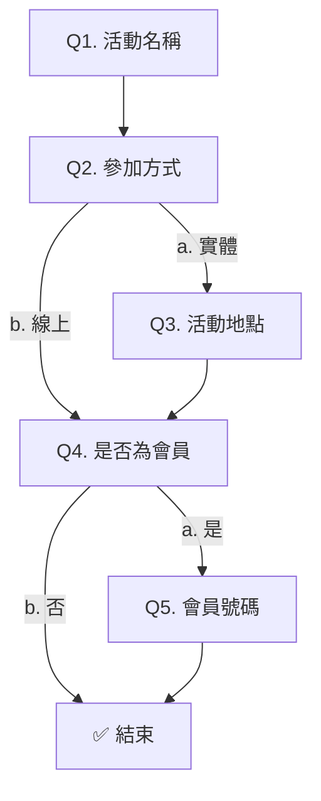

# 表單設定 - 跳題與邏輯

# 1. 跳題與邏輯設定

[圖片]

## 功能概述

讓表單根據填寫者的填答內容，自動**顯示或隱藏後續的題目**，實現靈活的互動流程。

只需要搭配以下兩個設定，就能完成跳題：

1. **預設隱藏**：先把某些題目設為「預設隱藏」
2. **邏輯任務**：再根據填寫者選擇的內容，決定什麼時候要顯示／隱藏這些題目

每一道題目都可以設定多個邏輯任務，系統會**依照題目與任務順序**，逐一執行邏輯任務，支援更複雜多元的跳題組合。

---

## 左側題目清單

[圖片]

- 左側題目欄位和「題目編輯頁」完全相同，可選取「選擇題」設定邏輯任務

---

## 新增邏輯任務

[圖片]

- 點擊頁面中間的「＋新增邏輯任務」按鈕，可建立多個邏輯任務

---

## 重新命名

[圖片]

- 編輯邏輯任務的名稱

---

## 拖曳 / 複製 / 刪除

[圖片]

- 點擊左側按鈕「拖曳」邏輯任務，會影響執行邏輯判斷的順序，詳請參考：[Untitled](https://app.notion.com/p/238ccd367ae880f19558ced81a229228)
- 點擊右側按鈕「複製」或「刪除」邏輯任務

---

## 設定邏輯任務

- 邏輯任務由「條件」與「執行」組成
  - 條件：代表填寫者選擇「某個題目」的「其中 1 個選項」作答時，會觸發右側的「執行」動作
  - 執行：當填寫者做出符合條件的行為時，會「顯示 or 隱藏」指定的題目

[圖片]

### 設定條件

[圖片]

- 選取「選擇題」

### 設定條件選項

[圖片]

- 選取該題的選項作為條件

### 設定執行

[圖片]

- 選擇「顯示 or 隱藏」

### 設定執行題目

[圖片]

- 選擇執行的題目

---

## 題目規則

[圖片]

- 「條件題目」必須在「選取的題目」之前
- 「執行題目」必須在「條件題目」之後

> 💡 備註：此限制是為了確保邏輯任務的正確性。

---

## 執行邏輯

[圖片]

- 根據左側題目順序，及每個題目內的邏輯任務，由上往下依序執行
- 後面的邏輯任務，會覆蓋前面的執行結果

> 💡 備註：若至「題目編輯」刪除題目或選項，在邏輯任務中也會同步移除喔！

---

# 2. 跳題範例 - 活動報名表單

## 跳題流程規劃

- **Q2. 參加方式：**
  1. 實體 → 額外顯示 Q3. 活動地點
  2. 線上 → Q4. 是否為會員
- **Q4. 是否為會員:**
  1. 是 → 額外顯示 Q5. 會員號碼
  2. 否 → 提交表單

---

## 後台設定方式

### 示範影片

[影片]

### 分解步驟

1. 於「題目設定」建立 5 道題目
  [圖片]
2. 題目 3、題目 5 可能被跳過，所以開啟「預設隱藏」
  [圖片]
3. 切換至「跳題與邏輯」頁，因題目 2 不同選項會跳至不同題目，故在此題新增邏輯任務
  - 條件：
    - 題目：2. 參加方式
    - 選項：a. 實體
  - 執行：
    - 顯示
    - 題目：3. 活動地點

    [圖片]
1. 題目 4 也會根據選項跳至不同題目，設定邏輯任務
  - 條件：
    - 題目：4. 是否為會員
    - 選項：a. 是
  - 執行：
    - 顯示
    - 題目：5. 會員號碼

  [圖片]

---

## 前台操作示範

[影片]
